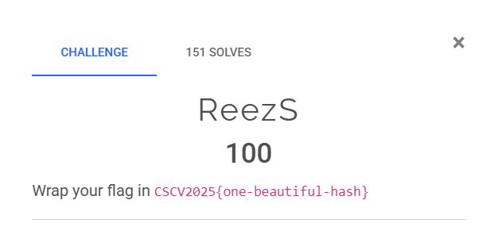
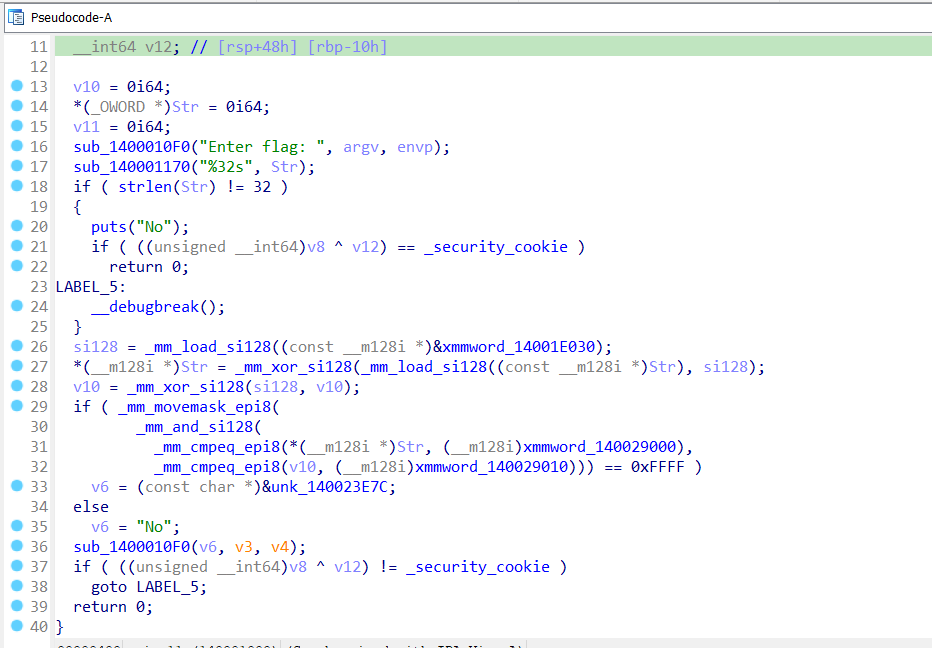
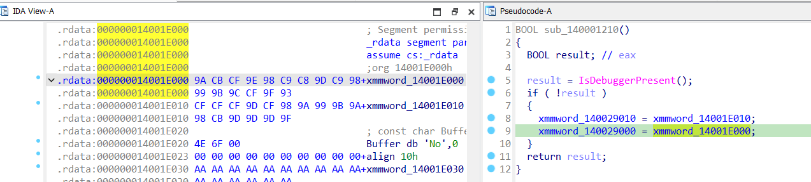

# ReezS

## [1] TỔNG QUAN
- Đề bài:

    


## [2] PHÂN TÍCH
- Từ hàm `main()` có thể hiểu logic chương trình như sau:

    

    - Flag có độ dài 32 kí tự
    - `si128` là key xor với chuỗi kí tự là `AA...`
    - XOR input với `si128`
    - compare nửa đầu với `xmmword_140029000 = 'D9 C5 D8 D8 D3 F5 DE C2 C3 D9 F5 C3 D9 F5 CC CB'`
    - compare nửa sau với `xmmword_140029010 = 'C1 CF F5 CC C6 CB CD 8B 8B 8B 8B 8B 8B 8B 8B 8B'`

- Lấy 2 biến đó xor ngược lại với `0xAA` thì sẽ ra được string `sorry_this_is_fake_flag!!!!!!!!!`. Khi debug và nhập string đó thì sẽ nhận được `Yes`, còn khi chạy chương trình trong terminal thì lại nhận lại `No`, điều này làm mình nghĩ ngay đến kỹ thuật anti-debug, có thể nó đã làm thay đổi giá trị của key hoặc giá trị của ciphertext.
- Mình đã xref thử tới chỗ gọi `xmmword_140029000` và `xmmword_140029010` thì thấy nó gán 1 giá trị mới nếu không có debugger

    

    ```py
    xmmword_14001E000 = '9A CB CF 9E 98 C9 C8 9D C9 98 99 9B 9C CF 9F 93'
    ```

    ```py
    xmmword_14001E010 = 'CF CF CF 9D CF 98 9A 99 9B 9A 98 CB 9D 9D 9D 9F'
    ```

- Khi sử dụng 2 giá trị trên thì mình nhận được 1 string `0ae42cb7c2316e59eee7e203102a7775`

## [3] SOLVE
```py
import argparse
from pwn import process

XMM1 = "9A CB CF 9E 98 C9 C8 9D C9 98 99 9B 9C CF 9F 93"
XMM2 = "CF CF CF 9D CF 98 9A 99 9B 9A 98 CB 9D 9D 9D 9F"

def unxor_aa(hexstr: str) -> bytes:
    b = bytes.fromhex(hexstr.replace(" ", ""))
    return bytes(x ^ 0xAA for x in b)

def build_input() -> bytes:
    p1 = unxor_aa(XMM1)
    p2 = unxor_aa(XMM2)
    flag_inp = p1 + p2
    assert len(flag_inp) == 32
    return flag_inp

def main():
    ap = argparse.ArgumentParser()
    ap.add_argument("--run", metavar="BIN", help="Chạy binary local để xác nhận")
    args = ap.parse_args()

    val = build_input()
    print(val.decode("ascii"))
    if args.run:
        io = process(args.run)
        io.recvuntil(b"Enter flag:")
        io.sendline(val)
        print(io.recvall(timeout=2).decode("utf-8", errors="ignore"))

if __name__ == "__main__":
    main()

```
> **Flag:** `CSCV2025{0ae42cb7c2316e59eee7e203102a7775}`