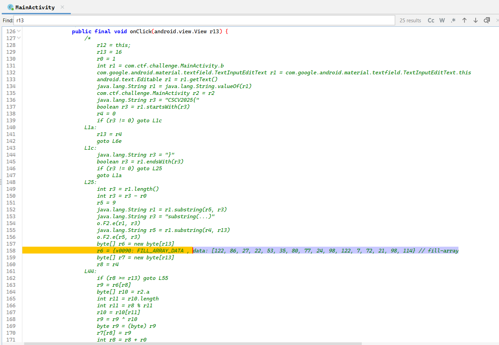
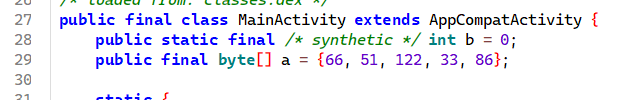
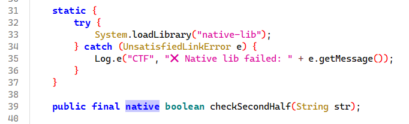
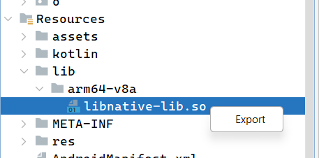
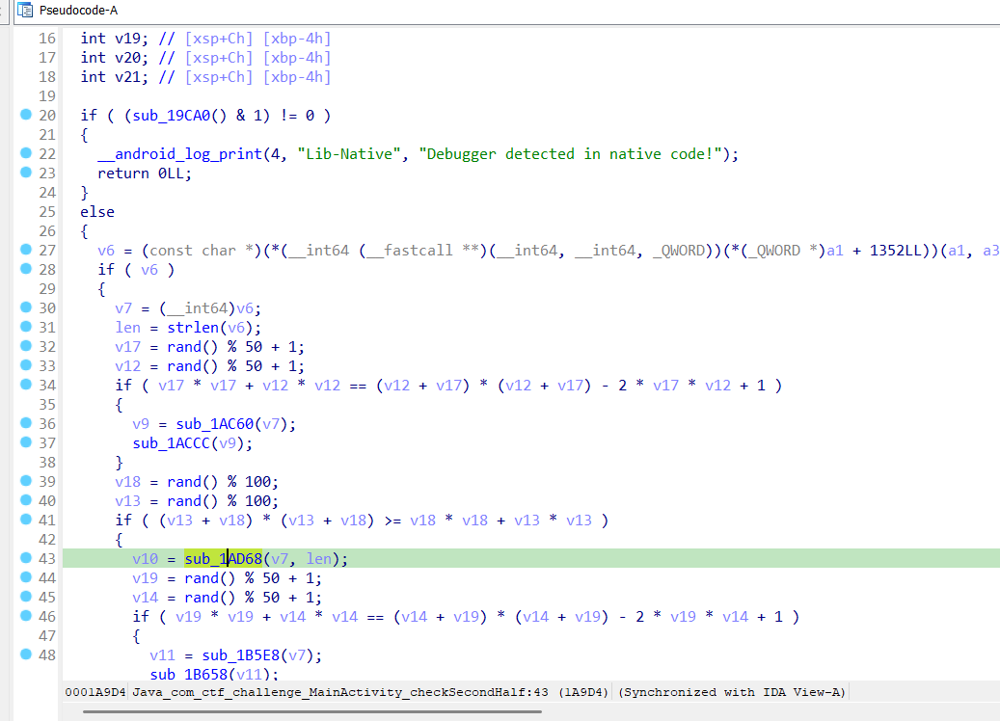

# Reverse Master

## [1] TỔNG QUAN
- Đề bài:

    

## [2] SOLVE
- Đây là file `.apk`, cần sử dụng tool jadx để xem được luồng thực thi của chương trình

    

### **2.1. Nửa flag đầu**
- Tại file `MainActivity` có thể thấy logic code không có gì lắm, tuy nhiên để ý ở hàm `onClick()` có thể thấy nó đang ẩn đi 1 phần mã hoá bằng cách comment.
- Ở dòng 158 chính là ciphertext được gán vào mảng `v6`.
- Nhãn `L44` chính là vòng lặp giải mã, trong đó key chính là mảng `r10` được gán bởi r2.a chính là mảng key được khai báo ở đầu hàm `MainActivity`

    

- Thuật toán giải mã cũng khá đơn giản, chỉ là phép toán xor lần lượt từng ký tự của key.
- Như vậy, cách giải mã của phần đầu tiên khá đơn giản, chúng ta chỉ việc xor ngược lại là ra nửa đầu flag.
- Solve nửa đầu:

    ```python
    encrypted = [122, 86, 27, 22, 53, 35, 80, 77, 24, 98, 122, 7, 72, 21, 98, 114]
    key = [66, 51, 122, 33, 86]

    decrypted_part1 = ""
    for i in range(len(encrypted)):
    decrypted_byte = encrypted[i] ^ key[i % len(key)]
    decrypted_part1 += chr(decrypted_byte)

    print(decrypted_part1)
    # Output: 8ea7cac794842440
    ```

### **2.2. Nửa flag sau**
- Tại label `L63` có thể thấy chương trình kiểm tra phần thứ 2 của flag bằng hàm `checkSecondHalf()`. Khi xref thì thấy nó được lấy từ thư viện libnative.so

    

- Vì thế mình đã export file libnative ra để đọc thử:

    

- Mục tiêu của mình là focus vào hàm `checkSecondHalf()` nên mình chỉ tập trung vào hàm đó trong file libnative, và hàm đó có tên là `Java_com_ctf_challenge_MainActivity_checkSecondHalf()`, hàm này đang gây obfuscate khá nhiều bằng hàm `random()`, tuy nhiên chúng ta chỉ cần để ý kỹ hàm `sub_1AD68()` bởi đây mới là hàm mã hoá chính

    

- Ban đầu, nó tạo 5 byte seed `v5 = [0x7D, 0xE2, 0x14, 0xB8, 0x63]` (do `*(_DWORD*)v5=0xB814E27D + v5[4]=0x63`, little-endian).
- Tiếp theo, dựng các byte rải rác của `v3` (chính là mảng "expected") từ các công thức XOR/OR/−const trong code:

    ```C
    v3[0]='6', v3[1]='f', v3[2]='e', v3[3]='3', v3[4]='c',
    v3[13]='7', v3[14]='e', v3[15]='4'
    ```

- Các byte 5..12 được tạo bằng cụm NEON:

    ```C
    t = v17 ^ [48 47 2E 4D 45 1E E8 53]
    t = t + [EA E7 E4 E1 DE DB D8 D5]
    t = t ^ [05 06 07 08 09 0A 0B 0C]
    tbl = vqtbl1(v6, [00 01 02 03 04 00 01 02]) = [7D E2 14 B8 63 7D E2 14]
    res = t ^ tbl
    *(_QWORD)&v3[5] = res
    ```

- Với `v17 = [0x79,0xE7,0x12,0xBF,0x6B,0x74,0xE8,0x1F]` và bảng `v6` chứa `{7D,E2,14,B8,63,...}` như code, tính ra:

    ```C
    res = [0x63,0x63,0x33,0x63,0x66,0x32,0x31,0x39] = "cc3cf219"
    ```

- Ghép tất cả 16 byte v3[0..15] theo đúng thứ tự ta có:

    ```C
    second_half = "6fe3ccc3cf2197e4"
    ```

- Ghép nửa đầu và nửa sau sẽ được flag của challenge này.

> **Flag:** `CSCV2025{8ea7cac7948424406fe3ccc3cf2197e4}`
