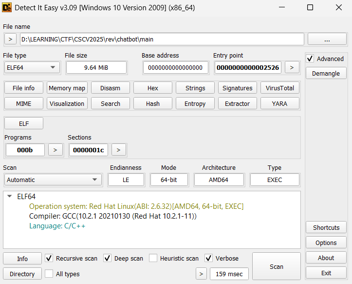

# chatbot

## [1] TỔNG QUAN
- Đề bài:

    

- Chương trình cung cấp 1 file binary `main`, 1 file `flag.enc`.
- File binary của challenge này là 1 file elf64:

    

- Tuy nhiên chương trình này được code bằng python, nên mình đã sử dụng công cụ pyinstxtractor để extract ra file .pyc.
- Tiếp theo mình sử dụng công cụ Pylingual web để chuyển từ .pyc sang code [main.py](main.py) để tiện cho việc đọc source

## [2] PHÂN TÍCH

### **2.1 main.py**
- Chương trình nạp libnative.so và ánh xạ 3 symbol:
    - check_integrity(char*) -> int
    - decrypt_flag_file(char*) -> void* (trả con trỏ NUL-terminated)
    - free_mem(void*)
- Có public key RSA để verify token VIP.
- Flag nằm trong `flag.enc`; nếu gọi được `decrypt_flag_file(".../flag.enc")` thì in ra flag.
- Trong đoạn code `main.py` có đoạn quan trọng sau:

    ```python
    if sys.platform == "win32":
        LIBNAME = "libnative.dll"
    else:
        LIBNAME = "libnative.so"

    lib = None
    check_integrity = None
    decrypt_flag_file = None
    free_mem = None

    try:
        lib = load_native_lib(LIBNAME)
        check_integrity = lib.check_integrity
        check_integrity.argtypes = [c_char_p]
        check_integrity.restype = c_int

        decrypt_flag_file = lib.decrypt_flag_file
        decrypt_flag_file.argtypes = [c_char_p]
        decrypt_flag_file.restype = c_void_p

        free_mem = lib.free_mem
        free_mem.argtypes = [c_void_p]
        free_mem.restype = None
    except Exception as e:
        print("Warning: native lib not loaded:", e)
        lib = None
        check_integrity = None
        decrypt_flag_file = None
        free_mem = None
    ```

- Có thể thấy đoạn đầu chỉ load thư viện libnative vào tiến trình, rồi lấy địa chỉ của 1 số hàm, trong đó có hàm `decrypt_flag_file()` là quan trọng nhất.
- Tại hàm `main()`, có 1 trong những lựa chọn như sau:

    ```python
    elif cmd in ["upgrade", "3"]:
        run_integrity_or_exit()
        token = input("Paste token: ").strip()
        ok, info = verify_token(token)
        if ok:
            if decrypt_flag_file is None:
                print("Native library not available -> cannot decrypt")
            else:
                flag_path = get_resource_path("flag.enc").encode("utf-8")
                res_ptr = decrypt_flag_file(flag_path)
                if not res_ptr:
                    print("Native failed to decrypt or error")
                else:
                    flag_bytes = ctypes.string_at(res_ptr)
                    try:
                        flag = flag_bytes.decode("utf-8", errors="strict")
                    except Exception:
                        flag = flag_bytes.decode("utf-8", errors="replace")
                    print("=== VIP VERIFIED ===")
                    print(flag)
                    if free_mem:
                        free_mem(res_ptr)
            return
        else:
            print("Token invalid:", info)
    ```

- Đoạn này chương trình lấy đường dẫn là file `flag.enc`, sau đó gọi hàm `decrypt_flag_file()` với tham số truyền vào là file `flag.enc` và giá trị trả về là plaintext của flag.
- Vì thế mình chỉ cần phân tích hàm `decrypt_flag_file()` file từ thư viện libnative.so là có thể giải mã được flag.

### **2.2 libnative.so**
- Thư viện này thực hiện giải mã AES-CBC với khoá 128bit hoặc 256bit.
- Các bước thực hiện:
    - Bước 1: Anti-debug:
    
        ```C
        if (!env_checks_ok()) return 0;
        ```

    - Bước 2: Lấy khoá:

        ```C
        v17 = 0;
        v1 = recover_key(&v17);
        if (!v1) return 0;
        ```
    
    - Bước 3: Đọc file và kiểm tra kích thước:

        ```C
        if (v17 <= 0xF || !(v3 = fopen(filename, "rb"))) { free(v1); return 0; }
        fseek(..., SEEK_END); v4 = ftell(...); rewind(...);
        if (v4 <= 16 || !(v6 = malloc(v4))) { fclose; free(v1); return 0; }
        fread(v6, 1, v4, v3); fclose(v3);
        ```

    - Bước 4: Tách IV:

        ```C
        v18[0] = _mm_loadu_si128(v6);   // load 16 byte đầu vào v18[0]
        v7 = v4 - 16;                   // size phần ciphertext
        ```
    
    - Bước 5: Setup AES-CBC:

        ```C
        ctx = EVP_CIPHER_CTX_new();
        cipher = (v17 <= 0x1F) ? EVP_aes_128_cbc() : EVP_aes_256_cbc();
        EVP_DecryptInit_ex(ctx, cipher, NULL, key=v1, iv=v18);
        ```

    - Bước 6: Giải mã + unpad PKCS#7

        ```C
        v10 = malloc(v4);              // buffer tạm lớn bằng file
        EVP_DecryptUpdate(ctx, v10, &v15, &v6[16], v7);
        EVP_DecryptFinal_ex(ctx, v10+v15, &v16);
        v11 = v15 + v16;               // tổng plaintext
        ```

## [3] SOLVE
```python
from Crypto.Cipher import AES
from Crypto.Util.Padding import unpad

OBF_KEY = bytes([
    0xEE, 0x50, 0xD1, 0xAA, 0xE0, 0x97, 0x5F, 0x43, 0xDD, 0xA8,
    0xAC, 0x83, 0xF0, 0x05, 0xF3, 0xFF, 0x62, 0x08, 0xF4, 0x44,
    0x4B, 0x2C, 0x55, 0xEC, 0xB9, 0x65, 0x23, 0xCC, 0x25, 0x65,
    0xEE, 0x70,
])

MASK = bytes([
    0x2A, 0x2A, 0x0A, 0x9A,
])

def recover_key_like_so() -> bytes:
    key = bytearray(32)
    key[0] = (256 - 60) & 0xFF  # -60 => 0xC4
    for i in range(1, 32):
        key[i] = OBF_KEY[i] ^ MASK[i & 3]
    return bytes(key)

def solve(path="flag.enc", out="flag.dec"):
    data = open(path, "rb").read()
    if len(data) <= 16:
        raise SystemExit("flag.enc quá ngắn (<=16B).")

    iv, ct = data[:16], data[16:]
    key = recover_key_like_so()

    print("[i] Key (hex):", key.hex())
    print("[i] IV  (hex):", iv.hex())

    cipher = AES.new(key, AES.MODE_CBC, iv)
    pt = unpad(cipher.decrypt(ct), 16)

    # lưu và in
    open(out, "wb").write(pt)
    try:
        print("[+] Flag:", pt.decode().strip())
    except UnicodeDecodeError:
        print("[+] Flag (bytes):", pt)
    print(f"[+] Đã lưu plaintext → {out}")

if __name__ == "__main__":
    solve()
```

> **Flag:** `CSCV2025{reversed_vip*_chatbot_bypassed}`
