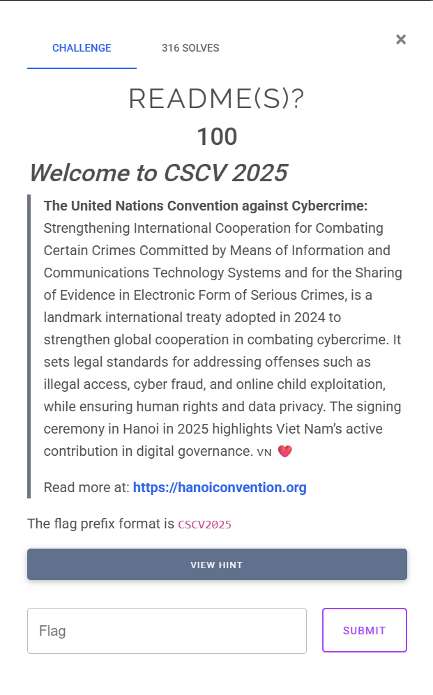
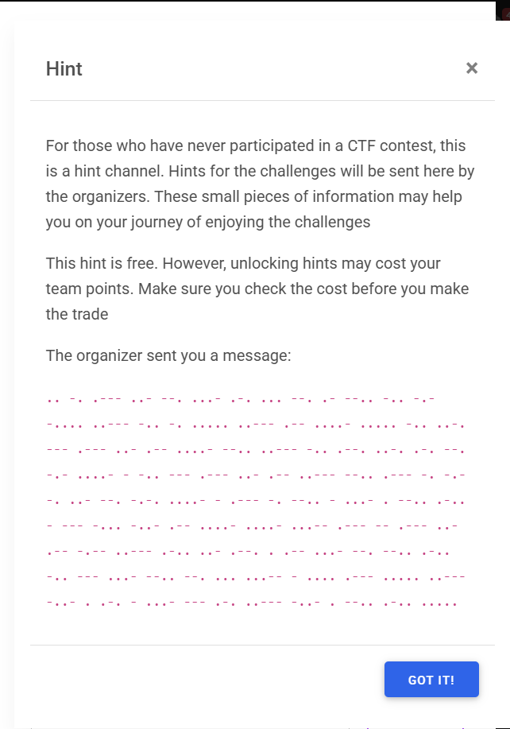
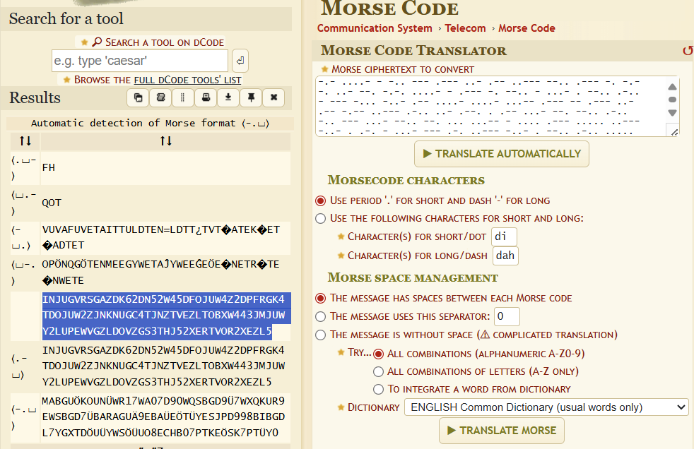
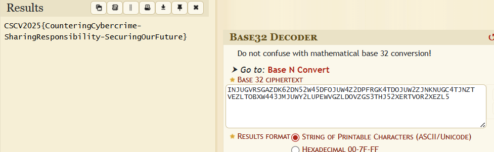

# README(S)?

## [1] TỔNG QUAN
- Đề bài:

    

- Hint:

    

## [2] SOLVE
- Hint cho 1 đoạn mã toàn dấu chấm và dấu trừ, dễ dàng đoán ngay đây chính là Morse Code, sử dụng công cụ `dcode.fr` giải mã ra được 1 đoạn string "INJUGVRSGAZDK62DN52W45DFOJUW4Z2DPFRGK4TDOJUW2ZJNKNUGC4TJNZTVEZLTOBXW443JMJUWY2LUPEWVGZLDOVZGS3THJ52XERTVOR2XEZL5"

    

- Đoạn string này chính là mã base32, đem đi giải mã thì ra được flag

    

> **Flag:** `CSCV2025{CounteringCybercrime-SharingResponsibility-SecuringOurFuture}`