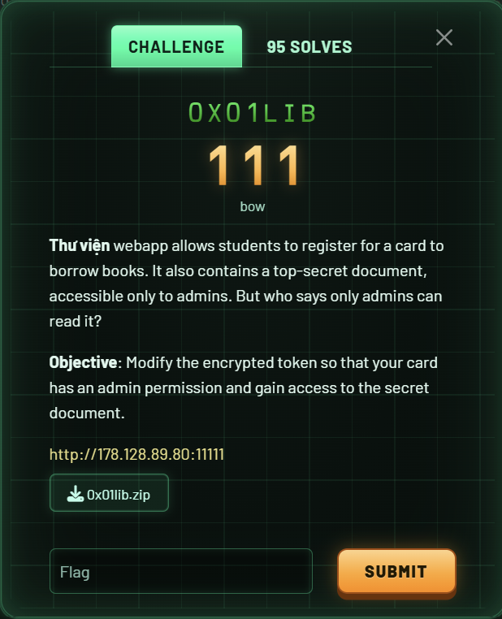
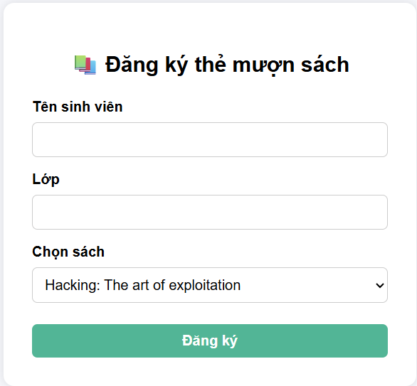
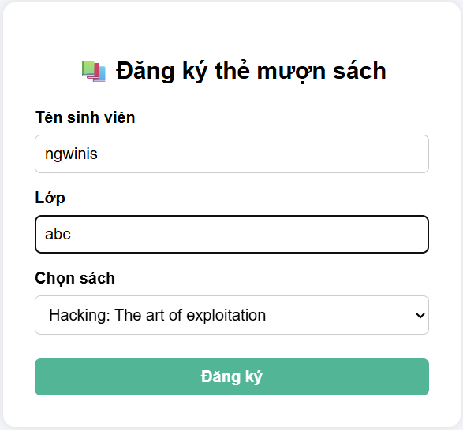
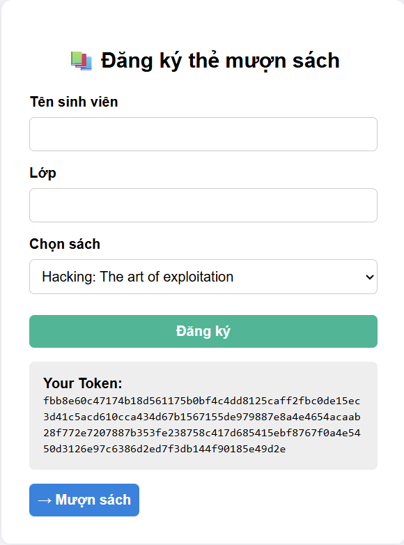
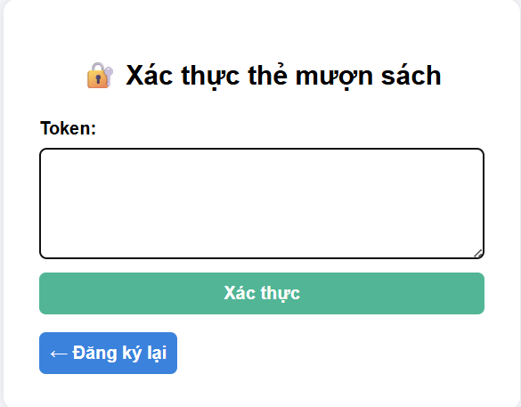
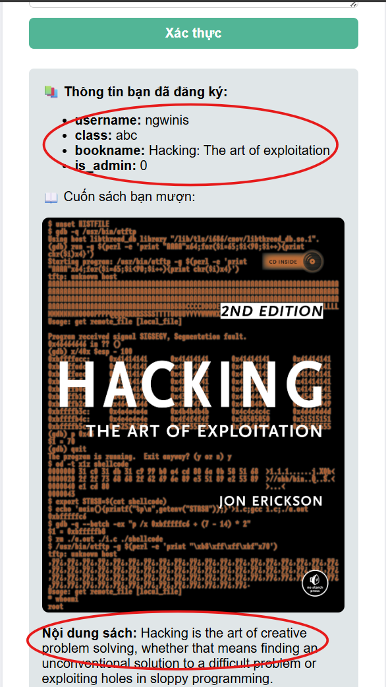
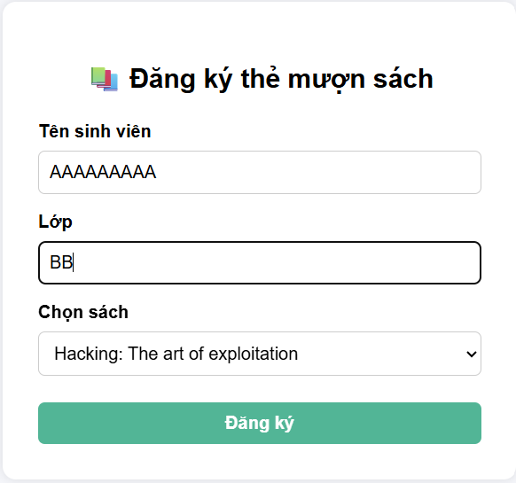
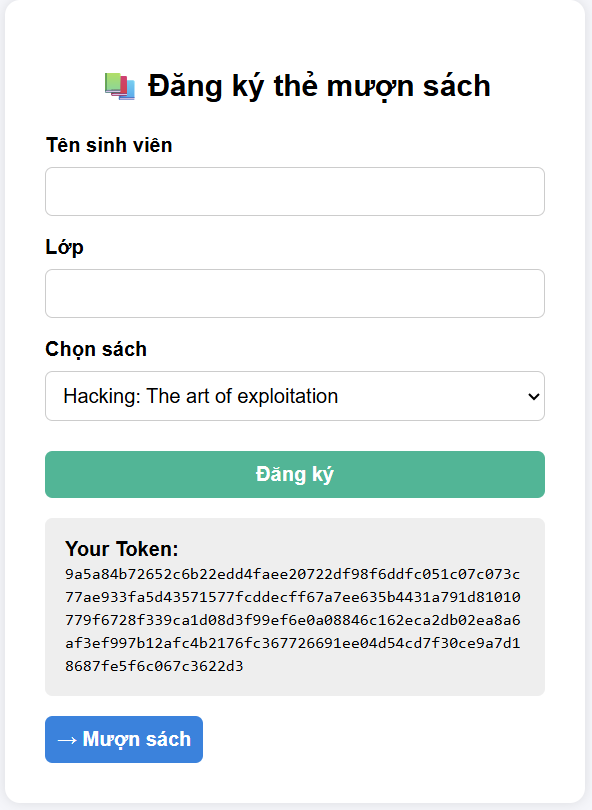
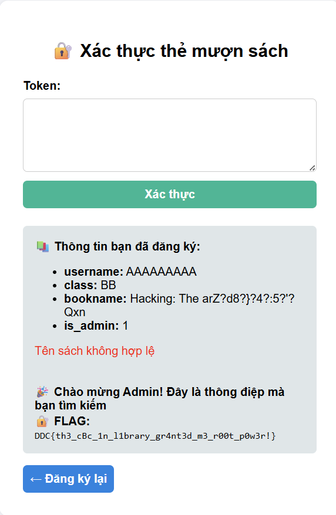

# 0x01lib

## [1] TỔNG QUAN
- Đề bài:

    

## [2] PHÂN TÍCH
- Đường link được cung cấp có giao diện như sau

    

- Challenge này yêu cầu đăng ký một tài khoản, mình nhập thử thì hệ thống sẽ trả ra 1 token như sau:

    

    

- Sau đó, giao diện xác thực hiện ra, yêu cầu mình nhập token

    

- Tuy nhiên sau khi nhập token xong thì hệ thống chỉ xác nhận mình là user đã đăng ký tài khoản thôi chứ không có flag nào ở đây cả

    

- Để ý kỹ hơn thì sẽ thấy 1 trường `is_admin: 0`, mà trong source [verify.php](src/verify.php) có đoạn:

    ```php
    // Check quyền admin
    $extra = "";
    if (!empty($data->is_admin)) {
        $extra = "<br><b>🎉 Chào mừng Admin! Đây là thông điệp mà bạn tìm kiếm</b><br><b>🔐 FLAG: </b><code>" . FLAG . "</code>";
    }
    ```

- Điều đó có nghĩa là token phải là token của admin mới có thể bypass được form verify này
- Xem lại source [function.php](src/function.php) thì thấy thuật toán mã hoá là `AES-256-CBC`.
- Lỗ hổng của dạng bài này là có thể dễ dàng tấn công `bit flip` trên AES-CBC, từ đó khi có token được tạo ra bởi cách tạo thông thường là `is_admin:0` có thể bị sửa trực tiếp vào token sao cho plaintext gốc có `is_admin:1`, từ đó có thể bypass được code verify

## [3] SOLVE
- Mình nhập xâu 9 byte `A` vào ô `Tên sinh viên` và `BB` vào ô `Lớp` rồi nhấn `Đăng ký` để tạo token

    

    

- Sau đó mình copy đoạn token đó và paste vào code dưới đây để tạo lại token mới đã đè số `1` vào để có được xác thực `is_admin:1`

    ```python
    import sys

    # Dán token MỚI NHẤT bạn vừa tạo ở bước 1 vào đây
    hex_token = "9a5a84b72652c6b22edd4faee20722df98f6ddfc051c07c073c77ae933fa5d43571577fcddecff67a7ee635b4431a791d81010779f6728f339ca1d08d3f99ef6e0a08846c162eca2db02ea8a6af3ef997b12afc4b2176fc367726691ee04d54cd7f30ce9a7d18687fe5f6c067c3622d3"

    # Chuyển từ hex sang bytes
    ciphertext = bytearray.fromhex(hex_token)

    # ĐÂY LÀ INDEX ĐÃ ĐƯỢC HIỆU CHỈNH
    target_index = 78

    # Giá trị XOR để đổi '0' thành '1'
    xor_value = ord('0') ^ ord('1')

    # Lật bit tại vị trí mục tiêu cuối cùng
    original_byte = ciphertext[target_index]
    modified_byte = original_byte ^ xor_value
    ciphertext[target_index] = modified_byte

    # Chuyển lại sang dạng hex để submit
    modified_hex_token = ciphertext.hex()

    print("Modified Token:", modified_hex_token)
    ```

- Token mới được sinh ra là `9a5a84b72652c6b22edd4faee20722df98f6ddfc051c07c073c77ae933fa5d43571577fcddecff67a7ee635b4431a791d81010779f6728f339ca1d08d3f99ef6e0a08846c162eca2db02ea8a6af3ee997b12afc4b2176fc367726691ee04d54cd7f30ce9a7d18687fe5f6c067c3622d3`
- Nhập token này vào form xác thực rồi nhấn `Xác thực` sẽ ra được flag

    

> **Flag**: `DDC{th3_cBc_1n_l1brary_gr4nt3d_m3_r00t_p0w3r!}`