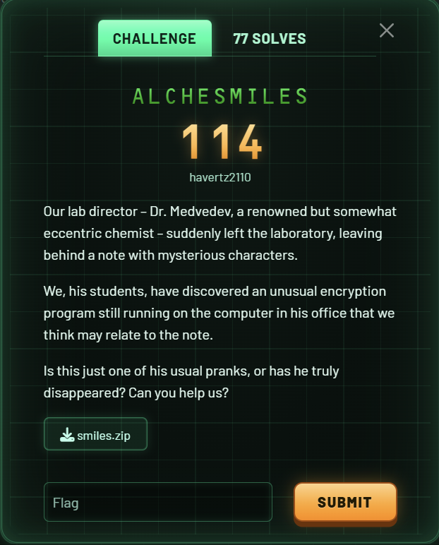
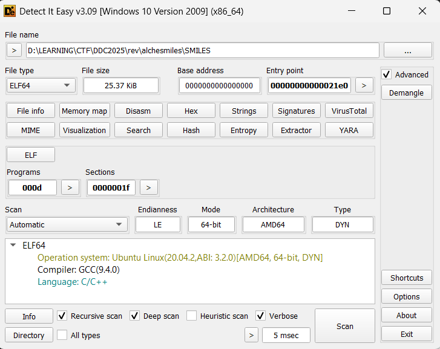
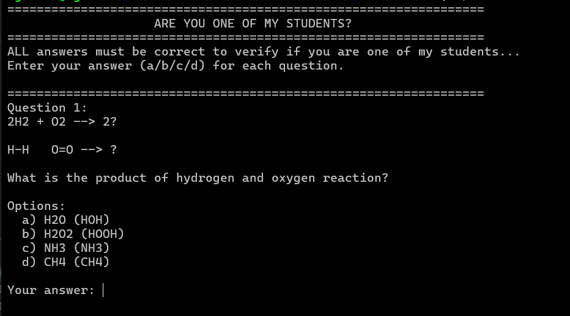
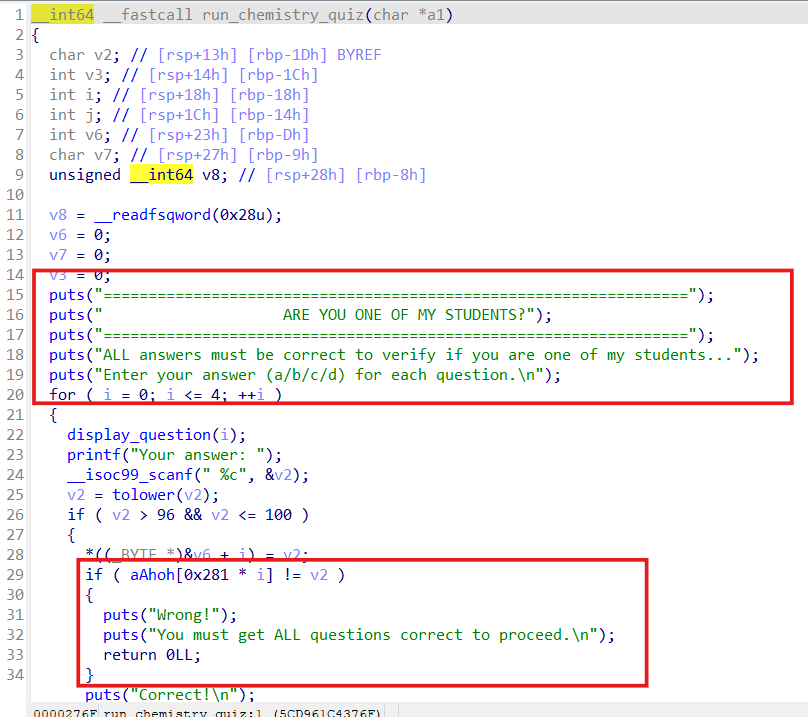
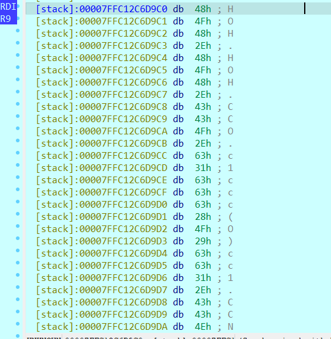
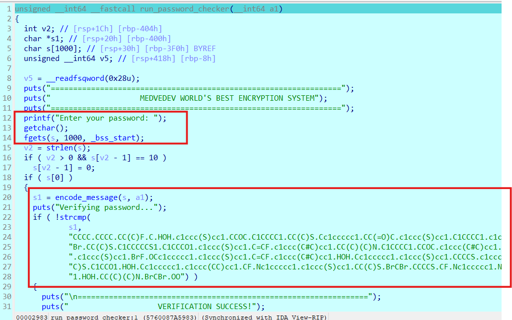
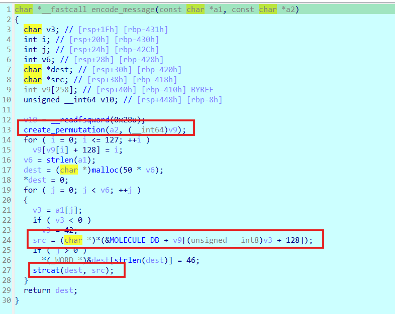
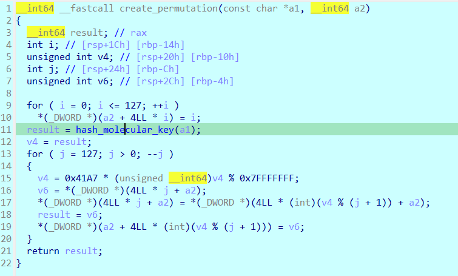

# ALCHESMILES

## [1] TỔNG QUAN
- Đề bài:

    

- Đây là định dạng file elf64

    

## [2] PHÂN TÍCH
- Chạy thử chương trình này thì mình nhận được yêu cầu giải bài toán cân bằng phương trình hoá học như sau

    

- Cần phải trả lời đúng 5 câu hỏi thì mới có thể pass qua được mục này.
- Vì mình là 1 hacker nên mình sẽ không ngồi giải hoá học theo một cách thông thường, mình sẽ debug để đọc được đáp án cần nhập.
- Hàm dưới đây chính là logic chính để thực hiện bài kiểm tra hoá học

    

- Sau đó mình debug chương trình thì nhận được các đáp án như sau:
    - Câu 1: a
    - Câu 2: b
    - Câu 3: b
    - Câu 4: c
    - Câu 5: d

    

- Trong quá trình trả lời câu hỏi hoá học, chương trình sẽ ghép các câu trả lời vào 1 string

    

- Sau đó nó lấy string này để đưa vào hàm kiểm tra flag. Tại hàm này, chương trình yêu cầu nhập flag, sau đó nó mã hoá với string truyền vào và kiểm tra với 1 hardcode ciphertext khác.

    

- Logic chính của hàm mã hoá là nó tra cứu trong 1 bảng tên là `MOLECULE_DB` rồi mã hoá flag rồi return ra ciphertext.

    

- Tuy nhiên trước đó, key, hay chính là string câu trả lời phía trên, được tạo lại với hàm hoán vị `create_permutation()` rồi lưu vào `v9`.

    

- Cuối cùng, flag được tra và gán lại vào một biến mới, sau đó trả ra encryption và so sánh với hardcode ciphertext. Tới đây, mình chỉ việc tra lại trong `MOLECULE_DB` để có thể tìm lại được flag.

## [3] SOLVE
```python
def parse_molecule_db():
    MOLECULE_DB_HEX = [
        0x43, 0x00, 0x43, 0x43, 0x00, 0x43, 0x43, 0x43, 0x00, 0x4F,
        0x00, 0x43, 0x4F, 0x00, 0x43, 0x43, 0x4F, 0x00, 0x4E, 0x00,
        0x43, 0x4E, 0x00, 0x43, 0x43, 0x4E, 0x00, 0x53, 0x00, 0x43,
        0x53, 0x00, 0x43, 0x43, 0x53, 0x00, 0x46, 0x00, 0x43, 0x46,
        0x00, 0x43, 0x43, 0x46, 0x00, 0x43, 0x6C, 0x00, 0x43, 0x43,
        0x6C, 0x00, 0x43, 0x43, 0x43, 0x6C, 0x00, 0x42, 0x72, 0x00,
        0x43, 0x42, 0x72, 0x00, 0x48, 0x4F, 0x48, 0x00, 0x4F, 0x4F,
        0x00, 0x4F, 0x43, 0x4F, 0x00, 0x63, 0x31, 0x63, 0x63, 0x63,
        0x63, 0x63, 0x31, 0x00, 0x43, 0x63, 0x31, 0x63, 0x63, 0x63,
        0x63, 0x63, 0x31, 0x00, 0x4F, 0x43, 0x63, 0x31, 0x63, 0x63,
        0x63, 0x63, 0x63, 0x31, 0x00, 0x4E, 0x63, 0x31, 0x63, 0x63,
        0x63, 0x63, 0x63, 0x31, 0x00, 0x53, 0x63, 0x31, 0x63, 0x63,
        0x63, 0x63, 0x63, 0x31, 0x00, 0x63, 0x31, 0x63, 0x63, 0x63,
        0x28, 0x43, 0x29, 0x63, 0x63, 0x31, 0x00, 0x63, 0x31, 0x63,
        0x63, 0x63, 0x28, 0x4F, 0x29, 0x63, 0x63, 0x31, 0x00, 0x63,
        0x31, 0x63, 0x63, 0x63, 0x28, 0x4E, 0x29, 0x63, 0x63, 0x31,
        0x00, 0x63, 0x31, 0x63, 0x63, 0x63, 0x28, 0x53, 0x29, 0x63,
        0x63, 0x31, 0x00, 0x63, 0x31, 0x63, 0x63, 0x63, 0x28, 0x46,
        0x29, 0x63, 0x63, 0x31, 0x00, 0x43, 0x43, 0x28, 0x43, 0x29,
        0x43, 0x00, 0x43, 0x43, 0x28, 0x43, 0x29, 0x4F, 0x00, 0x43,
        0x43, 0x28, 0x43, 0x29, 0x4E, 0x00, 0x43, 0x43, 0x28, 0x43,
        0x29, 0x53, 0x00, 0x43, 0x43, 0x28, 0x43, 0x29, 0x46, 0x00,
        0x43, 0x43, 0x43, 0x43, 0x00, 0x43, 0x43, 0x43, 0x43, 0x4F,
        0x00, 0x43, 0x43, 0x43, 0x43, 0x4E, 0x00, 0x43, 0x43, 0x43,
        0x43, 0x53, 0x00, 0x43, 0x43, 0x43, 0x43, 0x46, 0x00, 0x43,
        0x31, 0x43, 0x43, 0x31, 0x00, 0x43, 0x31, 0x43, 0x43, 0x4F,
        0x31, 0x00, 0x43, 0x31, 0x43, 0x43, 0x4E, 0x31, 0x00, 0x43,
        0x31, 0x43, 0x43, 0x53, 0x31, 0x00, 0x43, 0x31, 0x43, 0x43,
        0x46, 0x31, 0x00, 0x43, 0x3D, 0x43, 0x00, 0x43, 0x3D, 0x43,
        0x4F, 0x00, 0x43, 0x3D, 0x43, 0x4E, 0x00, 0x43, 0x3D, 0x43,
        0x53, 0x00, 0x43, 0x3D, 0x43, 0x46, 0x00, 0x43, 0x23, 0x43,
        0x00, 0x43, 0x23, 0x43, 0x4F, 0x00, 0x43, 0x23, 0x43, 0x4E,
        0x00, 0x43, 0x23, 0x43, 0x53, 0x00, 0x43, 0x23, 0x43, 0x46,
        0x00, 0x63, 0x31, 0x63, 0x63, 0x6E, 0x63, 0x63, 0x31, 0x00,
        0x63, 0x31, 0x63, 0x63, 0x6E, 0x63, 0x28, 0x43, 0x29, 0x63,
        0x31, 0x00, 0x63, 0x31, 0x63, 0x63, 0x6E, 0x63, 0x28, 0x4F,
        0x29, 0x63, 0x31, 0x00, 0x63, 0x31, 0x63, 0x63, 0x6E, 0x63,
        0x28, 0x4E, 0x29, 0x63, 0x31, 0x00, 0x63, 0x31, 0x63, 0x63,
        0x6E, 0x63, 0x28, 0x53, 0x29, 0x63, 0x31, 0x00, 0x43, 0x43,
        0x3D, 0x43, 0x00, 0x43, 0x43, 0x43, 0x3D, 0x43, 0x00, 0x43,
        0x43, 0x43, 0x43, 0x3D, 0x43, 0x00, 0x43, 0x43, 0x43, 0x43,
        0x43, 0x3D, 0x43, 0x00, 0x43, 0x43, 0x43, 0x43, 0x43, 0x43,
        0x3D, 0x43, 0x00, 0x63, 0x31, 0x63, 0x63, 0x63, 0x6E, 0x63,
        0x31, 0x00, 0x63, 0x31, 0x63, 0x63, 0x63, 0x28, 0x43, 0x3D,
        0x43, 0x29, 0x63, 0x63, 0x31, 0x00, 0x63, 0x31, 0x63, 0x63,
        0x63, 0x28, 0x43, 0x23, 0x43, 0x29, 0x63, 0x63, 0x31, 0x00,
        0x63, 0x31, 0x63, 0x63, 0x63, 0x28, 0x43, 0x43, 0x29, 0x63,
        0x63, 0x31, 0x00, 0x63, 0x31, 0x63, 0x63, 0x63, 0x28, 0x43,
        0x43, 0x43, 0x29, 0x63, 0x63, 0x31, 0x00, 0x43, 0x4F, 0x43,
        0x00, 0x43, 0x43, 0x4F, 0x43, 0x00, 0x43, 0x43, 0x43, 0x4F,
        0x43, 0x00, 0x43, 0x43, 0x43, 0x43, 0x4F, 0x43, 0x00, 0x43,
        0x43, 0x43, 0x43, 0x43, 0x4F, 0x43, 0x00, 0x43, 0x4E, 0x43,
        0x00, 0x43, 0x43, 0x4E, 0x43, 0x00, 0x43, 0x43, 0x43, 0x4E,
        0x43, 0x00, 0x43, 0x43, 0x43, 0x43, 0x4E, 0x43, 0x00, 0x43,
        0x43, 0x43, 0x43, 0x43, 0x4E, 0x43, 0x00, 0x43, 0x53, 0x43,
        0x00, 0x43, 0x43, 0x53, 0x43, 0x00, 0x43, 0x43, 0x43, 0x53,
        0x43, 0x00, 0x43, 0x43, 0x43, 0x43, 0x53, 0x43, 0x00, 0x43,
        0x43, 0x43, 0x43, 0x43, 0x53, 0x43, 0x00, 0x43, 0x46, 0x43,
        0x00, 0x43, 0x43, 0x46, 0x43, 0x00, 0x43, 0x43, 0x43, 0x46,
        0x43, 0x00, 0x43, 0x43, 0x43, 0x43, 0x46, 0x43, 0x00, 0x43,
        0x43, 0x43, 0x43, 0x43, 0x46, 0x43, 0x00, 0x43, 0x6C, 0x43,
        0x43, 0x6C, 0x00, 0x42, 0x72, 0x43, 0x42, 0x72, 0x00, 0x49,
        0x43, 0x6C, 0x00, 0x43, 0x6C, 0x46, 0x00, 0x42, 0x72, 0x46,
        0x00, 0x63, 0x31, 0x63, 0x63, 0x63, 0x32, 0x63, 0x63, 0x63,
        0x63, 0x63, 0x32, 0x63, 0x31, 0x00, 0x63, 0x31, 0x63, 0x63,
        0x63, 0x32, 0x63, 0x63, 0x28, 0x43, 0x29, 0x63, 0x63, 0x63,
        0x32, 0x63, 0x31, 0x00, 0x63, 0x31, 0x63, 0x63, 0x63, 0x32,
        0x63, 0x63, 0x28, 0x4F, 0x29, 0x63, 0x63, 0x63, 0x32, 0x63,
        0x31, 0x00, 0x63, 0x31, 0x63, 0x63, 0x63, 0x32, 0x63, 0x63,
        0x28, 0x4E, 0x29, 0x63, 0x63, 0x63, 0x32, 0x63, 0x31, 0x00,
        0x63, 0x31, 0x63, 0x63, 0x63, 0x32, 0x63, 0x63, 0x28, 0x53,
        0x29, 0x63, 0x63, 0x63, 0x32, 0x63, 0x31, 0x00, 0x43, 0x43,
        0x28, 0x43, 0x29, 0x28, 0x43, 0x29, 0x43, 0x00, 0x43, 0x43,
        0x28, 0x43, 0x29, 0x28, 0x43, 0x29, 0x4F, 0x00, 0x43, 0x43,
        0x28, 0x43, 0x29, 0x28, 0x43, 0x29, 0x4E, 0x00, 0x43, 0x43,
        0x28, 0x43, 0x29, 0x28, 0x43, 0x29, 0x53, 0x00, 0x43, 0x43,
        0x28, 0x43, 0x29, 0x28, 0x43, 0x29, 0x46, 0x00, 0x43, 0x31,
        0x43, 0x43, 0x43, 0x31, 0x00, 0x43, 0x31, 0x43, 0x43, 0x43,
        0x4F, 0x31, 0x00, 0x43, 0x31, 0x43, 0x43, 0x43, 0x4E, 0x31,
        0x00, 0x43, 0x31, 0x43, 0x43, 0x43, 0x53, 0x31, 0x00, 0x43,
        0x31, 0x43, 0x43, 0x43, 0x46, 0x31, 0x00, 0x43, 0x31, 0x43,
        0x43, 0x43, 0x43, 0x31, 0x00, 0x43, 0x31, 0x43, 0x43, 0x43,
        0x43, 0x4F, 0x31, 0x00, 0x43, 0x31, 0x43, 0x43, 0x43, 0x43,
        0x4E, 0x31, 0x00, 0x43, 0x31, 0x43, 0x43, 0x43, 0x43, 0x53,
        0x31, 0x00, 0x43, 0x31, 0x43, 0x43, 0x43, 0x43, 0x46, 0x31,
        0x00, 0x43, 0x31, 0x43, 0x43, 0x43, 0x43, 0x43, 0x31, 0x00,
        0x43, 0x31, 0x43, 0x43, 0x43, 0x43, 0x43, 0x4F, 0x31, 0x00,
        0x43, 0x31, 0x43, 0x43, 0x43, 0x43, 0x43, 0x4E, 0x31, 0x00,
        0x43, 0x31, 0x43, 0x43, 0x43, 0x43, 0x43, 0x53, 0x31, 0x00,
        0x43, 0x31, 0x43, 0x43, 0x43, 0x43, 0x43, 0x46, 0x31, 0x00,
        0x63, 0x31, 0x63, 0x63, 0x63, 0x28, 0x43, 0x28, 0x43, 0x29,
        0x43, 0x29, 0x63, 0x63, 0x31, 0x00, 0x63, 0x31, 0x63, 0x63,
        0x63, 0x28, 0x43, 0x28, 0x43, 0x29, 0x4F, 0x29, 0x63, 0x63,
        0x31, 0x00, 0x63, 0x31, 0x63, 0x63, 0x63, 0x28, 0x43, 0x28,
        0x43, 0x29, 0x4E, 0x29, 0x63, 0x63, 0x31, 0x00, 0x43, 0x43,
        0x28, 0x3D, 0x4F, 0x29, 0x43, 0x00, 0x43, 0x43, 0x28, 0x3D,
        0x4F, 0x29, 0x4F, 0x00
    ]
    db_bytes = bytes(MOLECULE_DB_HEX)
    return [s.decode('ascii') for s in db_bytes.split(b'\x00') if s]

def hash_molecular_key(key_str):
    h = 0
    for char in key_str:
        # Giả lập số nguyên 32-bit có dấu
        h = (31 * h + ord(char)) & 0xFFFFFFFF
        if h & 0x80000000:
            h -= 0x100000000
    return h & 0x7FFFFFFF

def create_permutation(key_str):
    perm = list(range(128))
    seed = hash_molecular_key(key_str)
    
    for j in range(127, 0, -1):
        seed = (0x41A7 * seed) % 0x7FFFFFFF
        idx = seed % (j + 1)
        perm[j], perm[idx] = perm[idx], perm[j]
        
    return perm

def reverse_password_checker(key, encoded_str):
    molecule_db = parse_molecule_db()
    
    molecule_to_db_index = {mol: i for i, mol in enumerate(molecule_db)}

    permutation_table = create_permutation(key)

    encoded_parts = encoded_str.split('.')
    
    password_chars = []
    for part in encoded_parts:
        if part in molecule_to_db_index:
            db_index = molecule_to_db_index[part]
            original_char_code = permutation_table[db_index]
            password_chars.append(chr(original_char_code))
        else:
            print(f"Lỗi: Phần '{part}' không tìm thấy trong MOLECULE_DB.")
            return None
            
    return "".join(password_chars)

if __name__ == "__main__":
    INPUT_KEY = "HOH.HOH.CCO.c1ccc(O)cc1.CCNC"
    TARGET_ENCODED_STRING = (
        "CCCC.CCCC.CC(C)F.C.HOH.c1ccc(S)cc1.CCOC.C1CCCC1.CC(C)S.Cc1ccccc1.CC(=O)C.c1ccc(S)cc1.C1CCCC1.c1ccc(S)cc1.BrC"
        "Br.CC(C)S.C1CCCCCS1.C1CCCO1.c1ccc(S)cc1.C=CF.c1ccc(C#C)cc1.CC(C)(C)N.C1CCCC1.CCOC.c1ccc(C#C)cc1.c1ccc(CC)cc1"
        ".c1ccc(S)cc1.BrF.OCc1ccccc1.c1ccc(S)cc1.C=CF.c1ccc(C#C)cc1.HOH.Cc1ccccc1.c1ccc(S)cc1.CCCCS.c1ccc(C#C)cc1.CC("
        "C)S.C1CCO1.HOH.Cc1ccccc1.c1ccc(CC)cc1.CF.Nc1ccccc1.c1ccc(S)cc1.CC(C)S.BrCBr.CCCCS.CF.Nc1ccccc1.N.c1ccc(CC)cc"
        "1.HOH.CC(C)(C)N.BrCBr.OO"
    )
    
    password = reverse_password_checker(INPUT_KEY, TARGET_ENCODED_STRING)
    
    if password:
        print(f"Flag: {password}")
```

> **Flag**: `DDC{1_gu3s5_u_n3v4_7hought_0f_7h1s_ch3m1stry_3ncrypt1on}`