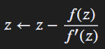

# Compute It

## **[1] TỔNG QUAN**

* Challenge cho 2 file:
  * Executable: [`validator`](validator)
  * Dataset: [`signal_data.txt`](signal_data.txt)

* Ý tưởng: `validator` không check "flag string" theo kiểu truyền thống, mà dùng **tính toán số học** (Newton–Raphson trên số phức). Dataset chứa nhiều điểm đầu vào `(x, y)`; nếu điểm nào "hội tụ đúng cách" thì được đánh dấu, rồi ghép lại thành ảnh/chuỗi để đọc ra flag.

---

## **[2] PHÂN TÍCH**

### **[2.1] Hành vi của `validator`**

* Khi reverse `validator`, phần core là một vòng lặp Newton–Raphson để giải phương trình:

  ```
  [ f(z) = z^3 - 1 = 0 ]
  ```

  với số phức:

  ```
  [ z = x + yi ]
  ```

* Công thức Newton:

  

* Điều kiện dừng (đọc từ binary):

  * Nếu `(|f'(z)|^2)` quá nhỏ (gần 0) thì dừng sớm (tránh chia cho số rất nhỏ).
  * Nếu `(|x-1| < 10^{-6})` và `(|y| < 10^{-6})` thì coi như hội tụ về nghiệm thực `(1+0i)`.
  * Có giới hạn số vòng lặp (tương đương `0x31`).

* Điểm quan trọng: **binary chỉ chấp nhận input khi số bước Newton đúng bằng 12** (tức hội tụ đúng tốc độ).

---

### **[2.2] Dùng dataset để tạo bitmap**

* File [`signal_data.txt`](signal_data.txt) chứa **2600 dòng**, mỗi dòng là 2 số thực dạng:

  ```
  x,y
  ```

* Với mỗi điểm `(x, y)`, mình mô phỏng đúng vòng Newton của binary rồi lấy:

  * `bit = 1` nếu **steps == 12**
  * `bit = 0` nếu không

* Script thực hiện phần này: [`genbitmap.py`](genbitmap.py)

---

### **[2.3] Ghép 2600 bit thành “ảnh”**

* Ban đầu reshape theo kiểu quen thuộc (100×26) sẽ ra nhiễu.
* Nhận ra `2600` có nhiều ước (ví dụ `130×20`, `50×52`, ...), nên thử các cặp để tìm layout “có chữ”.
* Kết quả đúng là:

  * `W = 130`
  * `H = 20`

* Khi in theo 130×20, phần chữ hiện lên rõ:

  ```text
         #### #  # #  # #  #   ## ###  #### #   # ###  ##  ###       #   # #  # ####       ####   #  #### #  # ###   ##
         #    #  # #  #  ##   ##  #  #    # #   #  #  #  # #  #      #   # #  # #          #  #  ##  #    #  #  #   ##
         ###  #### ####   #   #   #  #  ### # # #  #  #  # #  # #### # # # #### ###  ####  ###    #  # ## ####  #   #
         #    #  #    #  ##   ##  #  #    # ## ##  #  #  # #  #      ## ##    #    #       # #    #  #  # #  #  #   ##
         #### #  #    # #  #   ## #  # #### #   #  #   ##  #  #      #   #    # ####       #  # #### #### #  #  #    ##
  ```

---

### **[2.4] Render ra PNG để nhìn cho rõ**

* Script render: [`gen_image.py`](gen_image.py)
* Ảnh kết quả:
  

> **Flag:** `EH4X{N3WTON-W4S-R1GHT}`
