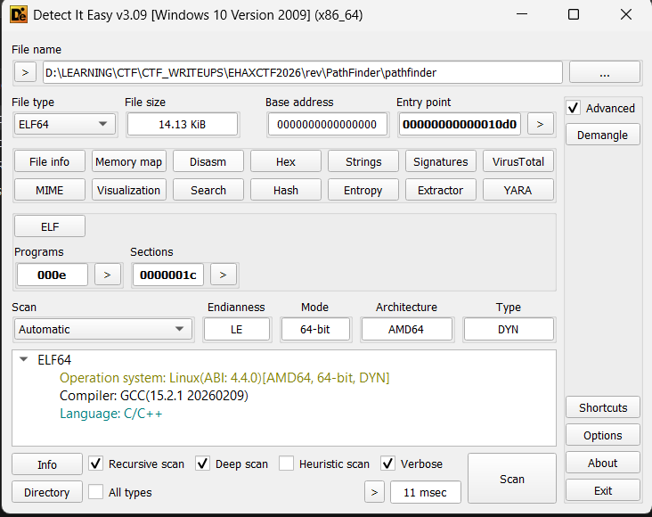
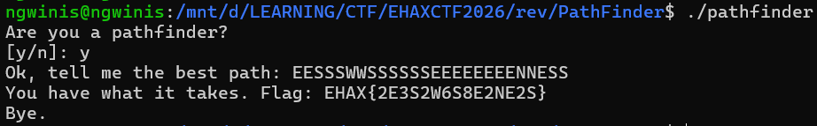

# Path Finder

## **[1] TỔNG QUAN**

* Challenge cho 1 file ELF64 tên `pathfinder`.

  

* Chạy thử thì chương trình hỏi:

  * `Are you a pathfinder? [y/n]:`
  * Nếu nhập `y` thì bắt nhập tiếp: `Ok, tell me the best path:`
  * Nhập sai sẽ báo: `Better luck next time.`

* Đây là dạng mini game tìm đường đi trong mê cung:

  * Input là chuỗi bước đi.
  * Check hợp lệ theo bản đồ 10x10 (100 ô).
  * Cuối cùng pass thì chương trình sẽ build ra **flag** theo format `EHAX{...}`.

---

## **[2] PHÂN TÍCH**

### **[2.1] Dữ liệu map 10x10 bị encode trong `.rodata`**

* Trong `.rodata` có đúng **100 byte** (tương ứng 10x10) nhưng bị “làm rối”.

* Chương trình giải mã bằng cách XOR theo index `i`:

  * Gọi hàm `key(i)`:

    ```c
    key(i) = ((i<<3) ^ (i*31 + 0x11) ^ 0xFFFFFFA5)   // lấy byte thấp
    ```
  * Map sau decode:

    ```c
    map[i] = enc[i] ^ (key(i) & 0xFF)
    ```

* Sau khi decode, map mỗi ô là **bitmask 4-bit** (giống kiểu “có đường đi theo hướng nào”):

  * Thấy các giá trị kiểu: `0, 1, 3, 5, 8, 10, 12, 9, ...` ⇒ đúng dạng OR của 1/2/4/8.

---

### **[2.2] Bảng điều khiển hướng đi (N/S/E/W)**

* Có 1 bảng 256 entry (mỗi entry 12 byte) tương ứng ASCII 0..255.

* Với mỗi ký tự bước đi, chương trình lấy ra:

  * `dx, dy` (dịch tọa độ)
  * 2 byte “seed” để tạo ra mask kiểm tra đường đi
  * 1 byte `valid` (bắt buộc ≠0)

* Với 4 hướng hợp lệ:

  * `N`: `dx=-1, dy=0`
  * `S`: `dx=+1, dy=0`
  * `E`: `dx=0, dy=+1`
  * `W`: `dx=0, dy=-1`

---

### **[2.3] Rule check di chuyển**

* Với mỗi bước `ch ∈ {N,S,E,W}`:

  1. Tính ô kế `(nx, ny) = (x+dx, y+dy)` và bắt buộc nằm trong `[0..9]`.
  2. Lấy:

     * `old = map[x][y]`
     * `new = map[nx][ny]`
  3. Tạo 2 mask từ bảng:

     ```c
     t = (ch * 0x6B) & 0xFF;
     out_mask = seed0 ^ t ^ 0x3C;
     in_mask  = seed1 ^ t ^ 0x3C;
     ```
  4. Check hợp lệ bằng điều kiện:

     ```c
     ((old & out_mask) | (new & in_mask)) != 0
     ```

     Tức là chỉ cần **một trong hai phía** “bật bit đúng” là đi được (edge có thể được encode ở ô hiện tại hoặc ô kế).

* Từ các mask suy ra mapping bit:

  * `S = 1`, `E = 2`, `N = 4`, `W = 8`

---

### **[2.4] Điều kiện đạt**

* Sau khi duyệt hết chuỗi:

  * Bắt buộc kết thúc tại `(9,9)` (góc dưới phải).
* Ngoài ra còn check thêm hash:

  * Hash khởi tạo `0xDEADBEEF`
  * Mỗi ký tự:

    ```c
    h ^= ch;
    h = rol(h, 13);
    h *= 0x045D9F3B;
    ```
  * Finalize:

    ```c
    h ^= (h >> 16);
    h *= 0x85EBCA6B;
    h ^= (h >> 13);
    ```
  * So sánh với hằng số:

    ```c
    h == 0x86BA520C
    ```

=> Kết luận: path phải vừa đi hợp lệ trong maze, vừa đúng hash ⇒ gần như chỉ có **1 nghiệm**.

---

### **[2.5] Cách build flag**

* Nếu pass, chương trình **RLE-encode** path:

  * Nếu ký tự lặp `k>1` lần ⇒ in `"<k><char>"`
  * Nếu `k==1` ⇒ in luôn `"<char>"`
* Sau đó bọc:

  ```text
  EHAX{<RLE(path)>}
  ```

---

## **[3] SOLVE**
- Script: [solve.py](solve.py)
- Path cần nhập là `EESSSWWSSSSSSEEEEEEEENNESS`

  

> **Flag:** `EHAX{2E3S2W6S8E2NE2S}`