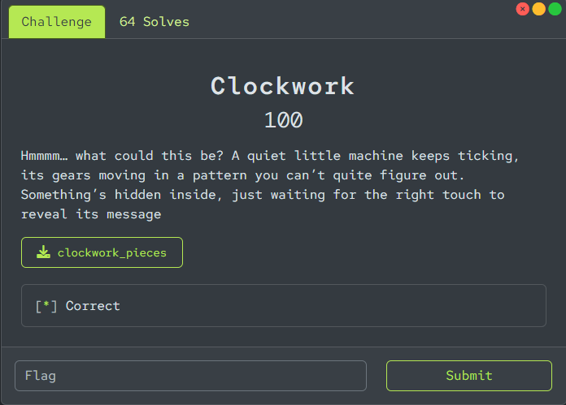
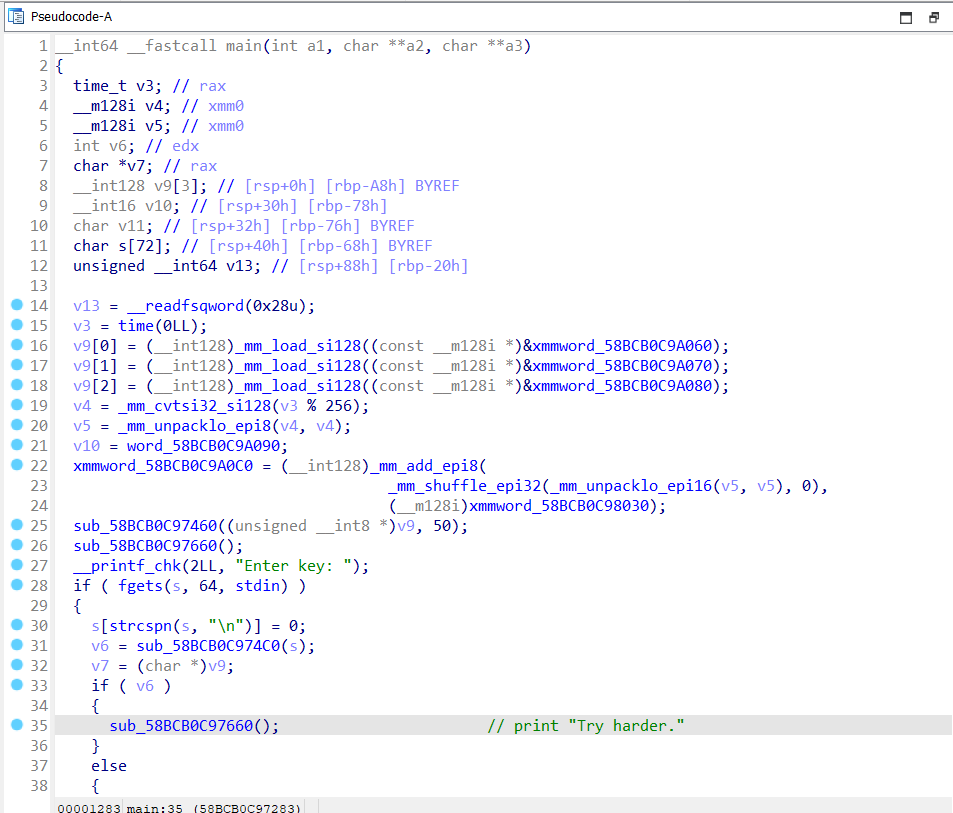
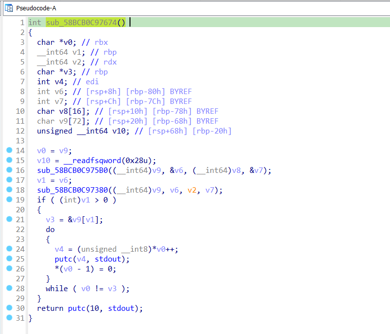
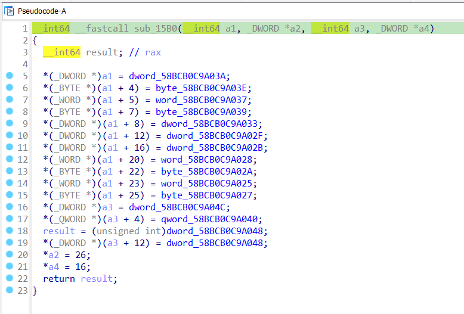
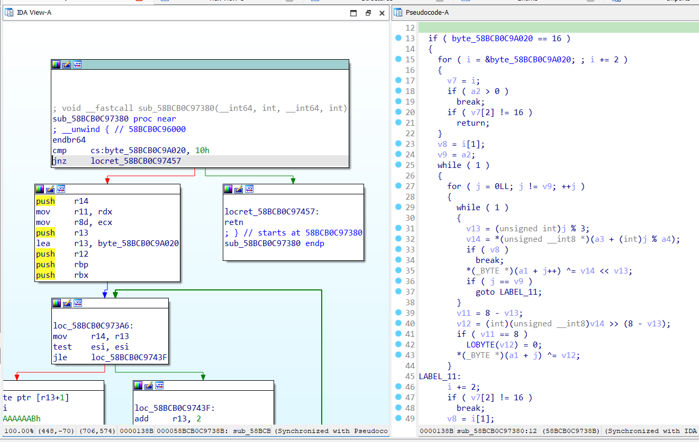
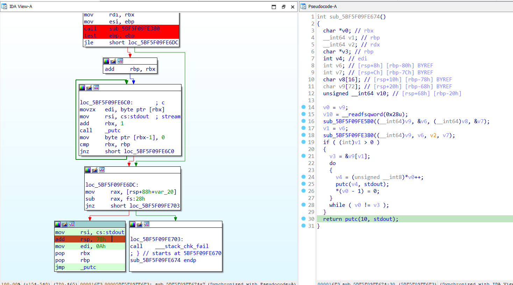
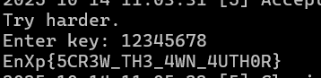

# clockwork

## [1] PHÂN TÍCH & SOLVE
- Đề bài:

    
    
- Khi vừa load vào IDA thì mình thấy ngay hàm `main()` khá clear

    

- Luồng này chỉ nhận vào input và sẽ có 2 tình huống như sau:
    - Nếu nhập đúng key thì nó sẽ tiếp tục in ra `"Try harder."`
    - Nếu nhập sai key thì nó sẽ in ra `"Invalid key"`
- Tuy nhiên, kể cả khi đã cung cấp đúng key thì cũng không có flag nào được in ra.
- Vì lý do đó nên mình đoán luồng chính để lấy flag là ở 1 hàm nào đó không được gọi trong hàm `main()`, sau đó mình kiểm tra các hàm được khai báo trong chương trình này và phát hiện hàm `sub_58BCB0C97674()` có gọi tới 2 hàm khác xử lý 1 số phép toán trên các dữ liệu hardcode.

    

    

    

- Có 1 điều khá đặc biệt là hàm này cũng không thể xref tới bất kì 1 hàm nào khác, điều đó có nghĩa là khi thực thi chương trình này, hàm đó sẽ không hề được gọi tới.
- Để ý kĩ sẽ thấy ở dòng 25 trong hàm `sub_58BCB0C97674()`, nó sẽ in kết quả gì đó ra nên mình sẽ debug và sửa thanh ghi `RIP` với giá trị của hàm `sub_58BCB0C97674()` để xem nó làm gì.

    

    

> **Flag:** `EnXp{5CR3W_TH3_4WN_4UTH0R}`