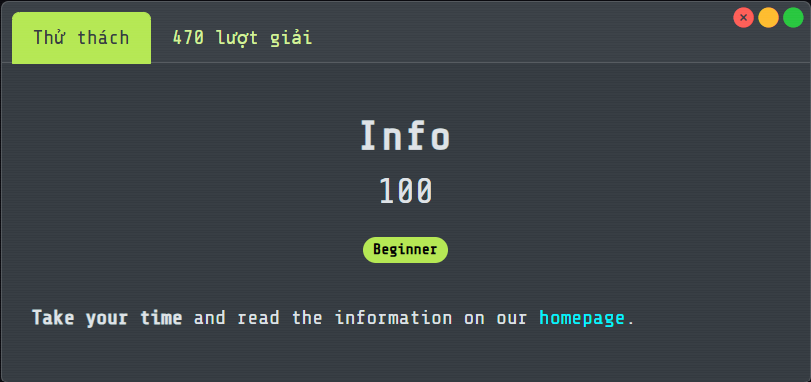
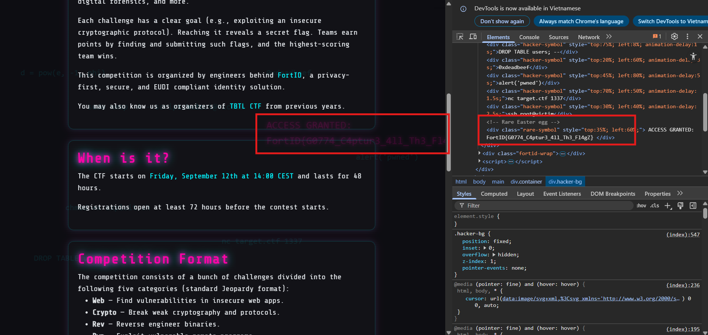

# Info

## [1] TỔNG QUAN
- Đề bài:
    
    

## [2] SOLVE
- Mở trang thông tin của giải này và đợi 1 lúc sẽ thấy hiện flag hoặc có 1 cách khác là dùng phím F12 để có thể lấy được flag.

    

> **Flag:** `FortID{G0774_C4ptur3_4ll_Th3_Fl4gZ}`