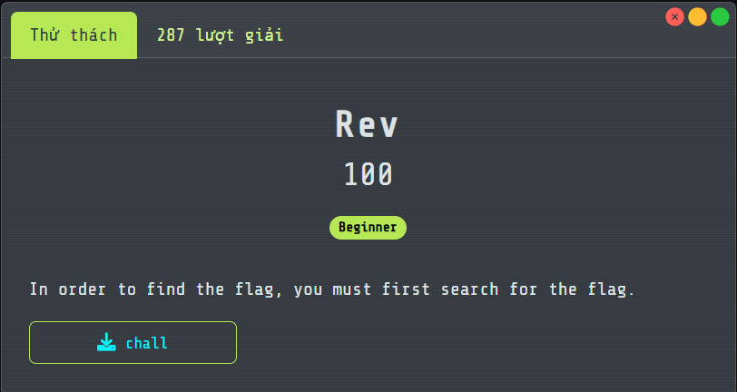
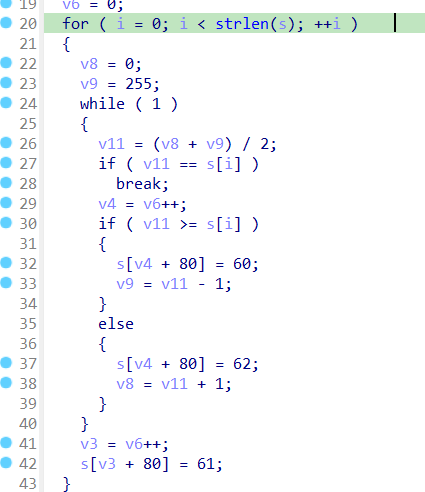
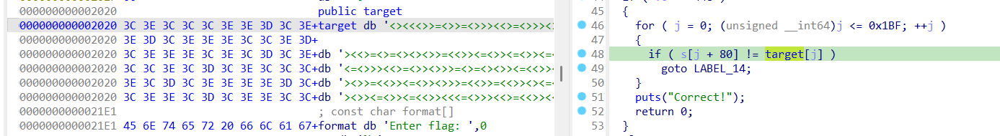

# Rev

## [1] TỔNG QUAN
- Đề bài:

    

## [2] PHÂN TÍCH
- Dựa trên yêu cầu của đề, "Nếu muốn tìm flag thì phải search nó".
- "Search" ở đây có ý nghĩa riêng của nó và có thể hiểu đây là hint cho 1 thuật toán tìm kiếm nào đó.
- Phân tích kỹ hơn trong chương trình thì thuật toán tìm kiếm được sử dụng ở đây là thuật toán binary search:

    

    - Giới hạn tìm kiếm là từ `l=0` đến `r=255`.
    - Lấy `mid=(l+r)/2`.
    - Nếu mã ascii của kí tự `flag[i]` nhỏ hơn `mid` thì sẽ lưu kí tự `<`, lớn hơn thì lưu kí tự `>`, còn nếu bằng thì lưu kí tự `=`.
    - Sau đó update số `l` hoặc `r` bằng với `mid`.
    - Vòng lặp tiếp tục như vậy cho tới khi tìm hết được các kí tự flag.
- Do mỗi lần lặp đều tìm `mid` theo công thức `(l+r)/2` cho tới khi tìm được kí tự bằng, nói cách khác khi mình duyệt chuỗi các kí tự `<>=`, mình chỉ việc thấy kí tự `=` thì mình sẽ dừng lần lặp đó và đó chính là kí tự của `flag[i]`.

    

- Từ đó mình sẽ viết script python để reverse lại quá trình đó theo đoạn code solve bên dưới.

## [3] SOLVE
```python
from pathlib import Path

def extract_trace(data: bytes) -> str:
    start = best = 0
    best_span = (0, 0)
    i = 0
    while i < len(data):
        if data[i] in (0x3c, 0x3e, 0x3d):  # '<', '>', '='
            j = i
            while j < len(data) and data[j] in (0x3c, 0x3e, 0x3d):
                j += 1
            if j - i > best:
                best = j - i
                best_span = (i, j)
            i = j
        else:
            i += 1
    s, e = best_span
    if best == 0:
        raise RuntimeError("no '<', '>', '=' run found")
    return data[s:e].decode()

def decode_from_trace(trace: str, lo0=0, hi0=255) -> str:
    out = []
    lo, hi = lo0, hi0
    for step in trace:
        mid = (lo + hi) // 2
        if step == '=':
            out.append(chr(mid))
            lo, hi = lo0, hi0
        elif step == '<':
            hi = mid - 1
        elif step == '>':
            lo = mid + 1
        else:
            raise ValueError("unexpected symbol in trace")
    return "".join(out)

def main(path="chall"):
    data = Path(path).read_bytes()
    trace = extract_trace(data)
    flag = decode_from_trace(trace, 0, 255)
    print(flag)

if __name__ == "__main__":
    import sys
    main(sys.argv[1] if len(sys.argv) > 1 else "chall")
```

> **Flag:** `FortID{3a7_Y0ur_V3gg1e5_4nd_L3rn_Y0ur_Fund4m3n741_S3arch_Alg0r17hm5}`