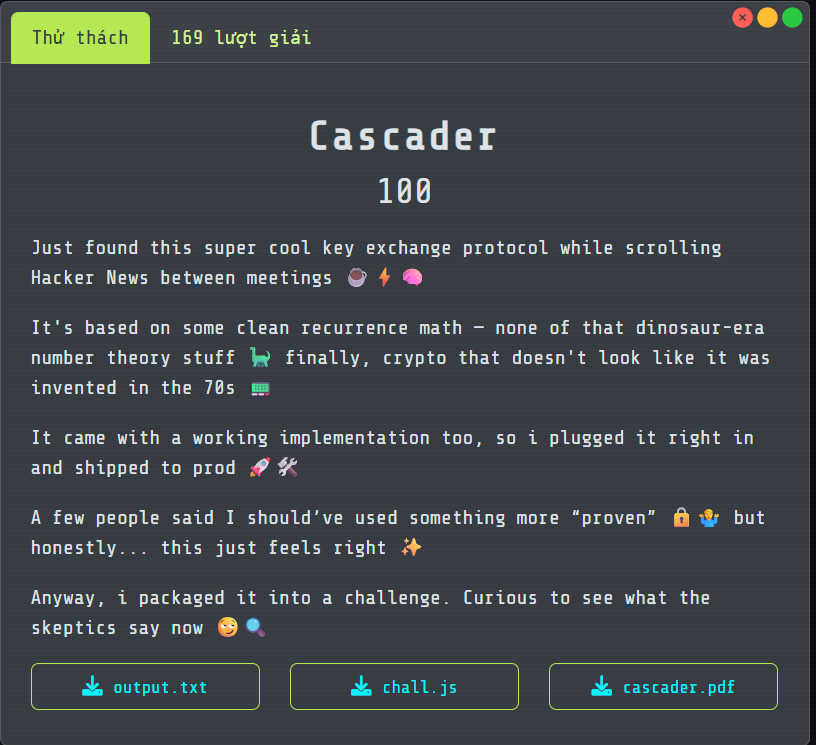

# Cascader

## [1] TỔNG QUAN
- Đề bài:

    

## [2] PHÂN TÍCH


## [3] SOLVE
```python
import re
from hashlib import sha256
from Crypto.Cipher import AES

KEY_SIZE_BITS = 256
MOD = (1 << KEY_SIZE_BITS) - 189
SEED = (1 << KEY_SIZE_BITS) // 5

def parse_output(path="output.txt"):
    s = open(path, "r", encoding="utf-8", errors="ignore").read()
    A = int(re.search(r"Alice public\s+(\d+)", s).group(1))
    B = int(re.search(r"Bob public\s+(\d+)", s).group(1))
    ct_hex = re.search(r"ct \(hex\):\s*([0-9a-fA-F]+)", s).group(1)
    return A, B, bytes.fromhex(ct_hex)

def modinv(a, m):
    return pow(a, -1, m)

def shared_from_pub(A, B):
    inv_seed = modinv(SEED, MOD)
    return (A * B * inv_seed) % MOD

def to_32_be(n: int) -> bytes:
    return n.to_bytes(32, "big")

def derive_key(shared_int: int) -> bytes:
    return sha256(to_32_be(shared_int)).digest()

def gcm_decrypt(key: bytes, blob: bytes) -> bytes:
    iv, ct, tag = blob[:12], blob[12:-16], blob[-16:]
    cipher = AES.new(key, AES.MODE_GCM, nonce=iv)
    return cipher.decrypt_and_verify(ct, tag)

if __name__ == "__main__":
    A, B, blob = parse_output("output.txt")
    shared = shared_from_pub(A, B)
    key = derive_key(shared)
    flag = gcm_decrypt(key, blob).decode()
    print("Flag:", flag)

```

> **Flag:** `FortID{St0p_B31n6_4_H1ps73r_4nd_5t1ck_70_Th3_G00d_0ld_D1ff1e_H3l1man}`