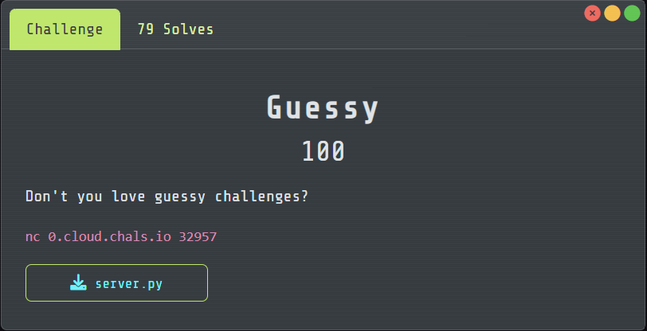
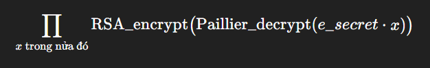
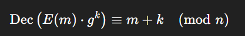

# Guessy

## [1] TỔNG QUAN
- Đề bài:

    

## [2] PHÂN TÍCH
1. Server dùng Paillier với `g=n+1` để mã hoá `secret + 0xD3ADC0DE`, rồi cho người chơi gửi 7 câu hỏi. Mỗi câu là một dãy số nguyên (số lượng phần tử phải chẵn và không trùng). Server chia đôi dãy và in ra 2 giá trị, mỗi giá trị là:

    

    Cụ thể nằm ở hàm `compute(...)` và cách tách đôi/kiểm tra đầu vào trong code.

2. Với Paillier (chọn `g=n+1`), có tính chất "dịch cộng" kinh điển:

    

    nên nếu lấy x=g**(−m) thì `Dec(E(m).x)=0`. Ở đây `m=secret+0xD3ADC0DE`.

3. Server sau đó mã hoá RSA thô (không padding): `encrypt(m) = m^e mod n`. Vì là RSA raw, nên `Enc(0)=0` — chỉ cần có một thằng bằng 0 trong tích thì cả kết quả in ra sẽ là 0.<br>
=> Kết luận: nếu một nửa dãy của bạn chứa `x = g**(-(secret + Δ))` (với `Δ=0xD3ADC0DE`), thì output của nửa đó sẽ là 0. Bài toán biến thành việc “giấu” đúng một giá trị `xs=g**(−(Δ+s))` tương ứng từng khả năng s∈[0,2047] vào các nửa của 7 câu sao cho từ vị trí nào in 0 ta suy ra s.

4. Mã hoá đa trị (base-3) để đủ 2048 khả năng: 7 câu hỏi → mỗi câu cho 3 trạng thái: trái 0, phải 0, không 0 → 3**7=2187 (>2048). Ta gán cho mỗi s (0..2047) một chuỗi 7 trit (base-3). Ở câu i:

    - trit=1 ⇒ bỏ xs vào nửa trái,
    - trit=2 ⇒ bỏ vào nửa phải,
    - trit=0 ⇒ không bỏ vào câu i.

    Khi server trả lời, nhìn 7 cặp kết quả:
    - nếu trái==0 ⇒ trit=1,
    - nếu phải==0 ⇒ trit=2,
    - nếu cả hai ≠0 ⇒ trit=0.

    Ghép 7 trit lại (base-3) ⇒ đúng s ⇒ đoán được `secret=s`. (Nhớ quy tắc nhập: mỗi dòng phải chẵn phần tử và không trùng trong cùng dòng—ta sẽ pad bằng vài giá trị “rác” an toàn để cân hai nửa.)

## [3] SOLVE
```python
from pwn import remote, context, log
from math import gcd

HOST = "0.cloud.chals.io"
PORT = 32957

context.log_level = "info"

DELTA = 0xD3ADC0DE
SECRET_MAX = 2048
Q = 7

def to_base3(x, digits=Q):
    t = []
    for _ in range(digits):
        t.append(x % 3)
        x //= 3
    return t

def parse_two_bigints(line):
    s = line.strip()
    parts = s.split()
    if len(parts) != 2:
        return None
    try:
        a = int(parts[0], 10)
        b = int(parts[1], 10)
        return a, b
    except ValueError:
        return None

def build_queries(n):
    g = n + 1
    n2 = n * n

    log.info("Build queries với g = n+1, mod n^2 có %d bits", n2.bit_length())

    xs = []
    for s in range(SECRET_MAX):
        k = (- (DELTA + s)) % n
        x = pow(g, k, n2)
        xs.append((s, k, x))

    left = [[] for _ in range(Q)]
    right = [[] for _ in range(Q)]

    for s, k, x in xs:
        trits = to_base3(s, Q)
        for i, t in enumerate(trits):
            if t == 1:
                left[i].append(x)
            elif t == 2:
                right[i].append(x)
    queries = []
    junk_exp = 1
    for i in range(Q):
        L = left[i][:]
        R = right[i][:]

        used = set(L + R)
        g = n + 1
        n2 = n * n
        while len(L) < len(R):
            junk = pow(g, junk_exp % n, n2)
            junk_exp += 1
            if junk in used:
                continue
            used.add(junk)
            L.append(junk)
        while len(R) < len(L):
            junk = pow(g, junk_exp % n, n2)
            junk_exp += 1
            if junk in used:
                continue
            used.add(junk)
            R.append(junk)

        line = L + R
        queries.append(line)

        def preview(arr, k=3):
            show = [str(arr[j]) for j in range(min(k, len(arr)))]
            if len(arr) > k:
                show.append("...")
            return ", ".join(show)

        log.info(
            "[Q%d] left=%d, right=%d, total=%d | left: [%s] | right: [%s]",
            i, len(L), len(R), len(line), preview(L), preview(R)
        )

    return queries

def solve_one_test(io):
    io.recvuntil(b"n = ")
    n = int(io.recvline().strip())
    log.info("Nhận n (%d bits): %d", n.bit_length(), n)

    io.recvuntil(b"You can ask 7 questions:")
    log.info("Server đã sẵn sàng nhận 7 câu hỏi.")

    queries = build_queries(n)

    for i, line in enumerate(queries):
        payload = " ".join(str(v) for v in line)
        io.sendline(payload.encode())
        log.info("[SEND Q%d] %d phần tử (độ dài chuỗi: %d)", i, len(line), len(payload))

    pairs = []
    while len(pairs) < Q:
        raw = io.recvline(timeout=10)
        if raw is None:
            log.failure("Timeout khi chờ cặp số thứ %d!", len(pairs))
            break
        s = raw.decode(errors="ignore").strip()
        got = parse_two_bigints(s)
        if got is None:
            log.debug("[SKIP] %s", s)
            continue
        pairs.append(got)
        log.info("[RECV %d] L=%s | R=%s", len(pairs)-1, got[0], got[1])

    if len(pairs) != Q:
        log.failure("Không nhận đủ 7 cặp! Nhận được: %d", len(pairs))
        return "bad"

    trits = []
    for i, (lval, rval) in enumerate(pairs):
        if lval == 0:
            trits.append(1)
            where = "LEFT"
        elif rval == 0:
            trits.append(2)
            where = "RIGHT"
        else:
            trits.append(0)
            where = "NONE"
        log.info("[PAIR %d] zero at: %s -> trit=%d", i, where, trits[-1])

    s = 0
    p = 1
    for t in trits:
        s += t * p
        p *= 3

    base3_str = "".join(str(t) for t in trits[::-1])
    log.success("Trits (big-endian) = %s  =>  secret s = %d", base3_str, s)

    io.recvuntil(b"Can you guess my secret?")
    io.sendline(str(s).encode())

    verdict = io.recvline(timeout=5)
    if verdict:
        verdict = verdict.decode().strip()
        if "Correct" in verdict or "correct" in verdict:
            log.success("Server: %s", verdict)
        else:
            log.warning("Server: %s", verdict)
    else:
        verdict = ""
        log.warning("Không nhận được verdict ngay sau khi trả lời.")

    return verdict

def main():
    log.info("Kết nối tới %s:%d ...", HOST, PORT)
    io = remote(HOST, PORT)

    for t in range(10):
        log.info("====== Test #%d ======", t)
        verdict = solve_one_test(io)

    log.info("Đọc phần còn lại (có thể là flag) ...")
    try:
        while True:
            chunk = io.recvline(timeout=3)
            if not chunk:
                break
            s = chunk.decode(errors="ignore").rstrip()
            if s:
                print(s)
    except EOFError:
        pass

    log.info("Xong.")

if __name__ == "__main__":
    main()

```

> **Flag:** `FortID{Y0u_R_4_Phr3ak1n6_M1nd_R3ad3r!_orz_orz}`