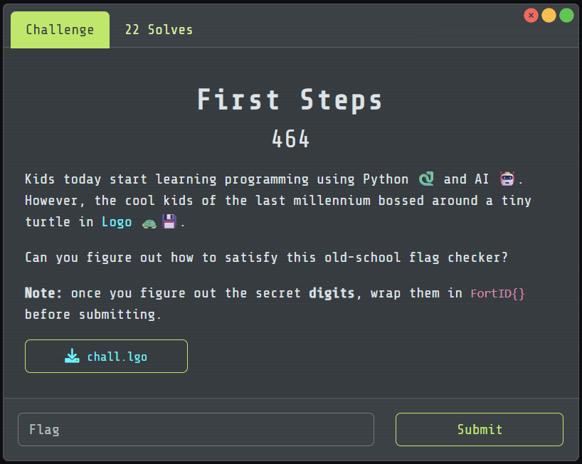

# First Steps

## [1] TỔNG QUAN
- Đề bài:

    

## [2] PHÂN TÍCH
Từ đoạn code [chall.lgo](chall.lgo), ta có thể đưa ra dự đoán chương trình này kiểm tra:
- Vẽ từng chữ số kiểu 7-segment (các đoạn a–g như đồng hồ số).
- Với mỗi hình (một digit), duyệt lưới pixel và đếm:
    - corner (a): pixel có 2 láng giềng vuông góc → tạo thành góc 90°.
    - T-fork (b): pixel có 3 láng giềng → chỗ giao hình chữ T.
- Tính ret = 10*a + b.
- Trường hợp đặc biệt khi ret ∈ {40, 41} (các chữ số trùng đặc trưng):
    - Chương trình soi “đoạn dọc ngay trên góc trái-dưới” (segment E trong 7-segment).
    - Dùng nó để tách cặp 2/5 (cùng 4 góc, 0 fork) và 6/9 (cùng 4 góc, 1 fork).
- Từ cấu trúc 7-segment + luật đặc biệt trên, các chữ số cho ra giá trị:

    | ret | digit | Giải thích nhanh                                    |
    | --: | :---: | --------------------------------------------------- |
    |   0 |   1   | Hai vạch dọc, **không góc, không fork**             |
    |  10 |   7   | 1 góc, 0 fork                                       |
    |  11 |   4   | 1 góc, 1 fork (giao giữa g và dọc phải)             |
    |  21 |   3   | 2 góc, 1 fork                                       |
    |  42 |   8   | Nhiều nhất: 4 góc, 2 fork                           |
    |  43 |   2   | (4,0) **có** đoạn dọc E                             |
    |  44 |   5   | (4,0) **không** đoạn E                              |
    |  46 |   6   | (4,1) **có** đoạn E                                 |
    |  47 |   9   | (4,1) **không** đoạn E                              |

- Từ bảng trên có thể đối chiếu với mảng được cung cấp như sau:

    ```
    44 47 0 10 11 43 10 42 46 21 11 0 42
    5  9 1  7  4  2  7  8  6  3  4 1  8  → 5917427863418
    ```

## [3] SOLVE

```python
RET2DIGIT = {0:1,10:7,11:4,21:3,42:8,43:2,44:5,46:6,47:9,45:0}
vals = [44,47,0,10,11,43,10,42,46,21,11,0,42]
digits = ''.join(str(RET2DIGIT[v]) for v in vals)
print("FortID{" + digits + "}")
```

> **Flag:** `FortID{5917427863418}`