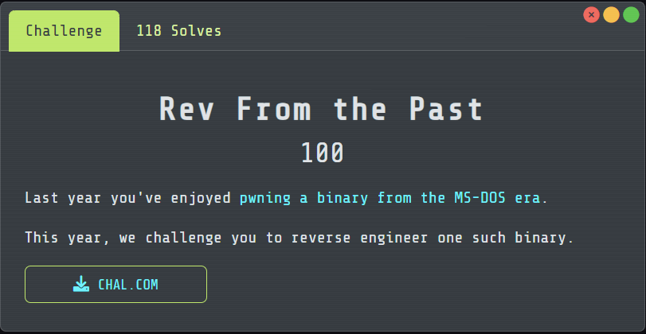

# Rev From The Past

## [1] TỔNG QUAN
- Đề bài:

    

## [2] PHÂN TÍCH
- Chương trình là DOS 16-bit .COM, nhận flag qua command line dạng `CHAL.COM FortID{...}`, rồi kiểm tra bằng một phép biến đổi bảng (xlat) + XOR.
- Chi tiết:
    - Đọc input kiểu DOS: Hàm ở 0x0060 push hết register, trỏ vào PSP:0x80 (command tail của DOS). Nó:
        - Bỏ space đầu.
        - So sánh đúng 7 ký tự đầu với chuỗi cố định tại DS:0x0234 → chính là "FortID{".
        - Sau đó copy nội dung trong ngoặc tới khi gặp '}' vào buffer tại DS:0x0258, tối đa 0x21 = 33 byte. Nếu format sai → in "Nope.".
    - Mảng tra cứu S (xlat table): Ở 0x00E0–0x012F, chương trình tạo mảng S độ dài 256 byte tại DS:0x0279:
        - Khởi tạo S[i] = i.
        - Dùng LFSR 16-bit với đa thức 0xB400:<br>
        `state = (state >> 1) ^ (0xB400 nếu state&1 == 1 else 0)`<br>
        Seed lấy từ DS:0x0254 (trong file là hằng 0xB4C1).
        - Dùng state % (i+1) làm chỉ số tráo kiểu Fisher-Yates để xáo S.
        - → Đây chính là bảng dùng bởi lệnh XLAT (AL := S[AL]).

    - Khối "ciphertext" cố định: Trong file, tại offset file `0x027e` (tương ứng `DS:0x037e` khi chạy) có 33 byte dữ liệu cố định:

        ```
        2a 35 a9 11 e3 6f 17 79 11 e3 79 88 94 b2 01 fd
        68 11 6f 01 b7 11 ac 6f 53 01 ce e2 11 84 35 35 51
        ```
    
    - Trước khi so sánh, chương trình XOR mỗi byte của khối này với `BL`, trong đó `BL = AL ^ 0xA5`, và `AL` là byte thấp của seed (0xC1).<br>
    ⇒ `BL = 0xC1 ^ 0xA5 = 0x64`.
    - So sánh: Với chuỗi ta nhập (trong ngoặc nhọn), nó lặp từng ký tự:
        - `AL = input[i]`
        - `AL = S[AL]` (XLAT với bảng vừa trộn)
        - So với byte đã XOR ở bước (3). Khớp toàn bộ 33 byte → in `"Correct!"`.
    - Suy ra flag: Vì điều kiện là `S[input[i]] == (cipher[i] ^ 0x64)`, ta chỉ việc đảo bảng S: `input[i] = S^{-1}[ cipher[i] ^ 0x64 ]`.

## [3] SOLVE
```python
from pathlib import Path

def build_sbox(seed):
    S = list(range(256))
    state = seed & 0xFFFF
    for i in range(0xFF, -1, -1):
        lsb = state & 1
        state = (state >> 1) & 0xFFFF
        if lsb:
            state ^= 0xB400
        j = state % (i + 1)
        S[i], S[j] = S[j], S[i]
    return S

def invert_box(S):
    inv = [0]*256
    for i, v in enumerate(S):
        inv[v] = i
    return inv

def solve(path="CHAL.COM"):
    data = Path(path).read_bytes()

    seed = int.from_bytes(data[0x0154:0x0156], "little")
    sbox = build_sbox(seed)
    inv = invert_box(sbox)

    ct = data[0x027e:0x027e + 0x21]
    xor_const = (seed & 0xFF) ^ 0xA5

    pt_bytes = bytes(inv[b ^ xor_const] for b in ct)
    flag = "FortID{" + pt_bytes.decode("ascii") + "}"
    return flag

if __name__ == "__main__":
    print(solve("CHAL.COM"))
```

> **Flag:** `FortID{N0w_S4v3_S3t71ng5_4nd_L4unch_D00M}`
