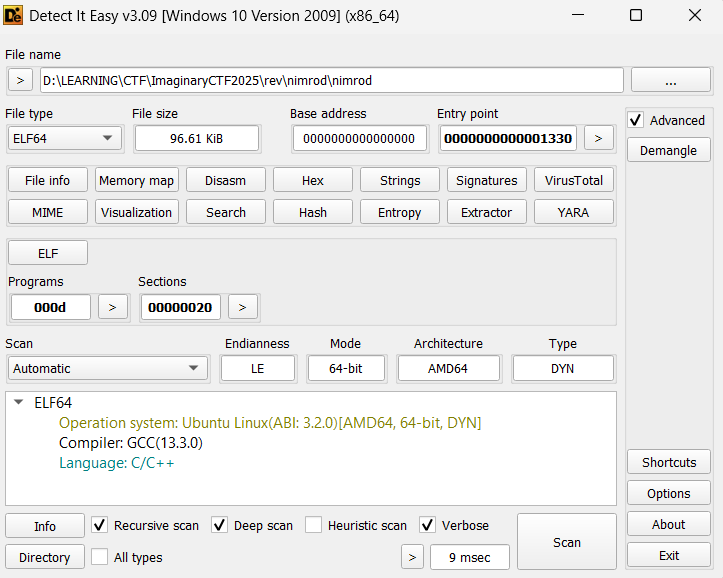
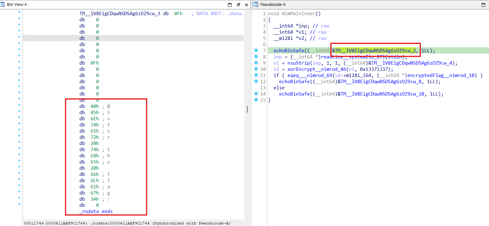
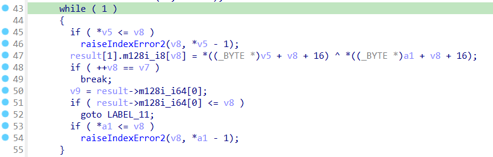
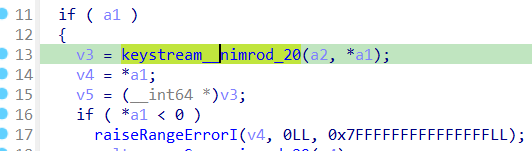
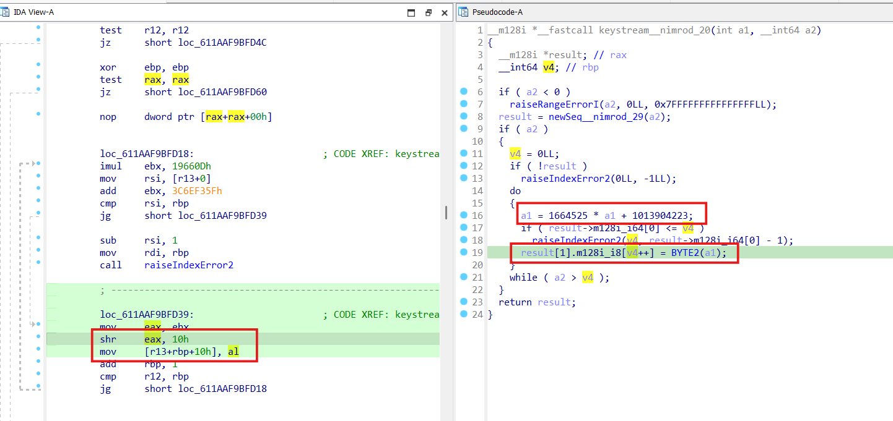
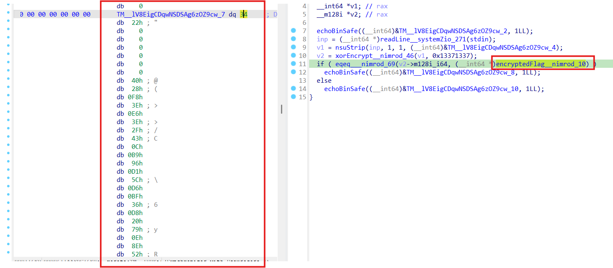

# nimrod

## [1] TỔNG QUAN
- Đánh giá ban đầu: Đây là file elf64 được compile bằng ngôn ngữ C/C++

    

- Tuy nhiên, khi tải vào IDA thì mình nhận ra nó được viết bằng ngôn ngữ nim.
- Dù vậy, các hàm cần phân tích cũng khá cơ bản và rõ ràng.

## [2] PHÂN TÍCH
- Khi mới load vào IDA, mình thấy ngay hàm `NimMainInner()`, tất cả các logic của chương trình đều nằm ở đây.

    

- Có thể đánh giá hàm `echoBinSafe()` giống như `printf()` trong C, còn `readLine__systemZio_271()` chính là `scanf()` như trong C.
- Hàm `nsuStrip()` đơn giản chỉ cắt đi những kí tự khoảng trắng thừa trong xâu input.
- Tiếp theo, ở dòng 10 chính là hàm mã hoá chính, hàm này không có gì khó, nó chỉ thực hiện xor flag với 1 chuỗi các kí tự trong keystream.

    

- `keystream` là 1 mảng byte được khởi tạo các giá trị bằng hàm `keystream__nimrod_20()` với tham số truyền vào là 1 `seed` có giá trị `0x13371337`.

    

- Hàm tạo key này thực hiện nhân `seed` với số `1664525` rồi cộng với `1013904223`, sau đó lấy 1 byte cuối khi dịch phải 2 byte, vòng lặp cứ tiếp tục như thế cho đến khi `key` mã hoá có độ dài bằng với `len(flag)`.

    

- Quay trở lại với hàm `NimMainInner()`, mình thấy có đoạn check ciphertext.

    

- Có thể thấy cipher có độ dài là 34 byte, tương đương với flag cũng có độ dài 34 byte, vì thế mình chỉ cần lấy ciphertext này và đem xor với key được tạo ra là sẽ ra được flag.

## [3] SOLVE
```python
def generate_keystream(seed, length):
    keystream = bytearray()
    state = seed

    multiplier = 1664525
    increment = 1013904223

    for _ in range(length):
        state = (multiplier * state + increment) & 0xFFFFFFFF

        key_byte = (state >> 16) & 0xFF
        keystream.append(key_byte)
    
    return keystream

def solve():
    SEED = 0x13371337

    encrypted_flag_bytes = [
        0x28, 0xF8, 0x3E, 0xE6, 0x3E, 0x2F, 0x43, 0x0C, 0xB9, 0x96, 
  0xD1, 0x5C, 0xD6, 0xBF, 0x36, 0xD8, 0x20, 0x79, 0x0E, 0x8E, 
  0x52, 0x21, 0xB2, 0x50, 0xE3, 0x98, 0xB5, 0xC9, 0xB8, 0xA0, 
  0x88, 0x30, 0xD9, 0x0A
    ]

    if not encrypted_flag_bytes:
        print("[-] Lỗi: Vui lòng chỉnh sửa script và điền giá trị cho biến 'encrypted_flag_bytes'.")
        print("[-] Bạn có thể lấy giá trị này bằng cách dùng debugger (GDB, IDA Pro, x64dbg) để xem nội dung của biến `encryptedFlag__nimrod_10`.")
        return

    flag_length = len(encrypted_flag_bytes)
    print(f"[+] Độ dài của flag đã mã hóa: {flag_length}")

    print(f"[+] Đang tạo keystream với seed = {hex(SEED)}...")
    keystream = generate_keystream(SEED, flag_length)
    print(f"[+] Keystream (dạng hex): {keystream.hex()}")

    print("[+] Đang giải mã...")
    decrypted_flag = bytearray()
    for i in range(flag_length):
        decrypted_byte = encrypted_flag_bytes[i] ^ keystream[i]
        decrypted_flag.append(decrypted_byte)

    print("\n" + "="*30)
    try:
        print(f"[+] SUCCESS! Flag đã giải mã là: {decrypted_flag.decode('utf-8')}")
    except UnicodeDecodeError:
        print(f"[+] Hoàn thành! Flag đã giải mã (dạng byte): {decrypted_flag}")
        print(f"[+] Flag đã giải mã (dạng hex): {decrypted_flag.hex()}")
    print("="*30)


if __name__ == "__main__":
    solve()

```
> **Flag:** `ictf{a_mighty_hunter_bfc16cce9dc8}`