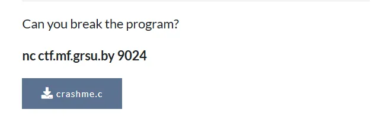
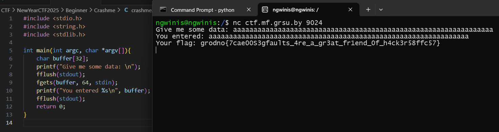
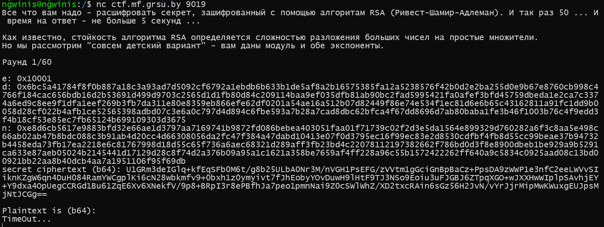
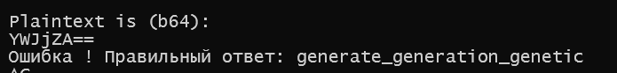
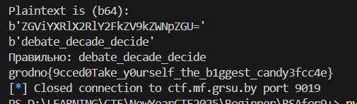
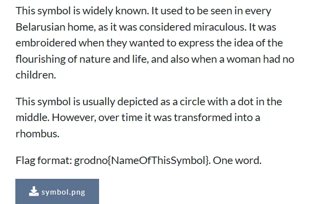
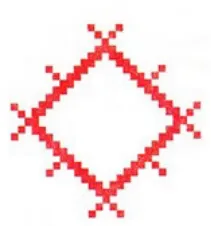
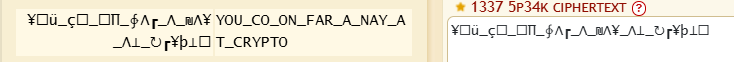

# New Year CTF 2025
## **[1] - BEGINNER**
### **[Crash Me]**

This challenge requires player to input a string of at least 64 characters and we'll get the flag:



> ***Flag:** grodno{7cae00S3gfaults_4re_a_gr3at_fr1end_0f_h4ck3r58ffc57}*

### **[RSA for 9+]**
- This is a crypto challenge using RSA algorithm. There are a random number of rounds for each connection and we have to answer each question in at most 5 seconds or we'll get "TimedOut...".

- First, I connect to server and get all 2 exponent `e` and `d`, the modulo `n` and the `ciphertext` also.


- If we calculate plaintext with `pow(c,d,n)`, server will return the error:
```
Traceback (most recent call last):
File "/usr/local/bin/python9019.py", line 60, in <module>
    data = base64.b64decode(data).decode()
UnicodeDecodeError: 'utf-8' codec can't decode byte 0x9d in position 1: invalid start byte
```
- This means the data we've sent to server is a bunch of unreadable bytes, so that base64 cannot decode it.

- In another case, I sent `YWJjZA==` (base64 of `abcd`), I got error and the true message:

- Repeat this process and I realized that the message is random.

- I tried to reverse all the bytes of secret ciphertext and decrypted it by calculating `pow(c,d,n)` and I got the text which can be read.

- Now, we can just use pwntools to solve the challenge: 
[solve.py](Beginner/RSAfor9+/solve.py)

> ***Flag:** grodno{9cced0Take_y0urself_the_b1ggest_candy3fcc4e}*

### **[Symbol]**
- The description tells us that the symbol is used to be seen in every Belarusian home so that I searched it with Google Lens and found that its name is Sun



> ***Flag:** grodno{Sun}*
## **[2] CODE ANALYSIS**
### **[From 8 to 16]**
- We were given a code used to encrypt the flag:
```python
def rev001(flag):
    return ''.join([chr((ord(flag[i]) << 8) + ord(flag[i + 1])) for i in range(0, len(flag), 2)])
```
- Each 2 bytes was joined to generate a 16-bit character by the following way:
```
'g' = '01100111'
'g' << 8 = '01100111 00000000'
'r' = '01110010'
'g' << 8 + 'r' = '01100111 01110010' = 26482 = '杲'
```
All we need to do is to reverse these processes:
```python
def decrypt(cipher):
    return ''.join([chr(ord(cipher[i]) >> 8) + chr(int(bin(ord(cipher[i]))[-8:], 2)) for i in range(0, len(cipher))])

s = open('enc-transf', 'r', encoding='utf-8').read()
s = decrypt(s)
print(f'flag: {s}')
```

> ***Flag:** grodno{instead_of_8_bits_make_16_bits}*
## **[3] CRYPTO**
### **[The hacker sent]**
We were given a string `¥☐ü_ç☐_☐∏_∲Λ┏_Λ_₪Λ¥_Λ⊥_↻┏¥þ⊥☐`. Use [dcode.fr](dcode.fr) to identify the cipher and we can see that it's [Leet Speak 1337](https://www.dcode.fr/leet-speak-1337). Decrypt it and we get the plaintext:


> ***Flag:** grodno{YOU_GO_ON_FAR_A_WAY_AT_CRYPTO}*
### **[Speeding Up RSA]**
- The given modulo `n` has 1024 bits, `p` and `q` are random where `q` is one of the next primes of `p`. So we can take square root of `n` to find `p` and next, we can divide `n` by `p` to get `q`:
- **Solve:** [solve.py](Crypto/SpeedingupRSA/solve.py)

> ***Flag:** grodno{Ofru*YgePg8h}*
