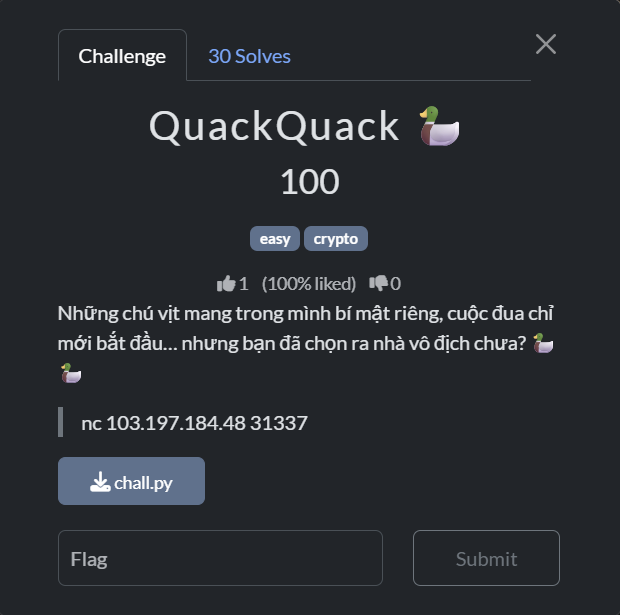

# Quack Quack

## [1] TỔNG QUAN
- Đề bài:

    

## [2] PHÂN TÍCH
- Mỗi round server cho `commit = SHA1(seed)` và `ticket = (seed*31337 + 1337) mod 2^16`.
- `BITS = 20` ⇒ `0 <= seed <= 2**20`. Với ticket mod `2**16 ` ta suy ra đúng 16 seed dạng `x + 2**16k` (với k=0..15) bằng cách lấy nghịch đảo 31337 mod `2**16`, rồi lọc bằng SHA1 để ra seed chính xác.
- Biết seed ⇒ khởi tạo lại DuckEngine (giống hệt server) và mô phỏng đến khi cán đích để lấy lane thắng, rồi gửi trước khi đua bắt đầu.

## [3] SOLVE
```python
from pwn import remote, context
import hashlib

BITS = 20
MOD  = 1 << BITS
ROUND_CONST = 0x9E377
TILE_NORMAL, TILE_BOOST, TILE_MUD, TILE_OIL = ".", "B", "M", "O"

def sha1_hex(x: int) -> str:
    return hashlib.sha1(str(x).encode()).hexdigest()

def ticket_of(seed: int) -> int:
    return (seed * 31337 + 1337) & 0xFFFF

def seed_for_round(secret: int, r: int) -> int:
    return (secret ^ ((r * ROUND_CONST) % MOD)) % MOD

def derive_int(*parts, bits=64):
    h = hashlib.sha1()
    for p in parts:
        h.update(str(p).encode()); h.update(b"|")
    return int.from_bytes(h.digest(), "big") & ((1 << bits) - 1)

import random, time

class FancyTrack:
    def __init__(self, seed, lane, length):
        rng = random.Random(derive_int("track", seed, lane, length, bits=64))
        self.tiles = []
        for _ in range(length):
            r = rng.random()
            self.tiles.append(TILE_BOOST if r<0.06 else TILE_MUD if r<0.11 else TILE_OIL if r<0.16 else TILE_NORMAL)
    def at(self, x, length): 
        return self.tiles[x] if 0 <= x < length else TILE_NORMAL

class DuckEngine:
    def __init__(self, seed, n, length=60):
        self.rng = random.Random(seed)
        self.n, self.length = n, length
        self.x   = [0]*n
        self.cd  = [0]*n
        self.trk = [FancyTrack(seed, i, length) for i in range(n)]
        self.wind_bias = self.rng.random()*0.08
        self.wind_puff = self.rng.random()*0.05
        self.finish_eps = [ (derive_int("finish_eps", seed, i, length, bits=64)/float(1<<64))*1e-6 + i*1e-9 for i in range(n) ]

    def step_once(self):
        prev = self.x[:]
        for i in range(self.n):
            prog = self.x[i]/max(1,self.length)
            step = self.rng.choice([0,1,1,1,2] if prog<0.7 else [0,1,1,1,1,2])
            if self.rng.random() < self.wind_bias: step += 1
            if self.rng.random() < self.wind_puff: step += 1
            if any(px - prev[i] in (1,2) for j,px in enumerate(prev) if j!=i): step += 1
            tentative = min(self.length, self.x[i]+step)
            tile = self.trk[i].at(tentative, self.length)
            slip_p = 0.05 + (0.10 if tile==TILE_OIL else 0.0)
            if tile==TILE_BOOST: step += 1
            elif tile==TILE_MUD: step = max(0, step-1)
            if self.rng.random() < slip_p:
                self.x[i] = max(0, self.x[i]-1)
                if self.cd[i]>0: self.cd[i]-=1
                continue
            if self.cd[i]<=0 and self.rng.random()<0.08:
                step += 2
                self.cd[i] = self.rng.randint(10,16)
            self.x[i] = min(self.length, self.x[i]+step)
            if self.cd[i]>0: self.cd[i]-=1

    def winner_1based_eps(self):
        best_i, best_s = 0, -1e99
        for i in range(self.n):
            s = self.x[i] - (self.length + self.finish_eps[i])
            if s > best_s: best_s, best_i = s, i
        return best_i+1

def modinv(a, m):
    r0, r1 = a % m, m
    s0, s1 = 1, 0
    while r1:
        q = r0 // r1
        r0, r1 = r1, r0 - q*r1
        s0, s1 = s1, s0 - q*s1
    if r0 != 1:
        raise ValueError("no inverse")
    return s0 % m

INV_31337 = modinv(31337, 1<<16)

def recover_seed_from_commit_ticket(commit_hex: str, ticket: int):
    base_x = ((ticket - 1337) * INV_31337) & 0xFFFF
    for k in range(16):
        s = base_x + (k << 16)
        if sha1_hex(s) == commit_hex:
            return s
    raise RuntimeError("Seed not found (unexpected)")

def solve(host="103.197.184.48", port=31337, track_len=60):
    context.log_level = "error"
    io = remote(host, port)

    def recv_until_contains(substr: str, timeout=10.0):
        buf = ""
        end = time.time() + timeout
        while time.time() < end:
            try:
                line = io.recvline(timeout=0.5).decode("utf-8", "ignore")
            except EOFError:
                break
            buf += line
            if substr in buf:
                return buf
        return buf

    recv_until_contains("Bạn phải chọn lane thắng")

    round_idx = 0
    while True:
        blk = recv_until_contains("Hãy nhập chỉ số vịt thắng", timeout=30.0)

        import re
        m_n = re.search(r"Hãy nhập chỉ số vịt thắng \(1\.\.(\d+)\)", blk)
        m_c = re.search(r"COMMIT:\s*([0-9a-fA-F]{40})", blk)
        m_t = re.search(r"TICKET:\s*(\d+)", blk)
        if not (m_n and m_c and m_t):
            print("[!] Parse fail, block:\n", blk)
            return

        n = int(m_n.group(1))
        commit = m_c.group(1).lower()
        ticket = int(m_t.group(1))

        seed = recover_seed_from_commit_ticket(commit, ticket)
        eng = DuckEngine(seed, n, track_len)
        while max(eng.x) < eng.length:
            eng.step_once()
        win_lane = eng.winner_1based_eps()

        io.sendline(str(win_lane).encode())
        round_idx += 1
        post = recv_until_contains("SHA1(seed)", timeout=5.0)
        if "Bạn đoán sai" in post:
            print(f"[x] Sai ở round {round_idx}")
            return
        if "FLAG:" in post:
            print(post)
            break

    rest = io.recvrepeat(2.0).decode("utf-8", "ignore")
    if "FLAG:" in rest:
        print(rest)
    io.close()

if __name__ == "__main__":
    solve()
```

> **Flag:** `PTITCTF{predict_the_quacker_y0u_crypto_duckmaster!}`