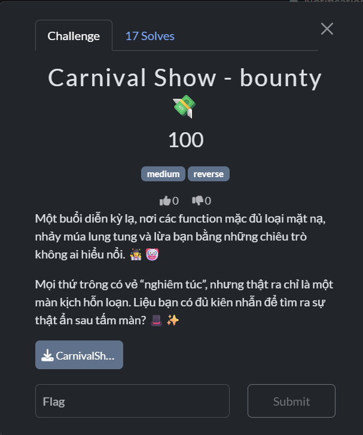
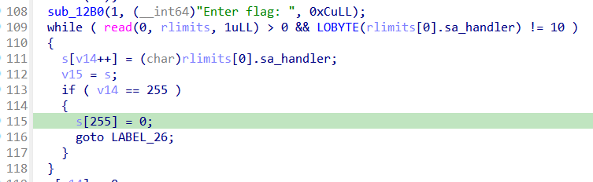
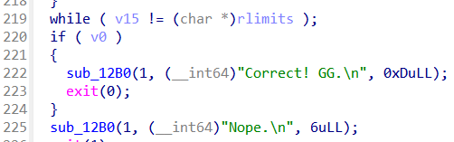
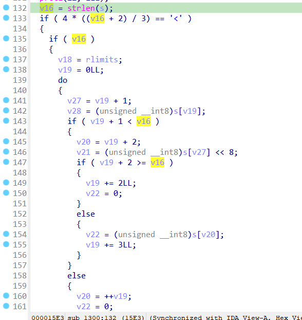
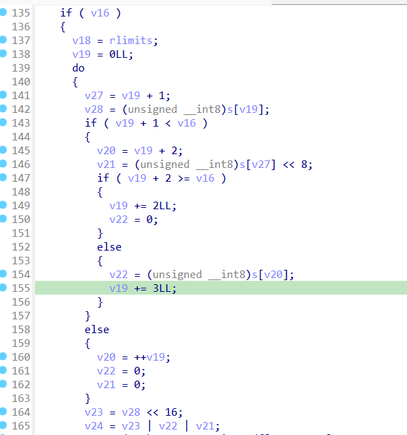
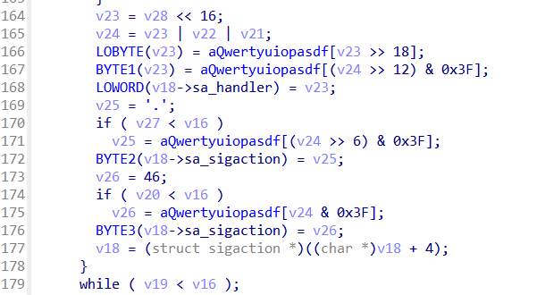
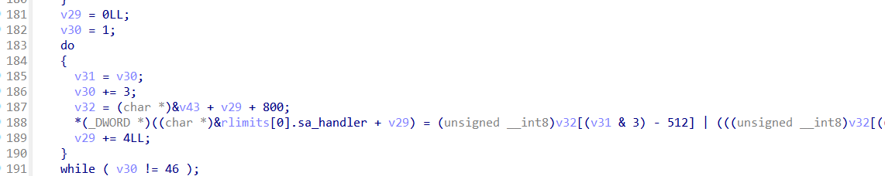
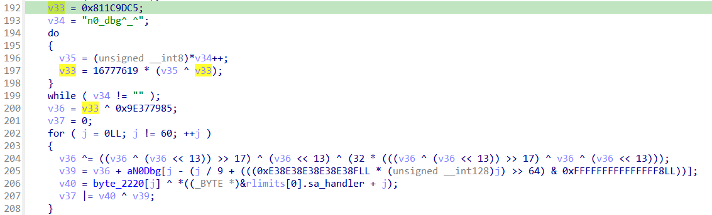

# Carnival Show

## [1] TỔNG QUAN
- Đề bài:

    

## [2] PHÂN TÍCH
### [2.1] Logic chính của chương trình:
- Mình mở bảng strings trong IDA và tìm thì thấy có 1 string khá quen thuộc `"Correct!"` và `"Nope."` nên mình focus vào đó thì mình thấy luôn logic chính của chương trình nằm tại hàm `sub_1300()`
- Đây chính là chỗ nhập input:
    
    

- Ngay phía dưới chính là logic check flag và in ra màn hình thông báo correct hoặc nope.

    

- Từ đó có thể suy ra logic mã hoá sẽ nằm ở ngay giữa 2 phần này:

    

- Ta có công thức `4 * ((L + 2)/3)` là độ dài Base64 của chuỗi đầu vào.
    
    ⇒ Điều kiện buộc độ dài `base64(input)` == 60.

    Giải ra: `4 * ((L+2)/3) = 60` ⇒ `(L+2)/3 = 15` ⇒ `L = 43`.

    Từ đó suy ra flag plaintext dài đúng 43 byte. Nếu không phải 43, chương trình bỏ qua toàn bộ kiểm tra chính và sẽ fail.

- Nếu điều kiện độ dài pass (L=43), hàm đi vào check
- Phần đầu tiên là Base64 tự custom
    - Lặp qua `s` theo cụm 3 byte → xuất 4 ký tự.

        

    - Bảng chữ cái được sử dụng là `QWERTYUIOPASDFGHJKLZXCVBNMqwertyuiopasdfghjklzxcvbnm0123456789-_`
    - Padding ở cuối thường dùng là dấu `=`, tuy nhiên bảng custom này lại dùng dấu `.`

        

- Phần thứ 2 là hoán vị theo khối 4 byte:

    

    - Chuỗi `v31 = 1, 4, 7, …, 43` (15 giá trị) ⇒ tức có 15 khối 4 byte.
    - Mỗi khối ứng với một phép xoay theo byte với s = `v31 & 3`:<br>
    Với dãy trên, `v31 & 3` chạy theo chu kỳ `1,0,3,2,1,0,3,2,...`
    - Kết quả khối đã xoay được chép sang một vùng khác (vẫn mượn field của `rlimits`).

- Phần thứ 3 là PRNG mask 60 byte

    

    - `v33` là 1 mã hash FNV-1a 32-bit của `"empty_string"`, rồi XOR với 0x9E377985.
    - PRNG `v36` cập nhật theo kiểu xorshift + feedback.
    - `v39` là mask byte: `v36` + `"n0_dbg^_^"[j % 9]`.
    - `byte_2220[j]` là mảng 60 byte trong .rodata:

        ```python
        byte_2220 = [
        0x87, 0xA4, 0x55, 0x21, 0xAC, 0x4B, 0x57, 0xAE, 0x13, 0xAB, 
        0x5D, 0x97, 0x5C, 0xFD, 0xF0, 0xB5, 0xCA, 0x5D, 0x22, 0xCF, 
        0xE7, 0xE0, 0x3F, 0x98, 0x49, 0x58, 0x06, 0xAF, 0x87, 0x90, 
        0x50, 0xBC, 0xE3, 0xA9, 0x30, 0xFC, 0xE0, 0xB3, 0x8F, 0xAE, 
        0x4C, 0x04, 0x56, 0x39, 0x76, 0xC0, 0x39, 0x93, 0xDC, 0x08, 
        0x21, 0xF7, 0xC2, 0xE2, 0x56, 0xFC, 0xFE, 0x16, 0xDE, 0x43]
        ```
    - `rlimits[0].sa_handler` là 60 byte đã qua (base64 custom) + (xoay khối 4B).
    - Gán cho biến `v37` bằng phép OR bit của `(byte_2220[j] ^ permenc[j]) ^ mask[j]`.

- Có thể hiểu phương trình cốt lõi cho mỗi vị trí j là:

    ```
    C[j]  ^  permute4( custom_b64(s) )[j]  ==  PRNG(j)
    ```
    hay tương đương:
    ```
    permute4( custom_b64(s) )[j]  ==  C[j] ^ PRNG(j)
    ```

### [2.2] Anti-debug:
- Dưới đây là bảng các kỹ thuật anti-debug được sử dụng trong chương trình này (đa phần nằm ở hàm xử lý logic `sub_1300()`):

| #  | Kỹ thuật                                             | Mục đích / Dấu hiệu                            | Vị trí gọi (trong `sub_1300`)                                          | Ghi chú nhanh                                                                                |
| -- | ---------------------------------------------------- | ---------------------------------------------- | ---------------------------------------------------------------------- | -------------------------------------------------------------------------------------------- |
| 1  | `ptrace(PTRACE_TRACEME)` (syscall 101)               | Bị attach/trace → trả `-1`                     | Ngay đầu hàm `sub_1300` (≈ `sub_1300+0x00`)                            | Nếu fail: log `"Debugger detected (ptrace).\n"` rồi `exit(1337)`                             |
| 2  | Đọc `/proc/self/status` tìm `TracerPid` (`sub_1040`) | Có tracer cha → `TracerPid != 0`               | `call sub_1040` (đầu hàm, ngay sau #1)                                 | Nếu có: `"Debugger detected (TracerPid).\n"` → `exit(1338)`                                  |
| 3  | Kiểm tra **cha đáng ngờ** (`sub_10F0`)               | Parent là tracer/launcher lạ                   | `call sub_10F0` (sau #2)                                               | Nếu có: `"Debugger parent detected.\n"` → `exit(1339)`                                       |
| 4  | Kiểm tra **preload env**                             | Hook qua `LD_PRELOAD`, `DYLD_INSERT_LIBRARIES` | 2× `getenv` và so sánh (sau #3)                                        | Nếu var tồn tại & non-empty: `"Suspicious preload env.\n"` → `exit(1340)`                    |
| 5  | **TSC timing anti single-step**                      | Single-step làm thời gian vòng lặp lớn         | Khối `v43=__rdtsc(); for(...) v44+=i; v45=__rdtsc(); if (v45-v43>4e7)` | Nếu vượt ngưỡng: `"Suspicious single-step timing.\n"` → `exit(1341)`                         |
| 6  | **Quét INT3 (0xCC)** quanh checker                   | Phát hiện breakpoint cứng                      | Vòng `for` duyệt từ `sub_1300` đến `sub_1300+64`                       | Nếu thấy `0xCC`: `"Breakpoint detected near checker.\n"` → `exit(1342)`                      |
| 7  | `cpuid` kiểm tra **hypervisor bit**                  | Phát hiện chạy trong VM (ECX\[31])             | Cặp `cpuid` sau vòng quét 0xCC                                         | Chỉ **cảnh báo**: `"[warn] Running under hypervisor.\n"` (không thoát)                       |
| 8  | **Tắt core dump**                                    | Giảm thông tin rò rỉ khi crash                 | `setrlimit(RLIMIT_CORE, ...)` (sau `cpuid`)                            | Chuẩn hardening anti-RE                                                                      |
| 9  | `prctl(PR_SET_DUMPABLE, 0)`                          | Cấm sinh core dump / gdb attach khó hơn        | `prctl(4, 0)` ngay sau #8                                              | 4 = `PR_SET_DUMPABLE`                                                                        |
| 10 | `prctl(PR_SET_NAME, "[kworker/u:0]")`                | Ngụy trang tên tiến trình                      | `prctl(15, "[kworker/u:0]")`                                           | 15 = `PR_SET_NAME`                                                                           |
| 11 | Cài **signal handlers**                              | Bẫy `SIGTRAP` & `SIGALRM`                      | `sigaction(5, ...)` và `sigaction(14, ...)`                            | Handler là `sub_1A40`                                                                        |
| 12 | `alarm(3)`                                           | Cắt phiên khi debug/treo                       | `alarm(3u)`                                                            | Timeout 3 giây                                                                               |
| 13 | `prctl(PR_SET_PDEATHSIG, 1)`                         | Chết theo parent / né trick reparent           | `prctl(22, 1)` ngay trước bước xử lý base64                            | 22 = `PR_SET_PDEATHSIG` — không “chống debug” trực diện, nhưng phá nhiều flow attach/suspend |
| 14 | **Scrub bộ nhớ tạm**                                 | Xoá vùng `rlimits` trước khi thoát             | Vòng set 0 từ `rlimits` tới `v49`                                      | Giảm artifact khi dump                                                                       |


## [3] SOLVE
- Script giải: [solve.py](solve.py)
> **Flag:** `PTITCTF{Y0u_c4n_bypass_4ll_types_0f_4nt1!!!}`