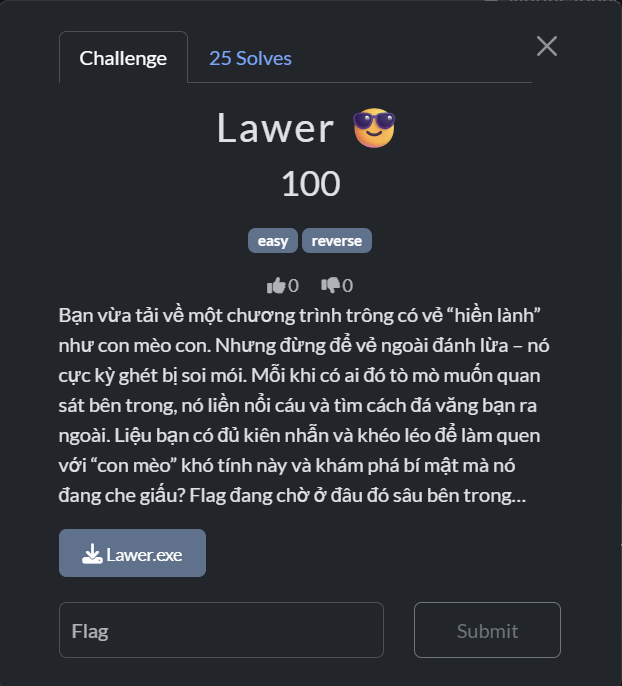
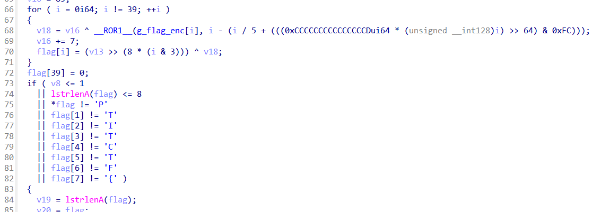
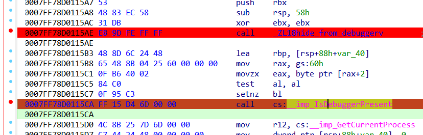
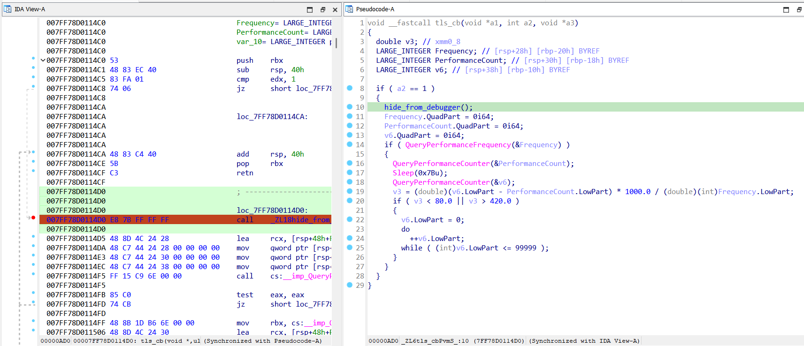
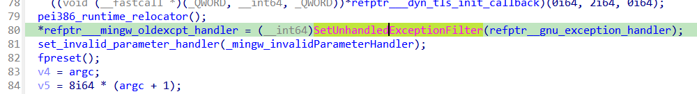

# Lawer

## [1] TỔNG QUAN
- Đề bài:

    

## [2] PHÂN TÍCH
- Mình mở bảng strings trong IDA thì thấy có đoạn `"[CTF] FLAG: "` nên mình đã focus vào hàm chứa nó, chính là hàm `WinMain()`.
- Tại đây mình thấy có đoạn decrypt khá rõ ràng:

    

- Phân tích kĩ hơn thì có thể thấy hằng `0xCCCC...CCCD` là kỹ thuật chia nhanh cho 5 của compiler. Biểu thức xoay:

    ```i - (i/5 + (((magic * i) >> 64) & 0xFC))```

    rút gọn thành i % 5 (vì `(magic * i>>64)` ≈ `floor(i/5)` và `& 0xFC` giữ bội số của 4, tổng là `5*floor(i/5)`).

    Từ đó có thể suy ra rằng thực chất: `__ROR1__(g_flag_enc[i], i % 5)` là xoay phải 8-bit theo i mod 5.

- Tiếp theo là 2 keystream XOR

    `v16 += 7` mỗi vòng → keystream cấp số cộng `mod 256`:

    `k1[i] = (seed + 7*i) & 0xFF` (với `seed = v16` lúc khởi đầu vòng lặp)

    `(v13 >> (8*(i&3)))` → lấy một byte của `v13` theo `i mod 4` (little-endian):

    `k2[i] = (v13 >> (8*(i&3))) & 0xFF`

- Tóm lại vòng lặp này đang giải mã 1 chuỗi hardcoded encrypt, mình có thể chỉ cần debug rồi cho nó chạy qua vòng for này và lấy kết quả trả về `flag` là xong. Tuy nhiên, thứ khiến cho bài này khó nhằn hơn là nó có khá nhiều chỗ đặt anti-debug.

    - Đây là 1 chỗ anti-debug ở ngay hàm `WinMain()`:

        
    
    - Đây là 1 kĩ thuật anti-debug ở hàm `Tls_Callback_0()`:

        
    
    - 1 kĩ thuật anti-debug nữa được đặt ở hàm `_tmainCRTStartup()`:

        
    
- Tất cả các kĩ thuật anti-debug này cũng khá lành tính, nếu gặp phải, nó chỉ gây crash chương trình chứ không thay đổi data nào. Tuy nhiên để bypass khi debug thì cũng khá phiền, nên mình phân tích tĩnh rồi lấy các phần quan trọng ra để giải thôi.

## [3] SOLVE
- Cách giải tĩnh:
    
    ```
    plain[i] = ROR8(enc[i], i%5) XOR (seed + 7i % 256) XOR ((v13 >> 8(i%4)) & 256)
    ```

- Source:
    ```python
    import struct

    PE = "Lawer.exe"
    TAG = b"[CTF] FLAG: "
    PREFIX = b"PTITCTF{"

    def ror8(x, r): r &= 7; return ((x >> r) | ((x & 0xff) << (8 - r))) & 0xff

    with open(PE, "rb") as f: blob = f.read()
    e_lfanew = int.from_bytes(blob[0x3c:0x40], "little")
    nsec     = int.from_bytes(blob[e_lfanew+6:e_lfanew+8], "little")
    optsz    = int.from_bytes(blob[e_lfanew+20:e_lfanew+22], "little")
    tab      = e_lfanew + 24 + optsz
    rdata = None
    for i in range(nsec):
        off = tab + 40*i
        name = blob[off:off+8].rstrip(b"\x00")
        roff = int.from_bytes(blob[off+20:off+24], "little")
        rsz  = int.from_bytes(blob[off+16:off+20], "little")
        if name == b".rdata":
            rdata = blob[roff:roff+rsz]; break

    p = rdata.find(TAG); q = p + len(TAG)
    while rdata[q] == 0: q += 1
    enc = bytearray(rdata[q:q+64])

    def try_seed(seed):
        k2 = [None]*4
        for i, want in enumerate(PREFIX):
            k1  = (seed + 7*i) & 0xFF
            rot = i % 5
            val = want ^ ror8(enc[i], rot) ^ k1
            j = i & 3
            if k2[j] is None: k2[j] = val
            elif k2[j] != val: return None
        return seed, k2

    candidate = next((res for s in range(256) if (res:=try_seed(s))), None)
    seed, k2 = candidate

    plain = bytes(ror8(c, i%5) ^ ((seed + 7*i) & 0xFF) ^ k2[i&3] for i, c in enumerate(enc))
    print(plain.decode("utf-8", "replace"))

    ```
    > **Flag:** `PTITCTF{This_1snot_m4lware_don't_worry}`