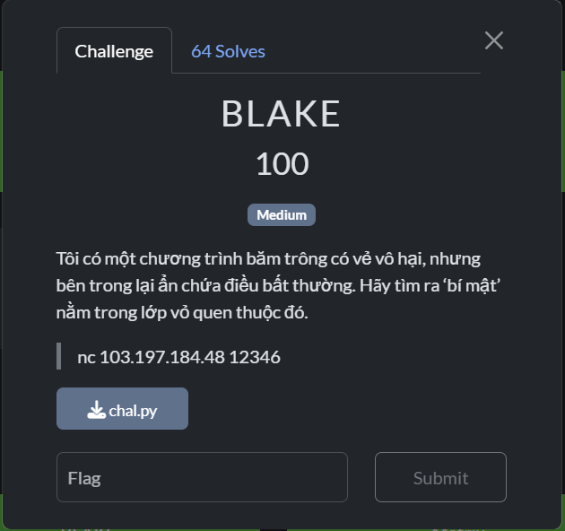

# Blake

## [1] TỔNG QUAN
- Đề bài:

    

- Bài này yêu cầu nc tới server và nhập password thì sẽ in ra flag. Vì thế việc cần làm là decrypt ciphertext để lấy được password.

## [2] SOLVE
```python
import sys

sys.set_int_max_str_digits(0)

N = int("7fed997cfb3a3e8440142aba39d2c62ef03e773f8d98d7d373b3e8336903ca122cdffa11fd4de735776c9aefdd1607c70f0c403bd745d2e3065fede7f22dbfa94ea22b833b2442bd474a88694305b0f389162ca25eddf2673baeb3b6a2855842a0a0a022a2a222a28802a2022888822a8a20aa20a28022a08088200a8a800801", 16)
C = int("16c88a06c4203b9ce6f5f652a52f449ce37347afb5cb25b0a1bf0b105f158246bd64adb2b6f2a563fa747d31b9ba4af54efd9449f6b75b1ea83015fefb1e1d206f20ca31fdf47ee45bbb382c9aa6e7ff7946f9973a2edebdb412bdc48e9a157cb36eb2e599c9c0a27153983d316b0d9ce08ef9d06f536b2ff29cf5393fba056d", 16)
E = 1234567891
NBIT = 256

def magicc(n: int) -> int:
    B = bin(n)[2:].zfill(NBIT)
    M = ''.join('01' if b == '0' else '11' for b in B)
    return int(M, 2)

def invert_magicc_str(magic_bin_str: str) -> str:
    if len(magic_bin_str) % 2 != 0:
        raise ValueError("Chuỗi nhị phân đầu vào phải có độ dài chẵn")
    
    original_bin = ""
    for i in range(0, len(magic_bin_str), 2):
        pair = magic_bin_str[i:i+2]
        if pair == '01':
            original_bin += '0'
        elif pair == '11':
            original_bin += '1'
        else:
            raise ValueError(f"Cặp bit không hợp lệ '{pair}' trong chuỗi magicc")
    return original_bin

print("[+] Bắt đầu quá trình phân tích N...")

k = 2**NBIT
r_lsbs = (-N) % k
print(f"[1] Tính toán 256 bit cuối của r (r_lsbs): {r_lsbs:x}")

r_lsbs_bin = bin(r_lsbs)[2:].zfill(NBIT)

p_lo_bin = invert_magicc_str(r_lsbs_bin)
p_lo = int(p_lo_bin, 2)
print(f"[2] Khôi phục 128 bit cuối của p (p_lo): {p_lo:x}")

target = N >> 640

low = 2**(NBIT // 2 - 1)
high = 2**(NBIT // 2) - 1
p_hi_candidate = -1

print("[3] Bắt đầu tìm kiếm nhị phân cho p_hi...")
while low <= high:
    mid = (low + high) // 2
    if mid == 0:
        low = mid + 1
        continue
    mid_magicc = int(''.join('01' if b == '0' else '11' for b in bin(mid)[2:].zfill(NBIT//2)), 2)
    approx_val = mid * mid_magicc
    
    if approx_val < target:
        low = mid + 1
    elif approx_val > target:
        high = mid - 1
    else:
        p_hi_candidate = mid
        break

p_hi = -1
for candidate in range(low - 10, low + 10):
    if candidate <= 0: continue
    p_candidate = (candidate << (NBIT // 2)) + p_lo
    q_candidate = p_candidate * k + (k - 1)
    if N % q_candidate == 0:
        p = p_candidate
        q = q_candidate
        r = N // q
        p_hi = candidate
        print(f"[+] Tìm thấy p_hi thành công: {p_hi:x}")
        break

if p_hi == -1:
    print("[-] Không tìm thấy p_hi. Thử lại hoặc điều chỉnh vùng tìm kiếm.")
    exit()

print(f"[4] Khôi phục thành công các giá trị:")
print(f"  p = {p:x}")
print(f"  q = {q:x}")
print(f"  r = {r:x}")

print("\n[+] Bắt đầu giải mã RSA...")
phi = (q - 1) * (r - 1)
print(f"[5] Tính toán phi (Euler's totient): {phi:x}")

d = pow(E, -1, phi)
print(f"[6] Tính toán d (khóa riêng): {d:x}")

m = pow(C, d, N)
print(f"[7] Giải mã được m: {m:x}")

byte_length = (m.bit_length() + 7) // 8
m_bytes = m.to_bytes(byte_length, 'big')
required_input = m_bytes.decode('utf-8', errors='ignore')

print("\n" + "="*50)
print("  KẾT QUẢ CUỐI CÙNG")
print("="*50)
print(f"Chuỗi đầu vào cần nhập để lấy FLAG là:\n\n{required_input}")
print("="*50)
```

> **Input**: `ghost_round_sigma12`