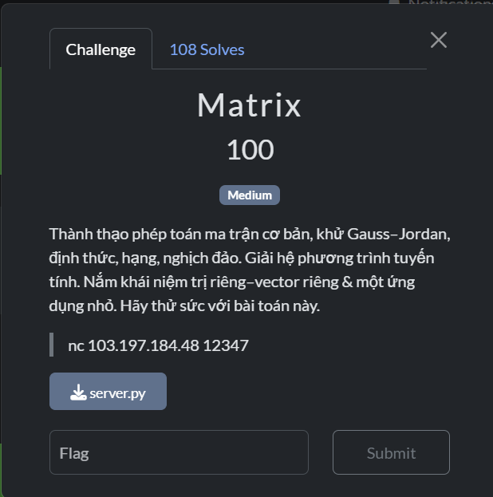

# Matrix

## [1] TỔNG QUAN
- Đề bài:

    

## [2] SOLVE

```python
import argparse, re, sys, telnetlib, subprocess

P = 1_000_000_007
N = 5

def V_matrix():
    return [[pow(k, r, P) for r in range(N)] for k in range(1, N+1)]

def mat_T(A):
    return [list(x) for x in zip(*A)]

def mat_mul(A, B, mod=P):
    n = len(A); m = len(B); p = len(B[0])
    assert len(A[0]) == m
    R = [[0]*p for _ in range(n)]
    for i in range(n):
        Ai = A[i]
        for k in range(m):
            aik = Ai[k] % mod
            if aik == 0: continue
            Bk = B[k]
            for j in range(p):
                R[i][j] = (R[i][j] + aik * (Bk[j] % mod)) % mod
    return R

def mat_inv(A, mod=P):
    n = len(A)
    M = [row[:] for row in A]
    I = [[1 if i==j else 0 for j in range(n)] for i in range(n)]
    for col in range(n):
        piv = col
        while piv < n and M[piv][col] % mod == 0:
            piv += 1
        if piv == n:
            raise ValueError("singular matrix")
        if piv != col:
            M[col], M[piv] = M[piv], M[col]
            I[col], I[piv] = I[piv], I[col]
        inv_piv = pow(M[col][col] % mod, mod-2, mod)
        for j in range(n):
            M[col][j] = (M[col][j] * inv_piv) % mod
            I[col][j] = (I[col][j] * inv_piv) % mod
        for r in range(n):
            if r == col: continue
            fac = M[r][col] % mod
            if fac:
                for j in range(n):
                    M[r][j] = (M[r][j] - fac * M[col][j]) % mod
                    I[r][j] = (I[r][j] - fac * I[col][j]) % mod
    return I

def needed_bytes(x: int) -> int:
    if x == 0: return 1
    n = 0
    while x:
        x //= 256
        n += 1
    return n

def decode_flag_from_F(F):
    parts = [F[i][j] % P for i in range(N) for j in range(N)]
    while parts and parts[-1] == 0:
        parts.pop()
    if not parts:
        return b""
    CH = max(needed_bytes(x) for x in parts)
    last_len = needed_bytes(parts[-1])
    blobs = []
    for x in parts[:-1]:
        blobs.append(int(x).to_bytes(CH, "big"))
    blobs.append(int(parts[-1]).to_bytes(last_len, "big"))
    data = b"".join(blobs)
    return data.rstrip(b"\x00")

# ----------- Oracle I/O -----------

_S_RE = re.compile(r"s_(\d)(\d)\s*=\s*(\d+)")

def _read_sij_from_stream(readline_func):
    while True:
        line = readline_func()
        if not line:
            raise EOFError("Stream closed before receiving s_ij")
        if isinstance(line, (bytes, bytearray)):
            dec = line.decode(errors="ignore")
        else:
            dec = line
        m = _S_RE.search(dec)
        if m:
            return int(m.group(3))

def gather_S_via_telnet(host, port):
    tn = telnetlib.Telnet(host, port)
    S = [[0]*N for _ in range(N)]
    try:
        tn.read_until(b"Commands", timeout=2)
    except Exception:
        pass
    for i in range(1, N+1):
        for j in range(1, N+1):
            tn.write(f"{i} {j}\n".encode())
            val = _read_sij_from_stream(lambda: tn.read_until(b"\n", timeout=5))
            S[i-1][j-1] = val
    tn.write(b"done\n")
    return S

def gather_S_via_local(chal_path):
    proc = subprocess.Popen(
        [sys.executable, chal_path],
        stdin=subprocess.PIPE, stdout=subprocess.PIPE, stderr=subprocess.STDOUT,
        bufsize=1, text=True
    )
    S = [[0]*N for _ in range(N)]
    try:
        for _ in range(5):
            line = proc.stdout.readline()
            if not line: break
    except Exception:
        pass
    for i in range(1, N+1):
        for j in range(1, N+1):
            proc.stdin.write(f"{i} {j}\n"); proc.stdin.flush()
            val = _read_sij_from_stream(proc.stdout.readline)
            S[i-1][j-1] = val
    try:
        proc.stdin.write("done\n"); proc.stdin.flush()
    except BrokenPipeError:
        pass
    try:
        proc.terminate()
    except Exception:
        pass
    return S

# ----------- Solve -----------

def recover_flag(S):
    V = V_matrix()
    Vinv = mat_inv(V, P)
    F = mat_mul(mat_mul(Vinv, S, P), mat_T(Vinv), P)
    data = decode_flag_from_F(F)
    try:
        text = data.decode()
    except UnicodeDecodeError:
        text = None
    return data, text, F

def main():
    ap = argparse.ArgumentParser(description="Solve Vandermonde bilinear oracle (recover F and FLAG)")
    g = ap.add_mutually_exclusive_group(required=True)
    g.add_argument("--host", help="remote host")
    ap.add_argument("--port", type=int, help="remote port")
    g.add_argument("--local", help="path to local chal.py")
    ap.add_argument("--show-matrices", action="store_true", help="print S and F")
    args = ap.parse_args()

    if args.host:
        if not args.port:
            ap.error("--port is required with --host")
        S = gather_S_via_telnet(args.host, args.port)
    else:
        S = gather_S_via_local(args.local)

    data, text, F = recover_flag(S)
    print("[*] Recovered bytes:", data)
    if text is not None:
        print("[*] FLAG:", text)
    else:
        print("[*] FLAG (hex):", data.hex())

    if args.show_matrices:
        import pprint
        print("\n[Matrix] S ="); pprint.pp(S, width=120)
        print("\n[Matrix] F ="); pprint.pp(F, width=120)

if __name__ == "__main__":
    main()
```