# AntiChatGPT

## [1] TỔNG QUAN
- Đề bài:

    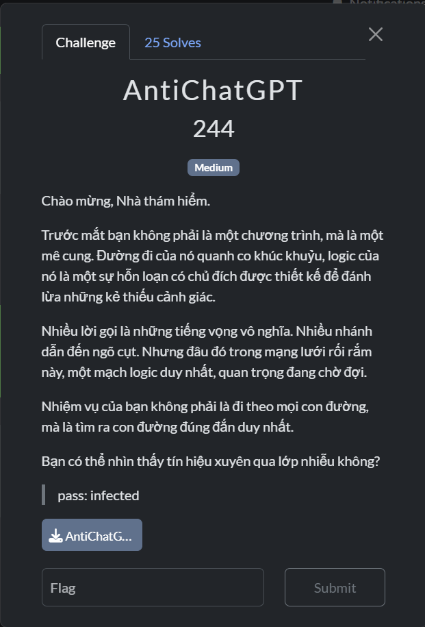

## [2] PHÂN TÍCH
- Chạy thử chương trình thì mình thấy chương trình yêu cầu nhập flag và một số dòng output như sau

    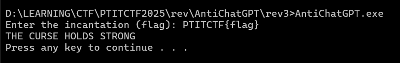

- Dựa vào những đoạn string này, mình đã cố gắng tìm thử nó trong bảng Strings nhưng không có đoạn nào như vậy cả, vì thế mình đã tìm trong section `.rdata` xem nó có gì thì mình phát hiện một số data khá lạ

    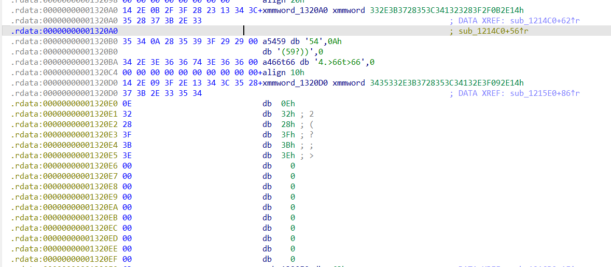

- Bên dưới còn có 1 mảng data khác trông khá khớp với mảng S-box trong các thuật toán mã hoá khối như AES, DES,...

    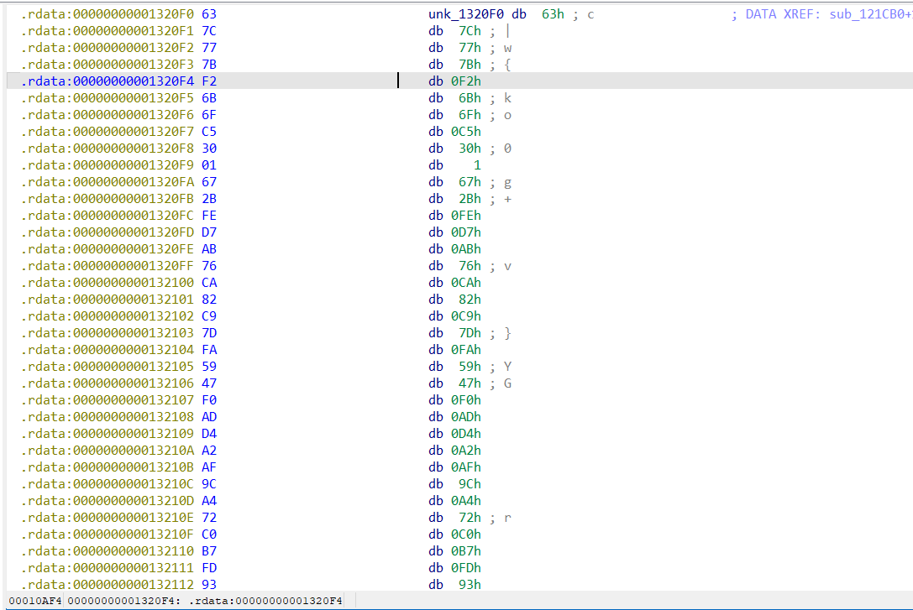

- Từ đây mình xref tới chỗ gọi các biến này để xem nó làm gì và hàm xử lý các data này chính là hàm `sub_122FF0()`

    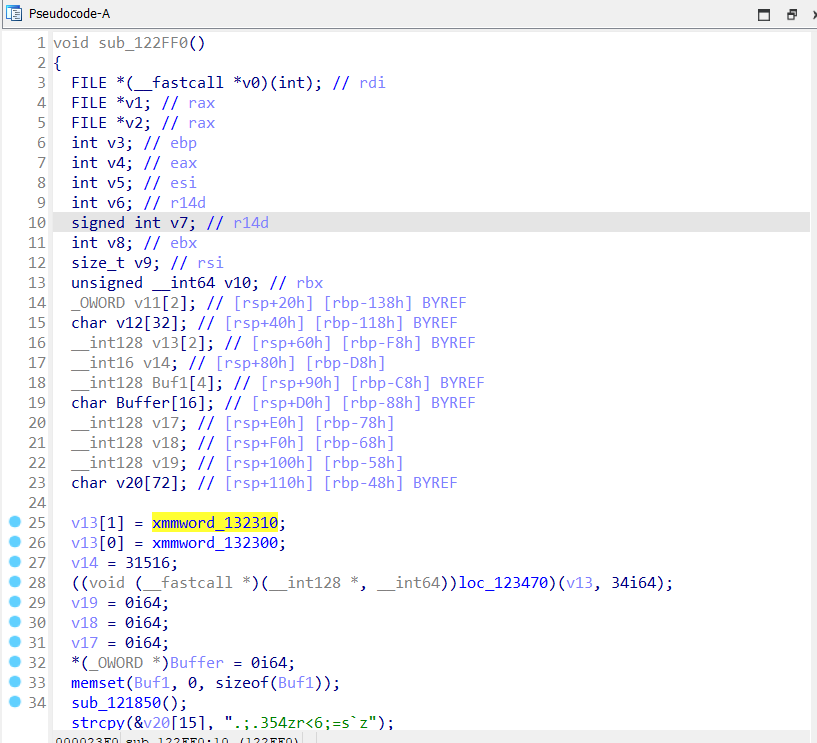

- Hàm này xử lý khá nhiều data mà mình tìm được nên mình đã debug nó, tuy nhiên mình đã bị crash khi cố chạy qua hàm `sub_121850()`.

    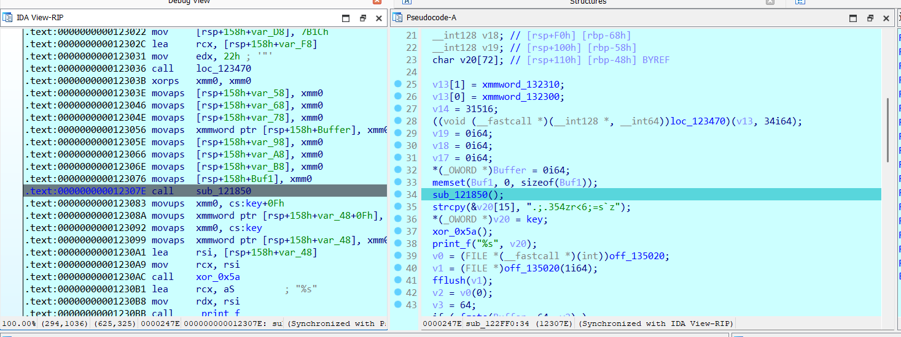

- Nghi ngờ gặp anti-debug nên mình đã debug vào nó để xem thử thì hàm này chứa khá nhiều kĩ thuật anti-debug phổ biến như đoạn dưới đây

    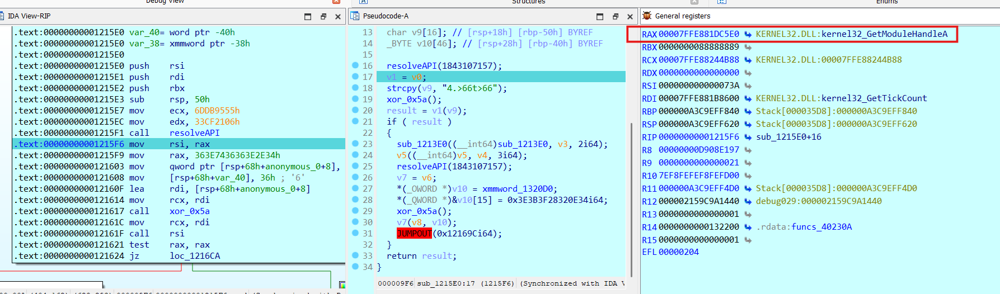

- Thực ra bên trong nó vẫn còn kĩ thuật anti-debug `IsDebuggerPresent()` nữa, nhưng mình thấy các kĩ thuật này không thay đổi data gì hết mà chỉ làm crash chương trình, ngăn cản mình debug thôi nên mình đã pass qua cả hàm `sub_121850()` để debug tiếp.
- Tiếp tục phía dưới có một hàm được gọi khá nhiều mỗi khi có data được load vào, hàm này chỉ thực hiện xor từng phần tử của data mà nó nhận vào với byte `0x5a` nên mình đổi tên nó thành `xor_0x5a()`

    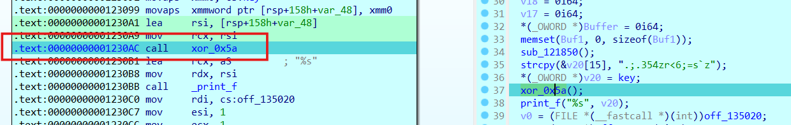

- Mình debug tiếp thì output mình nhận được đúng như những gì mình đã chạy chương trình

    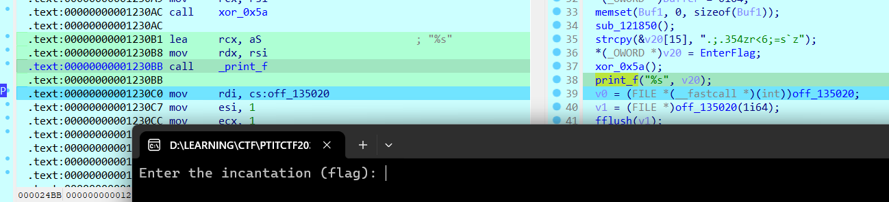

- Ở ngay đoạn dưới có chỗ compare, mình đoán chỗ này chính là `cipher` nên mình xem thử nó có độ dài bao nhiêu để nhập vào input cho nó tính toán

    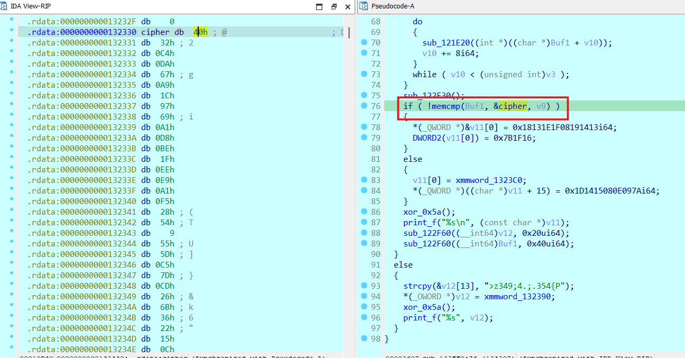

    ```python
    cipher = [0x40, 0x32, 0xC4, 0xDA, 0x67, 0xA9, 0x1C, 0x97, 0x69, 0xA1, 
  0xD8, 0xBE, 0x1F, 0xEE, 0xE9, 0xA1, 0xF5, 0x28, 0x54, 0x09, 
  0x55, 0x5D, 0xC5, 0x7D, 0xCD, 0x26, 0x6B, 0x36, 0x22, 0x15, 
  0x0C, 0xE2, 0x5E, 0x5E, 0xBE, 0xA5, 0xFF, 0x4A, 0x24, 0x34, 
  0x05, 0xF5, 0x7D, 0xDD, 0xBA, 0x9F, 0x62, 0xEB]
    ```

- `cipher` này dài 48 byte nên mình nhập chuỗi 48 byte `'a'` rồi tiếp tục debug.
- Ở phía dưới có đoạn gọi tới hàm xử lý `key` mã hoá, key này cũng là đoạn data và sau khi xor với `0x5a` thì nó là string `Th1s_1s_A_V3ry_S3cr3t_K3y_F0r_CTF!`

    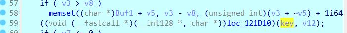

- Khi chạy qua hàm này, mình thấy key dài thêm ra, có lẽ nó đã được padding thêm
- Tiếp tục ngay phía dưới đó có một vòng lặp nhận input vào với từng khối 8 byte

    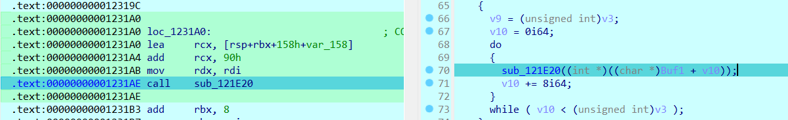

- Dự đoán đây chính là hàm mã hoá, nên mình đã focus vào nó để xem nó mã hoá như thế nào

    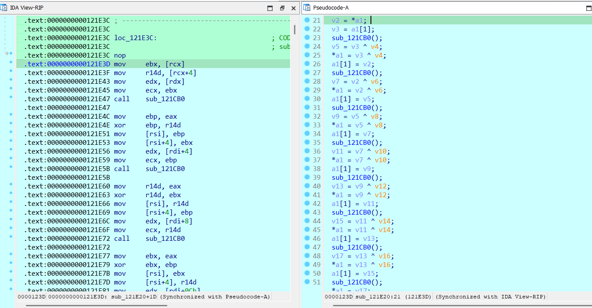

- Hàm này chỉ thực hiện các phép xor cơ bản giữa các phần tử trong mỗi khối 8 byte của flag. Và hàm cuối cùng thực hiện tra bảng `SBOX` rồi ghép các byte lại thành 1 số 32-bit.

    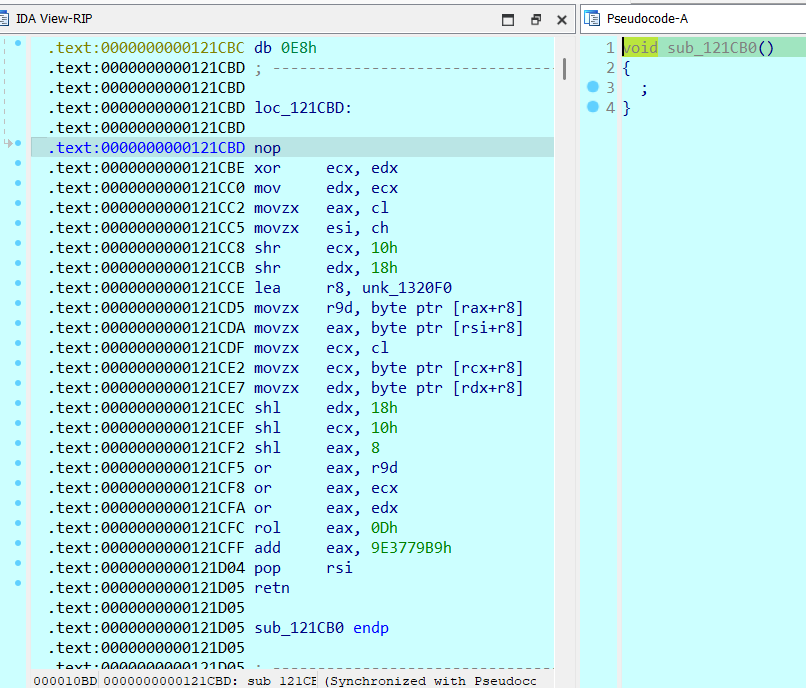
    
## [3] SOLVE
- Dưới đây là cách giải của mình:

    ```python
    import struct

    S_BOX = [
        0x63, 0x7C, 0x77, 0x7B, 0xF2, 0x6B, 0x6F, 0xC5, 0x30, 0x01, 0x67, 0x2B, 0xFE, 0xD7, 0xAB, 0x76,
        0xCA, 0x82, 0xC9, 0x7D, 0xFA, 0x59, 0x47, 0xF0, 0xAD, 0xD4, 0xA2, 0xAF, 0x9C, 0xA4, 0x72, 0xC0,
        0xB7, 0xFD, 0x93, 0x26, 0x36, 0x3F, 0xF7, 0xCC, 0x34, 0xA5, 0xE5, 0xF1, 0x71, 0xD8, 0x31, 0x15,
        0x04, 0xC7, 0x23, 0xC3, 0x18, 0x96, 0x05, 0x9A, 0x07, 0x12, 0x80, 0xE2, 0xEB, 0x27, 0xB2, 0x75,
        0x09, 0x83, 0x2C, 0x1A, 0x1B, 0x6E, 0x5A, 0xA0, 0x52, 0x3B, 0xD6, 0xB3, 0x29, 0xE3, 0x2F, 0x84,
        0x53, 0xD1, 0x00, 0xED, 0x20, 0xFC, 0xB1, 0x5B, 0x6A, 0xCB, 0xBE, 0x39, 0x4A, 0x4C, 0x58, 0xCF,
        0xD0, 0xEF, 0xAA, 0xFB, 0x43, 0x4D, 0x33, 0x85, 0x45, 0xF9, 0x02, 0x7F, 0x50, 0x3C, 0x9F, 0xA8,
        0x51, 0xA3, 0x40, 0x8F, 0x92, 0x9D, 0x38, 0xF5, 0xBC, 0xB6, 0xDA, 0x21, 0x10, 0xFF, 0xF3, 0xD2,
        0xCD, 0x0C, 0x13, 0xEC, 0x5F, 0x97, 0x44, 0x17, 0xC4, 0xA7, 0x7E, 0x3D, 0x64, 0x5D, 0x19, 0x73,
        0x60, 0x81, 0x4F, 0xDC, 0x22, 0x2A, 0x90, 0x88, 0x46, 0xEE, 0xB8, 0x14, 0xDE, 0x5E, 0x0B, 0xDB,
        0xE0, 0x32, 0x3A, 0x0A, 0x49, 0x06, 0x24, 0x5C, 0xC2, 0xD3, 0xAC, 0x62, 0x91, 0x95, 0xE4, 0x79,
        0xE7, 0xC8, 0x37, 0x6D, 0x8D, 0xD5, 0x4E, 0xA9, 0x6C, 0x56, 0xF4, 0xEA, 0x65, 0x7A, 0xAE, 0x08,
        0xBA, 0x78, 0x25, 0x2E, 0x1C, 0xA6, 0xB4, 0xC6, 0xE8, 0xDD, 0x74, 0x1F, 0x4B, 0xBD, 0x8B, 0x8A,
        0x70, 0x3E, 0xB5, 0x66, 0x48, 0x03, 0xF6, 0x0E, 0x61, 0x35, 0x57, 0xB9, 0x86, 0xC1, 0x1D, 0x9E,
        0xE1, 0xF8, 0x98, 0x11, 0x69, 0xD9, 0x8E, 0x94, 0x9B, 0x1E, 0x87, 0xE9, 0xCE, 0x55, 0x28, 0xDF,
        0x8C, 0xA1, 0x89, 0x0D, 0xBF, 0xE6, 0x42, 0x68, 0x41, 0x99, 0x2D, 0x0F, 0xB0, 0x54, 0xBB, 0x16
    ]

    CIPHERTEXT = bytes([
        0x40, 0x32, 0xC4, 0xDA, 0x67, 0xA9, 0x1C, 0x97,
        0x69, 0xA1, 0xD8, 0xBE, 0x1F, 0xEE, 0xE9, 0xA1,
        0xF5, 0x28, 0x54, 0x09, 0x55, 0x5D, 0xC5, 0x7D,
        0xCD, 0x26, 0x6B, 0x36, 0x22, 0x15, 0x0C, 0xE2,
        0x5E, 0x5E, 0xBE, 0xA5, 0xFF, 0x4A, 0x24, 0x34,
        0x05, 0xF5, 0x7D, 0xDD, 0xBA, 0x9F, 0x62, 0xEB
    ])

    BLOCK_SIZE = 8
    DELTA = 0x9E3779B9

    def rol32(x, bits):
        return 0xFFFFFFFF & ((x << bits) | (x >> (32 - bits)))

    def generate_subkeys(key: bytes) -> list[int]:
        # Unpack 16-byte key thành 4 số nguyên 32-bit (little-endian)
        p = list(struct.unpack('<4I', key[:16]))
        subkeys = [0] * 8

        v5 = p[3]
        v4 = 0xFFFFFFFF & (rol32(v5, 11) ^ p[0])
        v1 = p[1]
        v2 = 0xFFFFFFFF & (p[2] ^ (v1 + v4))
        v5 = 0xFFFFFFFF & ((v2 ^ 99) + v5)
        subkeys[0] = v4

        v3 = 0xFFFFFFFF & (rol32(v5, 11) ^ v4)
        v1 = 0xFFFFFFFF & (v1 + v4 + v3)
        v2 = 0xFFFFFFFF & (v2 ^ v1)
        v5 = 0xFFFFFFFF & ((v2 ^ 0x1F) + v5)
        subkeys[1] = v1

        v3 = 0xFFFFFFFF & (rol32(v5, 11) ^ v3)
        v1 = 0xFFFFFFFF & (v1 + v3)
        v2 = 0xFFFFFFFF & (v2 ^ v1)
        v4 = 0xFFFFFFFF & (v2 ^ 0x68)
        v5 = 0xFFFFFFFF & (v5 + v4)
        subkeys[2] = v4

        v3 = 0xFFFFFFFF & (rol32(v5, 11) ^ v3)
        v1 = 0xFFFFFFFF & (v1 + v3)
        v2 = 0xFFFFFFFF & (v2 ^ v1)
        v5 = 0xFFFFFFFF & ((v2 ^ 0x13) + v5)
        subkeys[3] = v5

        v3 = 0xFFFFFFFF & (rol32(v5, 11) ^ v3)
        v1 = 0xFFFFFFFF & (v1 + v3)
        v2 = 0xFFFFFFFF & (v2 ^ v1)
        v5 = 0xFFFFFFFF & ((v2 ^ 0xE1) + v5)
        subkeys[4] = v3

        v3 = 0xFFFFFFFF & (rol32(v5, 11) ^ v3)
        v1 = 0xFFFFFFFF & (v1 + v3)
        v2 = 0xFFFFFFFF & (v2 ^ v1)
        v5 = 0xFFFFFFFF & ((v2 ^ 0x8A) + v5)
        subkeys[5] = v1

        v3 = 0xFFFFFFFF & (rol32(v5, 11) ^ v3)
        v1 = 0xFFFFFFFF & (v1 + v3)
        v2 = 0xFFFFFFFF & (v2 ^ v1)
        v4 = 0xFFFFFFFF & (v2 ^ 0xE5)
        v5 = 0xFFFFFFFF & (v5 + v4)
        subkeys[6] = v4

        v3 = 0xFFFFFFFF & (rol32(v5, 11) ^ v3)
        subkeys[7] = 0xFFFFFFFF & (((v3 + v1) ^ v2 ^ 0x20) + v5)

        return subkeys

    def f_function(data: int, subkey: int) -> int:
        temp = data ^ subkey
        
        b0 = S_BOX[(temp >> 0) & 0xFF]
        b1 = S_BOX[(temp >> 8) & 0xFF]
        b2 = S_BOX[(temp >> 16) & 0xFF]
        b3 = S_BOX[(temp >> 24) & 0xFF]
        
        sbox_result = (b3 << 24) | (b2 << 16) | (b1 << 8) | b0
        
        return 0xFFFFFFFF & (rol32(sbox_result, 13) + DELTA)


    def decrypt_block(block: bytes, subkeys: list[int]) -> bytes:
        # Unpack 8-byte block thành 2 số nguyên 32-bit (L và R)
        L, R = struct.unpack('<2I', block)

        # Vòng lặp giải mã Feistel (8 vòng)
        R = R ^ f_function(L, subkeys[7])
        for i in range(6, -1, -1):
            L, R = R, L ^ f_function(R, subkeys[i])
            
        # Pack L và R trở lại thành 8 bytes
        return struct.pack('<2I', L, R)


    def main():
        key = b"Th1s_1s_A_V3ry_S3cr3t_K3y_F0r_CTF!"
        
        # Lưu ý: Thuật toán chỉ sử dụng 16 bytes đầu tiên của key
        print(f"Sử dụng 16 bytes key: {key[:16]}")
        
        # 1. Sinh các khóa con từ key chính
        subkeys = generate_subkeys(key)
        
        # 2. Giải mã từng khối dữ liệu
        decrypted_bytes = b""
        for i in range(0, len(CIPHERTEXT), BLOCK_SIZE):
            block = CIPHERTEXT[i : i + BLOCK_SIZE]
            decrypted_bytes += decrypt_block(block, subkeys)
            
        # 3. Decode kết quả từ bytes sang chuỗi UTF-8 để đọc
        flag = decrypted_bytes.decode('utf-8')
        print("Flag:", end=' ')
        print(flag)

    if __name__ == "__main__":
        main()

> **Flag**: `PTITCTF{k1ng_0f_Pt1t_NigM4o_z3ro_d4Y_zxo}`