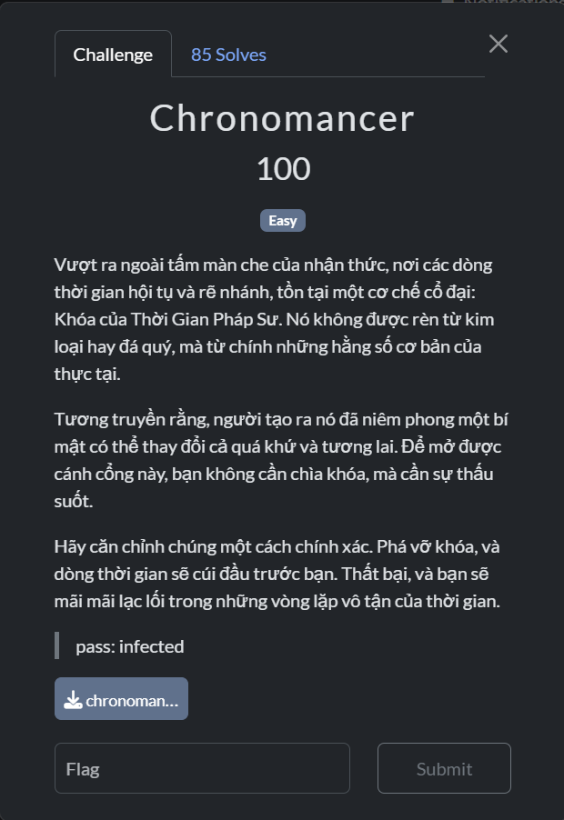
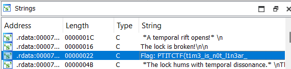
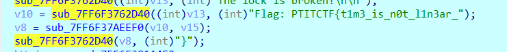
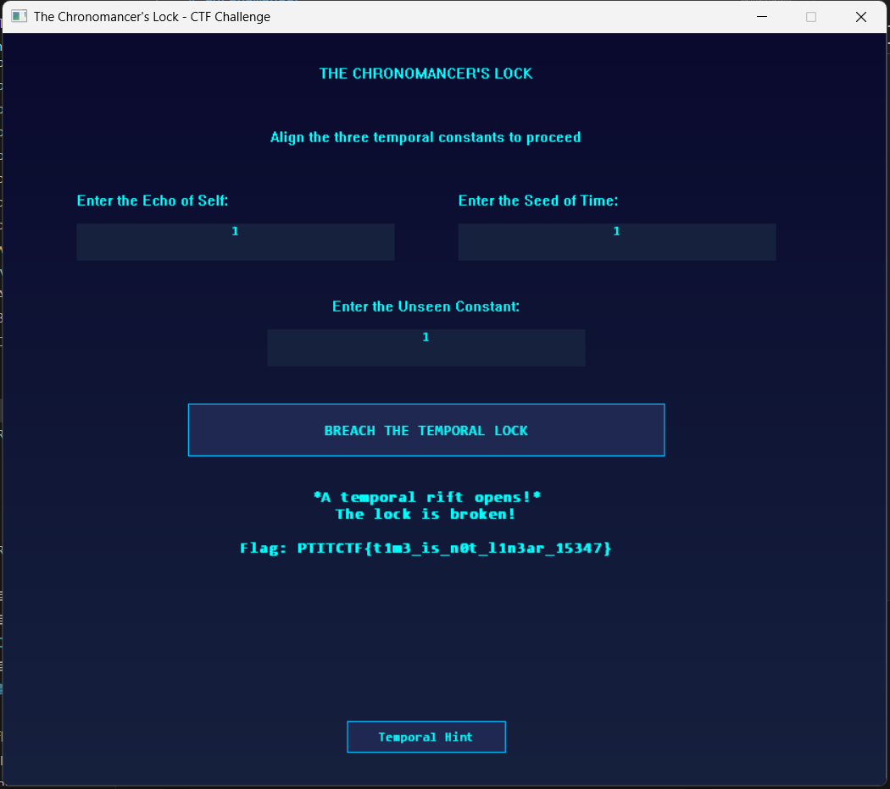

# Chronomancer

## [1] TỔNG QUAN
- Đề bài:

    

- Challenge này khá đơn giản, mình chỉ debug rồi xem nó in ra những gì là xong.

## [2] PHÂN TÍCH & SOLVE
- Mở bảng Strings thì thấy có 1 đoạn flag như sau:

    

- Dự đoán đây chính là 1 phần của flag, mình chỉ cần focus vào nó rồi debug tới chỗ xử lý nó là được.

    

- Có thể dự đoán đoạn này chính là đoạn xử lý và ghép chuỗi flag.
- Tới đây chỉ việc nhấn F9 để chạy đến cuối chương trình sẽ hiện ra flag ở trên GUI:

    

> **Flag**: `PTITCTF{t1m3_is_n0t_l1n3ar_15347}`