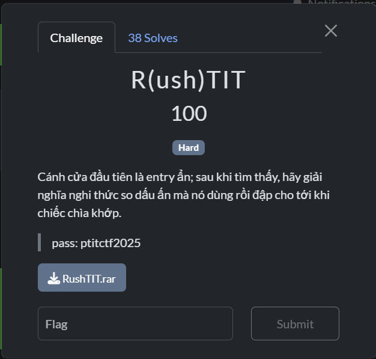
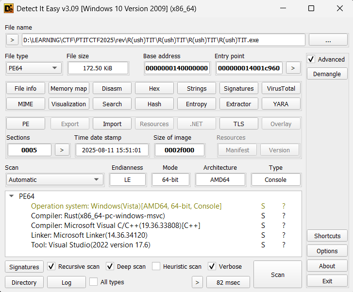
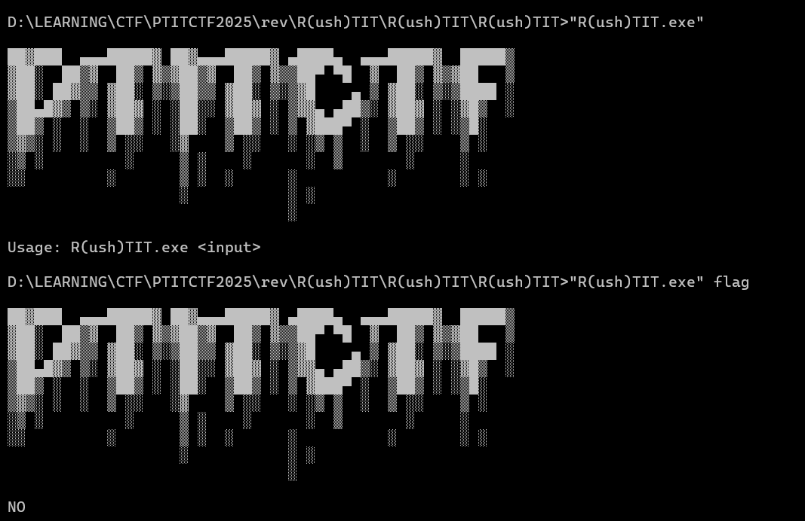
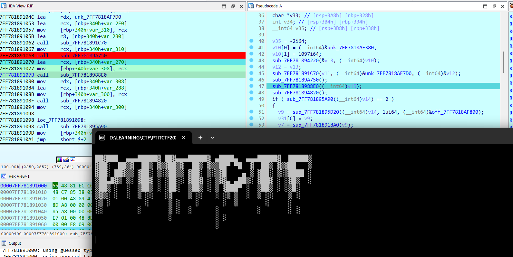
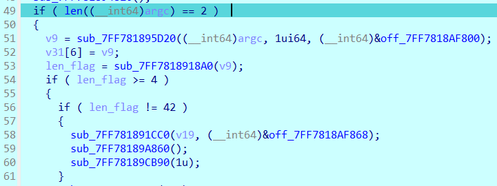
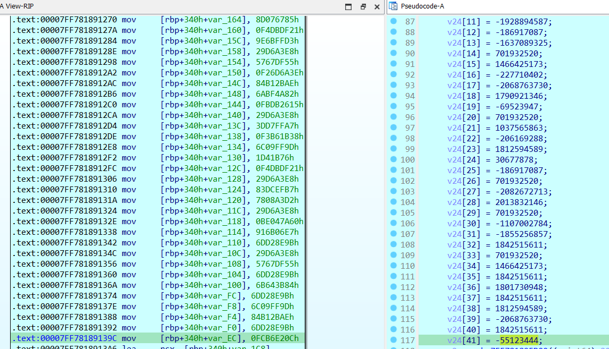
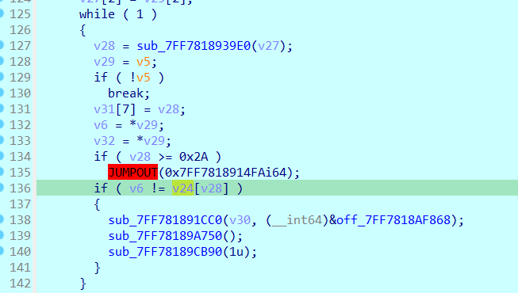

# R(ush)TIT

## [1] TỔNG QUAN
- Đề bài:

    

- Chương trình được cung cấp là 1 file PE được compile bằng ngôn ngữ Rust và nó đã bị obfuscate khá nhiều.

    

## [2] PHÂN TÍCH
- Chạy thử chương trình bằng cmd, mình thấy có yêu cầu chạy chương trình với đối số truyền vào rồi mình nhập thử 1 chuỗi bất kì thì chương trình in ra lỗi:

    

- Sau đó mình debug trong IDA để tìm đoạn nó in ra chỗ này và focus vào nó thì mình thấy luồng thực thi chính có in ra các thành phần kia nằm ở hàm `sub_7FF781891000()`
    
    

- Sau đó mình tiếp tục đọc phần bên dưới của hàm này, thấy có đoạn kiểm tra số tham số khi run chương trình và kiểm tra độ dài của flag.

    

- Có thể kết luận flag có độ dài 42 kí tự.
- Tiếp tục kéo xuống phía dưới thì mình phát hiện có 1 mảng chứa đúng 42 phần tử và được gán với 1 số hex nào đó trông khá giống mã hash, sau đó mình đã thử 1 vài số hex đó thì nhận ra đây chính là hash crc32, mỗi số hex đó đại diện cho 1 kí tự của flag.

    
- Ở gần cuối cũng có 1 đoạn compare với chuỗi mã hash này

    

## [3] SOLVE
- Vì mỗi mã hash này là 1 kí tự của flag, đều là kí tự đọc được nên mình sử dụng phương pháp bruteforce toàn bộ kí tự đọc được của ascii, lưu vào 1 dictionary rồi search toàn bộ các mã hash kia
- Solve:
    ```python
    import binascii

    # Danh sách hash (CRC32 của từng ký tự)
    v24 = [
        0xB969BE79, 0xBE047A60, 0xDD0216B9, 0xBE047A60,
        0x3DD7FFA7, 0xBE047A60, 0x4DBD0B28, 0x15D54739,
        0x4AD0CF31, 0x83DCEFB7, 0x7808A3D2, 0x8D076785,
        0xF4DBDF21, 0x9E6BFFD3, 0x29D6A3E8, 0x5767DF55,
        0xF26D6A3E, 0x84B12BAE, 0x6ABF4A82, 0xFBDB2615,
        0x29D6A3E8, 0x3DD7FFA7, 0xF3B61B38, 0x6C09FF9D,
        0x01D41B76, 0xF4DBDF21, 0x29D6A3E8, 0x83DCEFB7,
        0x7808A3D2, 0x29D6A3E8, 0xBE047A60, 0x916B06E7,
        0x6DD28E9B, 0x29D6A3E8, 0x5767DF55, 0x6DD28E9B,
        0x6B643B84, 0x6DD28E9B, 0x6C09FF9D, 0x84B12BAE,
        0x6DD28E9B, 0xFCB6E20C,
    ]

    # Hàm tính CRC32 chuẩn (như trong code reverse trước)
    def crc32_byte(b: int) -> int:
        return binascii.crc32(bytes([b])) & 0xFFFFFFFF

    # B1: Build dictionary: CRC32(char) -> char
    crc_dict = {}
    for c in range(0x20, 0x7F):  # các ký tự ASCII in được
        crc_dict[crc32_byte(c)] = chr(c)

    # B2: Dịch ngược từng phần tử trong v24
    decoded = []
    for val in v24:
        ch = crc_dict.get(val, "?")  # nếu không tìm thấy thì gán "?"
        decoded.append(ch)

    # B3: Ghép thành chuỗi
    result = "".join(decoded)
    print("Decoded string:", result)

> **Flag**: `PTITCTF{B1n90!_Ru57y_C4rg0_1n_Th3_R3v3r53}`