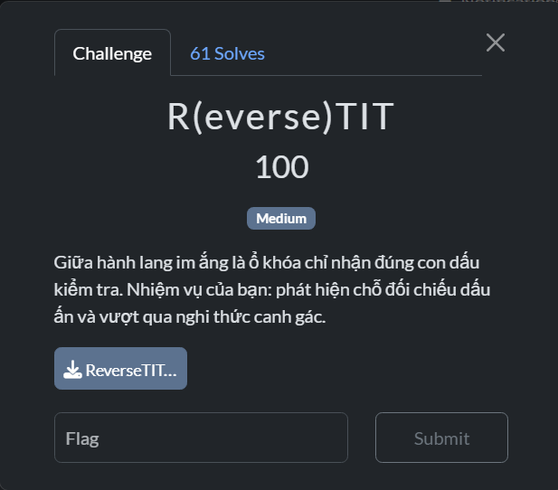
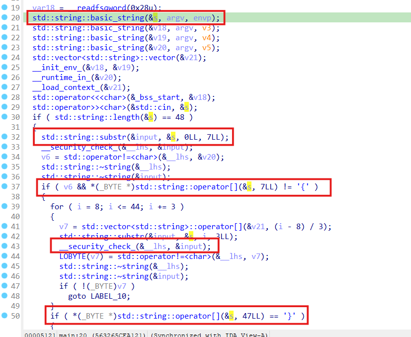
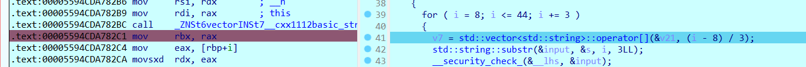
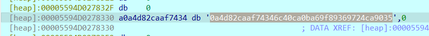
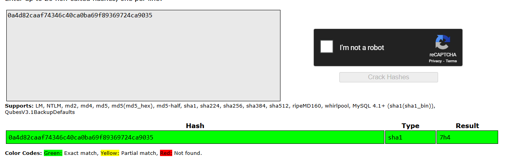

# R(everse)TIT

## [1] TỔNG QUAN
- Đề bài:

    

- Bài này sử dụng hash để mã hoá từng khối 3 ký tự của flag, mình sẽ debug để xem từng khối đó là gì.

## [2] PHÂN TÍCH & SOLVE
- Ngay ở đoạn đầu của hàm `main()` đã thấy có các dấu hiệu điển hình của đoạn code compare các string và độ dài của nó

    

- Dựa vào hàm `main()`, mình có 1 số đánh giá ban đầu như sau:
    - Độ dài flag là 48 byte.
    - 8 byte đầu và byte cuối cùng là form flag: `PTITCTF{}`
    - Vòng for kiểm tra thành phần bên trong form flag, vòng for này có biến lặp `i` cộng với 3 sau mỗi vòng lặp. Điều đó có nghĩa là đoạn kiểm tra này sẽ lấy 3 byte một để so sánh.
- Tới đây mình tiến hành debug và xem nó làm gì

    

- Focus vào giá trị trả về tại biến `v7` thì thấy có đoạn string như sau

    

- Mình dự đoán đây là 1 loại mã hash nào đó, crack thử thì thấy kết quả như sau:

    

- Cứ làm tương tự như thế cho tới hết, mình đã ra được flag.

> **Flag**: `PTITCTF{7h47_15_7h3_W4Y_W3_50lv3_7h15_ch4ll3n93}`