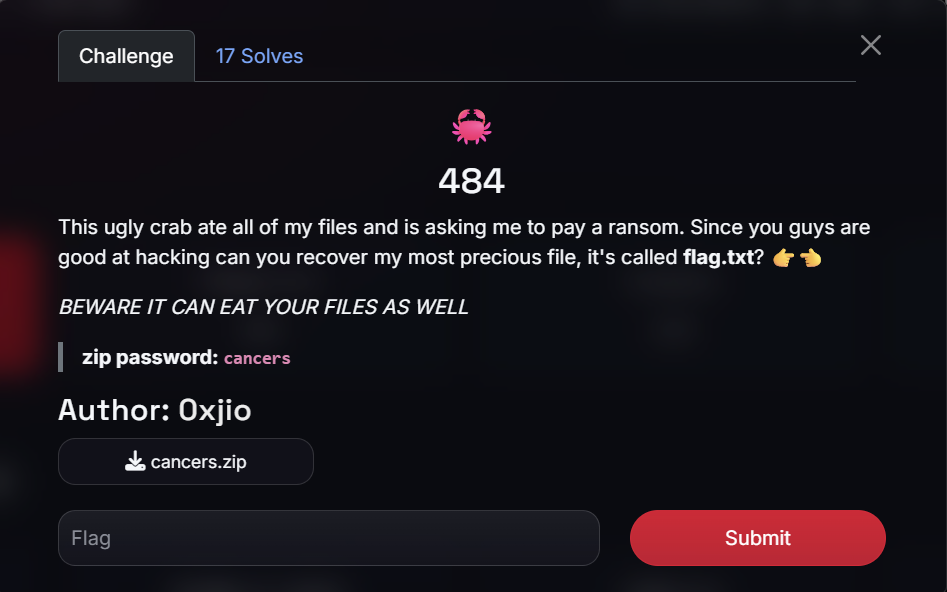
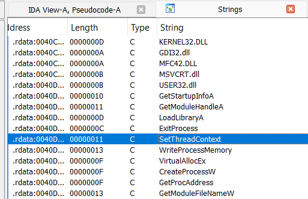
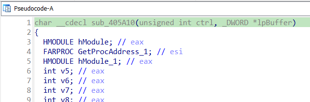

# crab

## [1] TỔNG QUAN
- Đề bài:

    

- Đây là 1 chương trình PE32 sử dụng kỹ thuật dạng shellcode injection. Có lẽ chính vì kỹ thuật này nên nó bị nghi ngờ là một mẫu mã độc khi mới tải về.

## [2] PHÂN TÍCH
### [2.1] Phase 1: Chương trình cancers.exe
- Vẫn như thông lệ, mình sẽ thử 1 số bước sau để tìm được đúng luồng cần phân tích:
    - Khi mới tải chương trình vào IDA, mình focus vào entry point là hàm `start()` và hàm `main()`, tuy nhiên 2 hàm này không có gì đáng chú ý và nó cũng không gọi tới hàm nào khác nên không thể tiếp tục phân tích tiếp được.
    - Mình kiểm tra bảng strings, thì thấy có 1 số string đáng lưu ý như `SetThreadContext()`, `VirtualAllocEx()`, `CreateProcess()`, `WriteProcessMemory()`,...

        

        nên mình đã xref tới thì mình thấy có hàm `sub_405A10()` là hàm khá dài, mình đã đọc thử qua thì đây chính là hàm xử lý chính

        

        hàm này nhận tham số đầu vào là 1 giá trị điều khiển (mình sẽ phân tích kỹ hơn ở bên dưới) và 1 buffer

- Nhìn ở đoạn đầu có thể thấy có khá nhiều chỗ gọi hàm `strcpy()` với các string mà mình vừa thấy trong bảng strings thì đây chính là những phần chuẩn bị cho quá trình resolve API từ các dll chuẩn.
    
    

- 

### [2.2] Phase 2: Chương trình myapp.exe

## [3] SOLVE