# crab

## [1] TỔNG QUAN
- Đề bài:

    

- Đây là 1 chương trình PE32 sử dụng kỹ thuật dạng shellcode injection. Có lẽ chính vì kỹ thuật này nên nó bị nghi ngờ là một mẫu mã độc khi mới tải về.

## [2] PHÂN TÍCH
### [2.1] Phase 1: Chương trình cancers.exe
- Vẫn như thông lệ, mình sẽ thử 1 số bước sau để tìm được đúng luồng cần phân tích:
    - Khi mới tải chương trình vào IDA, mình focus vào entry point là hàm `start()` và hàm `main()`, tuy nhiên 2 hàm này không có gì đáng chú ý và nó cũng không gọi tới hàm nào khác nên không thể tiếp tục phân tích tiếp được.
    - Mình kiểm tra bảng strings, thì thấy có 1 số string đáng lưu ý như `SetThreadContext()`, `VirtualAllocEx()`, `CreateProcess()`, `WriteProcessMemory()`,...

        

        nên mình đã xref tới thì mình thấy có hàm `sub_405A10()` là hàm khá dài, mình đã đọc thử qua thì đây chính là hàm xử lý chính

        

        hàm này nhận tham số đầu vào là 1 giá trị điều khiển `ctrl` (mình sẽ phân tích kỹ hơn ở bên dưới) và 1 `buffer`

- Nhìn ở đoạn đầu có thể thấy có khá nhiều chỗ gọi hàm `strcpy()` với các string mà mình vừa thấy trong bảng strings thì đây chính là những phần chuẩn bị cho quá trình resolve API từ các dll chuẩn.
    
    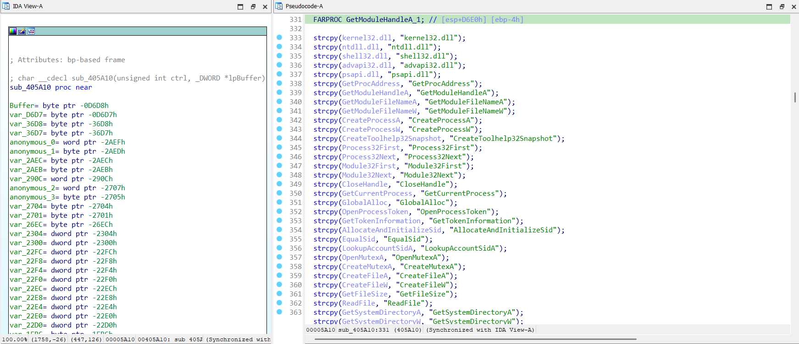

- Lui xuống phía dưới 1 chút mình thấy có 1 số câu lệnh rẽ nhánh với biến điều khiển `ctrl`.
- Có thể nhận xét lần lượt như sau:
    - Với các lệnh điều khiển `if ( ctrl == 7 || ctrl == 8 || ctrl == 9 || ctrl == 10 || ctrl == 20 )` thì chương trình sẽ kiểm tra header của buffer xem có phải là 1 file PE hay không, dấu hiệu khá đặc trưng chính là trường `e_lfanew == 'MZ'` và trường `signature == 'PE'`. Sau đó nó sẽ thực hiện các hành vi mở cmd, cấp phát vùng nhớ và ghi 1 shellcode vào vùng nhớ được cấp phát đó

        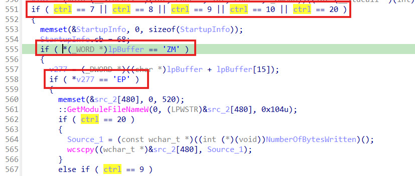

        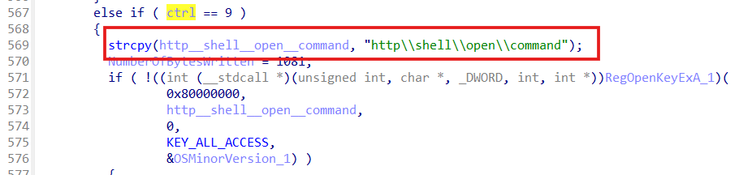

        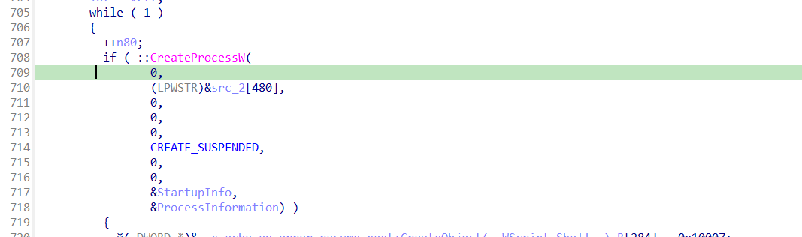

        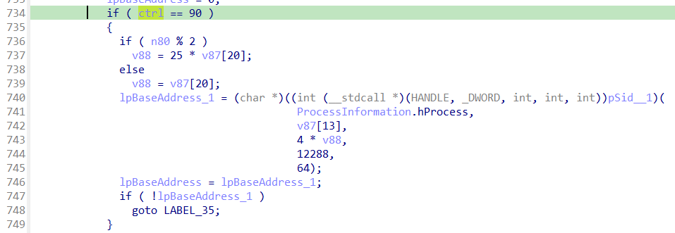

        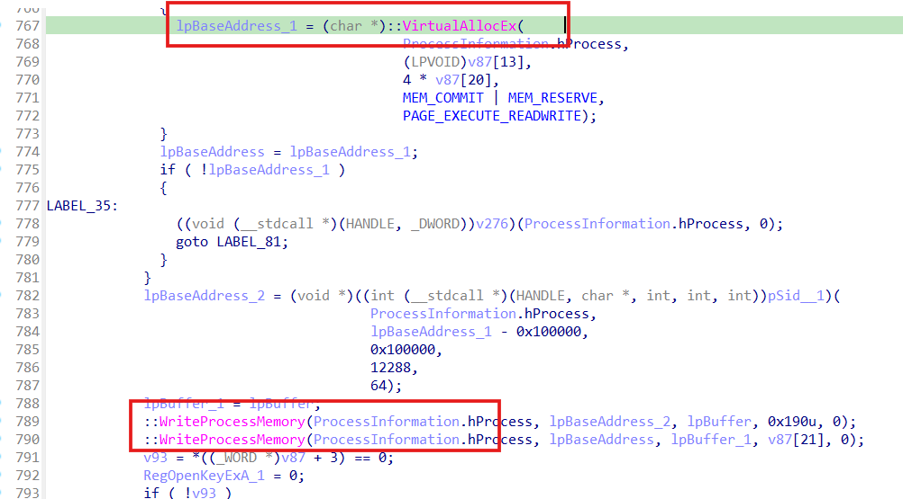

    -  Với biến `ctrl` bằng `4` thì chương trình kiểm tra xem nó có được chạy dưới quyền admin hay không

        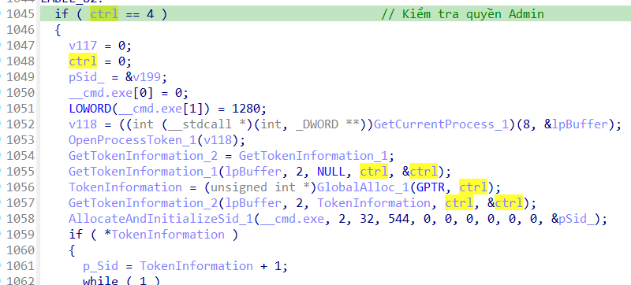
    
    - Nếu biến `ctrl` bằng `5` thì chương trình sẽ cố gắng mở file với các quyền khác nhau

        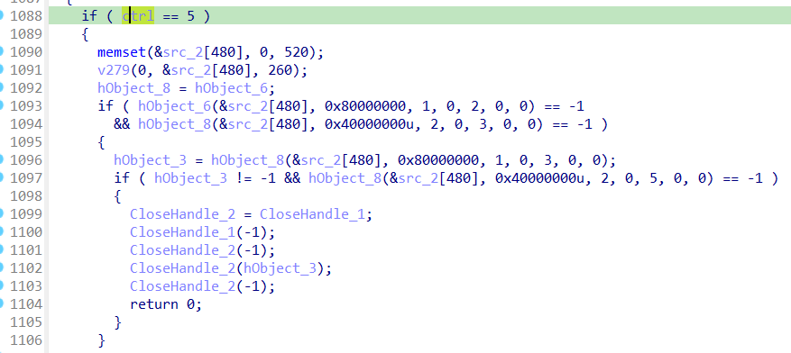
    
    - Với `ctrl` bằng `6`, đây là đoạn cuối của chương trình, chính là cơ chế Anti-VM

        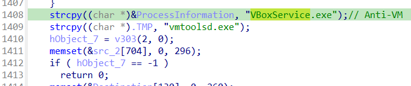

- Cuối cùng là luồng chính của chương trình này chính là ở giữa đoạn kiểm tra `ctrl == 5` và `ctrl == 6`

    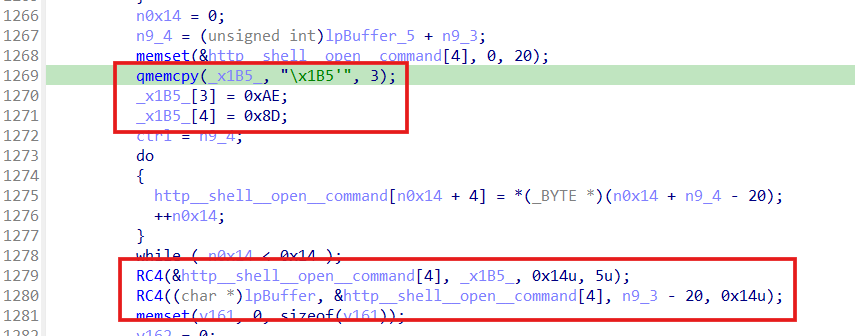

- Đoạn này khởi tạo key giải mã RC4 cho `buffer` được truyền vào chính hàm `sub_405A10()` này. Dự đoán buffer này chính là 1 binary của PE file, vì thế mình đặt breakpoint tại ngay sau lệnh call hàm `RC4()` lần 2 rồi debug và dump binary ra để phân tích tiếp.

    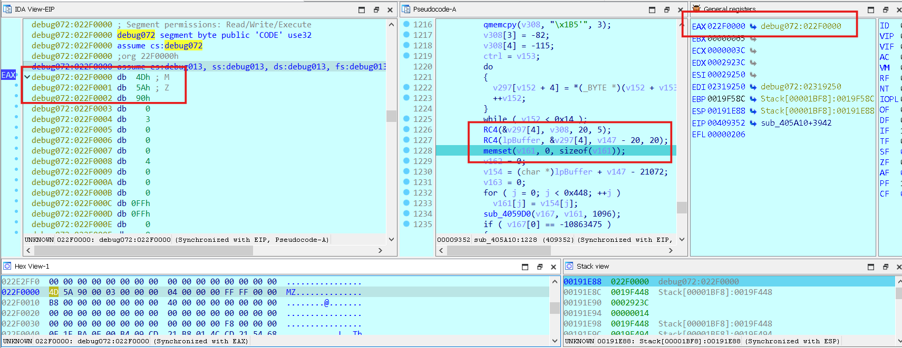

    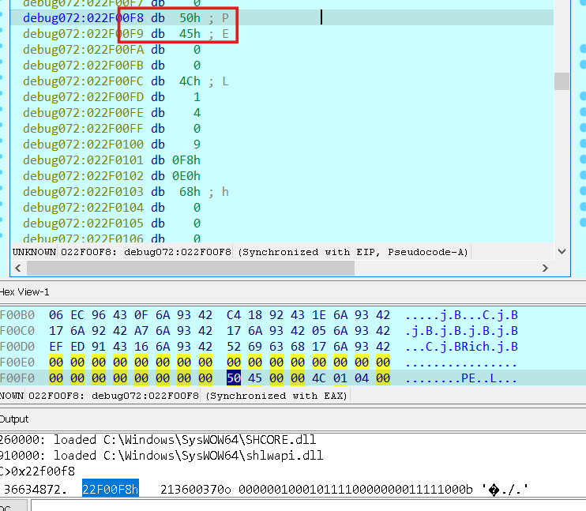

- Dựa theo chương trình chính `cancers.exe` này thì sau khi dump, mình đặt tên cho binary này là `myapp.exe`, đây chính là chương trình mã hoá flag chính.

### [2.2] Phase 2: Chương trình myapp.exe

## [3] SOLVE