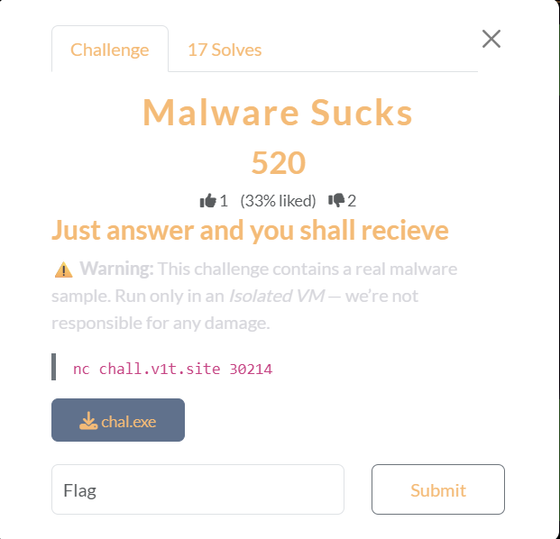

# Malware Sucks

## [1] TỔNG QUAN
- Đề bài:

    

- Challenge này cho 1 file .exe là 1 mã độc và yêu cầu tìm hiểu 1 số thông tin liên quan đến các hành vi của nó.

## [2] SOLVE
- Để trả lời toàn bộ câu hỏi, mình tìm kiếm toàn bộ thông tin của mã độc này trên virustotal và các trang liên quan.
- Vì vấn đề an toàn và cả lời cảnh báo của chính challenge này, mình sẽ không để malware ở trong folder này, mình chỉ để lại mã hash sha256 ở [đây](malware.txt)
- Header:

    ```
    Welcome to the malware quiz server.
    Answer all questions exactly (small case/upper case tolerated where reasonable).
    Any wrong answer will terminate the session.
    Good luck!
    ```

- Câu hỏi đầu tiên:

    ```
    Question 1: What is the c2 server of the malware?
    ```
    - Ở câu này, trên trang virus total không có sẵn string kiểu như "c2 server" nên mình tìm đoạn nào có IP và port thì ra được khá nhiều chỗ `127.0.0.1:4782` nên mình paste thử thì đáp án chính xác

- Câu hỏi thứ 2:

    ```
    Question 2: What are the total number of processes?
    ```
    - Câu hỏi này mình không tìm thấy thông tin chính xác về số lượng tiến trình nên mình đã dùng cách bruteforce thì số `139` là đáp án chính xác

- Câu hỏi thứ 3:

    ```
    Question 3: Which process spawned the malicious binary?
    ```
    - Đáp án của câu này là `explorer.exe`

- Câu hỏi thứ 4:
    
    ```
    Question 4: What mutex did the malware create?
    ```
    - Câu này mình search `Mutexes created` trên trang virustotal thì ra được kết quả là `QSR_MUTEX_rnkp3cySkAKAvUWNtN`

- Câu hỏi thứ 5:

    ```
    Question 5: What is the reported Install_Name / executable name in the config?
    ```
    - Mình xem ở phần Decoded Text thì thấy có trường "InstallName" là `Client.exe` và đây chính là đáp án

- Câu hỏi thứ 6:

    ```
    Question 6: Which registry path did the sample write tracing settings to?
    ```
    - Đáp án của câu này là `HKLM\SOFTWARE\WOW6432Node\Microsoft\Tracing\RASAPI32`

- Câu hỏi thứ 7:

    ```
    Question 7: What is the deleted file path?
    ```
    - Câu này mình tìm thấy `C:\Users\<USER>\Desktop\sss.exe:Zone.Identifier`. Tuy nhiên không có user nên đường dẫn này chưa hoàn thiện. Sau đó mình tìm kiếm trong 1 báo cáo của CAPE Sandbox thì thấy toàn bộ path là `C:\Users\Bruno\Desktop\sss.exe:Zone.Identifier`

- Câu hỏi thứ 8:

    ```
    Question 8: Which process was observed performing an external IP check?
    ```
    - Ở câu này, mình submit file lên trang any.run và có [kết quả](https://app.any.run/tasks/5490e097-adfa-4669-901b-00e721c4a21d). Tại đây, mình thấy có tiến trình `svchost.exe` được báo cáo là Checks for external IP nên đây cũng là đáp án.

- Sau khi trả lời hết 8 câu hỏi trên thì server trả về flag, mình viết payload để solve và lấy được flag như sau:

    ```py
    from pwn import *

    p = remote("chall.v1t.site", 30214)
    p.sendline(b"127.0.0.1:4782")
    p.sendline(b"139")
    p.sendline(b"explorer.exe")
    p.sendline(b"QSR_MUTEX_rnkp3cySkAKAvUWNtN")
    p.sendline(b"Client.exe")
    p.sendline(b"HKLM\\SOFTWARE\\WOW6432Node\\Microsoft\\Tracing\\RASAPI32")
    p.sendline(b"C:\Users\Bruno\Desktop\sss.exe:Zone.Identifier")
    p.sendline(b"svchost.exe")
    p.interactive()

    # Flag: v1t{1_Kn0w_v1rus_t0t4l_h3lps_4_l0t_17a9794578c05e5618630736d96f0b85}
    ```