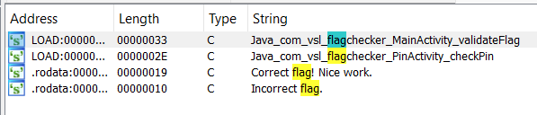
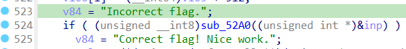
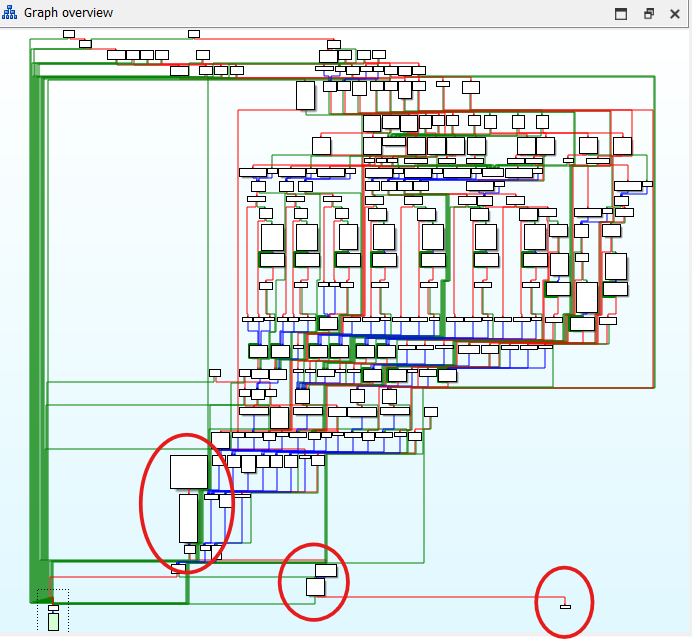
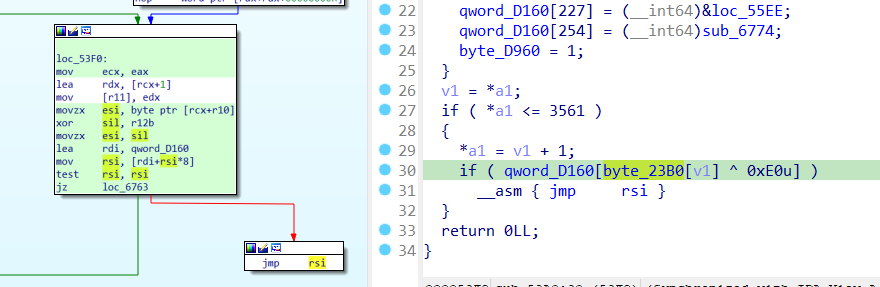

# flagchecker3

## [1] TỔNG QUAN
- Đầu tiên mình mở thử file apk này trên android thì thấy có phần yêu cầu nhập mã PIN như thế này:

    

- Vì quá lười ngồi brute mật khẩu nên mình đã thử kiểm tra các file được pack vào apk. Các bài dạng apk mình từng gặp thường sẽ lưu logic tính toán ở trong file lib, vì thế mình đã extract file apk rồi thử grep 1 số chuỗi thường gặp trong các dạng flag checker như form flag hay chính chuỗi "flag" thì mình thấy có file `libveilcore.so` có chứa các chuỗi này

    ```ps
    $ grep -ri "vsl" .
    grep: ./classes.dex: binary file matches
    grep: ./lib/arm64-v8a/libveilcore.so: binary file matches
    grep: ./lib/arm64-v8a/libveilcore.so.i64: binary file matches
    grep: ./lib/armeabi-v7a/libveilcore.so: binary file matches
    grep: ./lib/x86/libveilcore.so: binary file matches
    grep: ./lib/x86_64/libc++_shared.so: binary file matches
    grep: ./lib/x86_64/libveilcore.so: binary file matches
    grep: ./lib/x86_64/libveilcore.so.i64: binary file matches
    grep: ./lib/x86_64/libveilcore.so.id0: Permission denied
    grep: ./lib/x86_64/libveilcore.so.id1: Permission denied
    grep: ./lib/x86_64/libveilcore.so.nam: Permission denied
    grep: ./resources.arsc: binary file matches
    ```

    ```ps
    $ grep -ri "flag" .
    grep: ./classes.dex: binary file matches
    grep: ./lib/arm64-v8a/libveilcore.so: binary file matches
    grep: ./lib/arm64-v8a/libveilcore.so.i64: binary file matches
    grep: ./lib/armeabi-v7a/libveilcore.so: binary file matches
    grep: ./lib/x86/libveilcore.so: binary file matches
    grep: ./lib/x86_64/libveilcore.so: binary file matches
    grep: ./lib/x86_64/libveilcore.so.i64: binary file matches
    grep: ./lib/x86_64/libveilcore.so.id0: Permission denied
    grep: ./lib/x86_64/libveilcore.so.id1: Permission denied
    grep: ./lib/x86_64/libveilcore.so.nam: Permission denied
    grep: ./lib/x86_64/libveilcore.so.til: binary file matches
    grep: ./resources.arsc: binary file matches
    ```

- Tìm trong bảng strings thấy có dấu hiệu khá đặc trưng của logic check flag:

    

- Từ đây mình follow theo thì tìm thấy hàm `Java_com_vsl_flagchecker_MainActivity_validateFlag()` có hàm logic check gì đó (vì param inp vừa được gán lại bằng 0 ở phía trên) rồi in ra "Incorrect" hay "Correct".

    

## [2] PHÂN TÍCH
### 2.1. Logic chính
- Những phần phía trên của hàm `checker` mà mình vừa phát hiện ra chủ yếu là để anti-debug, không đụng gì đến biến `inp` nên mình sẽ bỏ qua.
- Mình tiếp tục focus vào hàm `sub_52A0()` này để xem nó làm gì với `inp`:

    ```C
    __int64 __fastcall sub_52A0(unsigned int *a1)
    {
    int v1; // eax

    if ( !byte_D960 )
    {
        qword_D160[42] = (__int64)&loc_541B;
        qword_D160[94] = (__int64)&loc_576D;
        qword_D160[109] = (__int64)&loc_55D7;
        qword_D160[156] = (__int64)&loc_55F3;
        qword_D160[19] = (__int64)&loc_5558;
        qword_D160[113] = (__int64)&loc_57B2;
        qword_D160[31] = (__int64)&loc_58E8;
        qword_D160[62] = (__int64)&loc_56B0;
        qword_D160[98] = (__int64)&loc_5989;
        qword_D160[168] = (__int64)&loc_55A7;
        qword_D160[178] = (__int64)&loc_5930;
        qword_D160[8] = (__int64)&loc_54E3;
        qword_D160[209] = (__int64)&loc_587C;
        qword_D160[68] = (__int64)&loc_58D1;
        qword_D160[153] = (__int64)&loc_54BF;
        qword_D160[227] = (__int64)&loc_55EE;
        qword_D160[254] = (__int64)sub_6774;
        byte_D960 = 1;
    }
    v1 = *a1;
    if ( *a1 <= 3561 )
    {
        *a1 = v1 + 1;
        if ( qword_D160[byte_23B0[v1] ^ 0xE0u] )
        __asm { jmp     rsi }
    }
    return 0LL;
    }
    ```

- Nhìn vào đoạn pseudocode này thì có lẽ chúng ta sẽ dễ bị đánh lừa vì nó chẳng thực thi thêm gì và không rõ phần return nào khác ngoài `return 0` nên mình đã kiểm tra assembly thì thấy ở giao diện graph còn khá nhiều logic phức tạp khác, trong đó chỉ có các phần sau là được disassemble:

    

- Sau khi đọc mã asm từ đầu hàm thì mình hiểu logic như sau:
    - Ở đoạn đầu hàm chương trình gán các địa chỉ vào 1 mảng mình gọi là mảng con trỏ `qword_D160[]`:

        ```C
        if ( !byte_D960 )
        {
            qword_D160[42] = (__int64)&loc_541B;
            qword_D160[94] = (__int64)&loc_576D;
            qword_D160[109] = (__int64)&loc_55D7;
            qword_D160[156] = (__int64)&loc_55F3;
            qword_D160[19] = (__int64)&loc_5558;
            qword_D160[113] = (__int64)&loc_57B2;
            qword_D160[31] = (__int64)&loc_58E8;
            qword_D160[62] = (__int64)&loc_56B0;
            qword_D160[98] = (__int64)&loc_5989;
            qword_D160[168] = (__int64)&loc_55A7;
            qword_D160[178] = (__int64)&loc_5930;
            qword_D160[8] = (__int64)&loc_54E3;
            qword_D160[209] = (__int64)&loc_587C;
            qword_D160[68] = (__int64)&loc_58D1;
            qword_D160[153] = (__int64)&loc_54BF;
            qword_D160[227] = (__int64)&loc_55EE;
            qword_D160[254] = (__int64)sub_6774;
            byte_D960 = 1;
        }
        ```

    - Ở đoạn `if ( *a1 <= 3561 )` thực chất là 1 vòng lặp, nhưng để lặp được thì nó sẽ sử dụng lệnh `jmp` với label `loc_53F0` chính là đoạn rẽ nhánh `if` này.

        

    - Trong thân của vòng lặp này, chương trình sẽ kiểm tra lần lượt từng byte của mảng `byte_23B0[]` xor với `0xE0`. Đoạn này ida không disassemble đúng cách nên nó chỉ hiển thị giá trị ban đầu là `0xE0`, thực tế khi soi chiếu vào asm thì nó đang xor với thanh ghi `r12d`, mà thanh ghi này được cập nhật sau mỗi đoạn `loc_xxxx` mà mình sắp phân tích bên dưới. Kết quả của phép xor này mình gọi là index vì nó đang biểu diễn chỉ số của 
    - Cần nói thêm, thanh ghi `rsi` ở đoạn này đang được gán là địa chỉ của mảng `qword_D160` tại index, mà mảng `qword_D160` chứa các địa chỉ của các `loc_xxxx` được gán phía trên, sau đó có lệnh `jmp rsi` là để jump tới các địa chỉ đó. Hay nói cách khác, các `loc_xxxx` phía trên sẽ lần lượt được thực thi thông qua cách này. Từ đây mình sẽ phân tích logic của các nhãn `loc_xxxx` này.

### 2.2. Logic xử lý của các label
- Phần này mình sẽ phân tích tổng quát các hành vi của từng label. Có tất cả 16 label, ở mỗi label, chương trình sẽ thực hiện tính toán với 2 hạng tử là 2 số ở đỉnh stack sau đó push lại vào đỉnh stack.
    - Với label `loc_541B` - PUSH: push 1 số nguyên 4 byte vào stack
    - Với label `loc_5558` - ADD: tính tổng 2 số bằng công thức:
        
        ```C
        sum = (a ^ b) + 2 * (a & b)
        ```

    - Với label `loc_55F3` - XOR: tính giá trị xor giữa 2 số trên đỉnh stack
    - Với label `loc_56B0` - OR: tính giá trị or giữa 2 số trên đỉnh stack
    - Với label `loc_58E8` - AND: tính giá trị and giữa 2 số trên đỉnh stack
    - Với label `loc_57B2` - SUB: tính hiệu 2 số bằng công thức:

        ```C
        a - b = (a ^ b) - 2*(~a & b)
        ```

    - Với label `loc_5989` - ROL8: ví dụ cnt=pop(); v=pop() thì label này thực hiện `push(rol8(v,cnt))`
    - Với label `loc_55A7` - duplicate giá trị tại đỉnh và push lại vào stack
    - Với label `loc_55D7` - push input length vào stack
    - Với label `loc_576D` - push input byte ở vị trí chỉ định ~ `push(input[idx])`
    - Với label `loc_5930` - CMP: nếu bằng thì lưu kết quả `a==b` vào `[r11+0x20]`; Nếu không bằng thì set byte `[r11+0x30] |= 1`
    - Với label `loc_54E3` - JNZ: jmp nếu so sánh bằng 0
    - Với label `loc_587C` - JMP: jmp vô điều kiện
    - Với label `loc_54BF` - trộn state/key phụ
- Điểm đáng quan tâm nhất là từ label `loc_6747` sang `loc_674B` rồi tới `loc_674E` thì giá trị tại thanh ghi `r12d` được update theo công thức sau:

    ```c
    r12d = (r12d >> 3) ^ [r11+0x20] ^ X ^ 0xA5A5A5A5
    ```
    Trong đó X là giá trị tại thanh ghi `eax` trước khi bắt đầu gọi tới label `loc_6747`
- Từ đây có thể khẳng định đây chính là 1 mini VM được sử dụng trong app apk. Mình có thể sử dụng các giá trị hardcode ở `byte_23B0` để lần lượt sử dụng trong các vòng lặp với các opcode tương ứng của VM.

## [3] SOLVE
- Solver: [solve.py](solve.py)
> **Flag:** `VSL{d0nt_trust_ops_even_wh3n_th3y_pretend_to_be_s4f3_2026_edfefa180f0ca9a7}`