# vm

## **[1] TỔNG QUAN**
- Đề bài của bài này được cho như sau:

    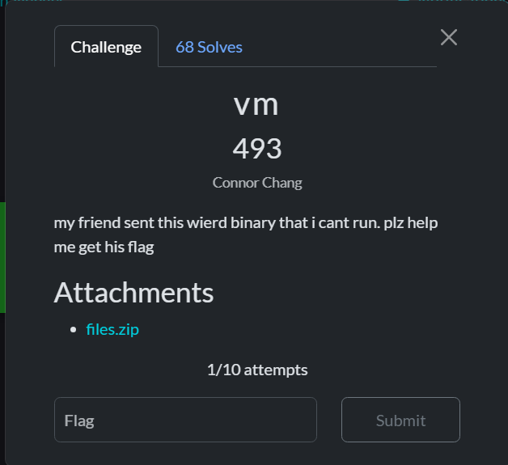

- Challenge này cung cấp cho chúng ta 2 file:
    - 1 file elf64 `reverse_me`. File này là file máy ảo (vm) có kiến trúc được custom.
    - 1 file binary thô `check.bin`. Sau khi phân tích kỹ kiến trúc của vm được cung cấp, ta sẽ thấy các byte trong đó chính là 1 chương trình giống dạng mã máy của C/C++.

- Ở bài này chúng ta không cần phải nhập input để check, không cần sử dụng các kỹ thuật reverse trực tiếp, debug hay các kỹ thuật khác lên file elf64 mà file cần reverse chính là file `check.bin`.
- Kiến thức liên quan cần tìm hiểu là các opcode mã máy trong các kiến trúc máy tính mà ta đã biết: [Opcode ASM](http://ref.x86asm.net/coder32.html#)

## **[2] PHÂN TÍCH**
### **[2.1] File elf64 `reverse_me`**
- Trước hết chúng ta sẽ phân tích và dự đoán hành vi của file máy ảo này xem nó sẽ làm gì liên quan đến file `check.bin` kia.
- Ở hàm `main()` có đoạn như sau:

    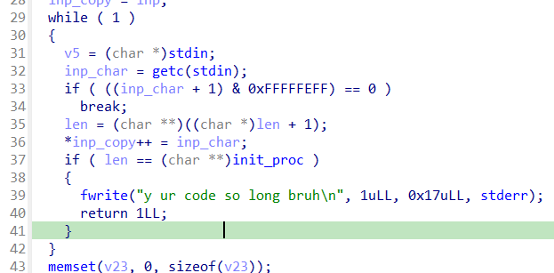

    - Đoạn này chính là 1 vòng lặp vô hạn, cho phép nhập input liên tục và với mỗi input chỉ nhận vào 1 byte (đây chính là các opcode được quy định ở phần sau)
    - Độ dài của input tối đa có thể nhập được khai báo ở phía đầu hàm `main()`:
        
        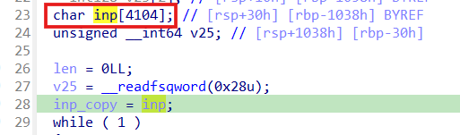
        
    - Nếu vượt qua khoảng này, chương trình sẽ in ra: "y ur code so long bruh"

- Để có thể tiếp tục phân tích và hiểu được đoạn sau, chúng ta cần hiểu các opcode mã máy là gì. Ví dụ, đối với [Opcode ASM](http://ref.x86asm.net/coder32.html#), chúng ta có thể thấy lệnh `mov` sẽ có opcode có range từ `0x88 - 0x8C` lần lượt tương ứng với các dạng toán hạng ngay sau nó (thanh ghi, hằng số,...).

    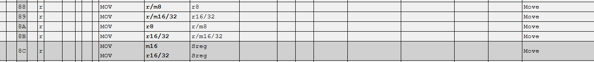

- Ở challenge này chúng ta cũng cần phải đọc hiểu các byte opcode tương tự như vậy nhưng nó được custom theo vm riêng của challenge. Biết các thanh ghi được sử dụng ở kiến trúc file vm này là `r0` - `r7`.
- Ở vòng lặp `while()` tiếp theo, lần lượt từng byte ký tự của input được duyệt qua và kiểm tra với các giá trị hex tương ứng:
    - Nếu byte này có giá trị bằng `0x40`, thì byte này tương đương với lệnh `jmp` trong asm

        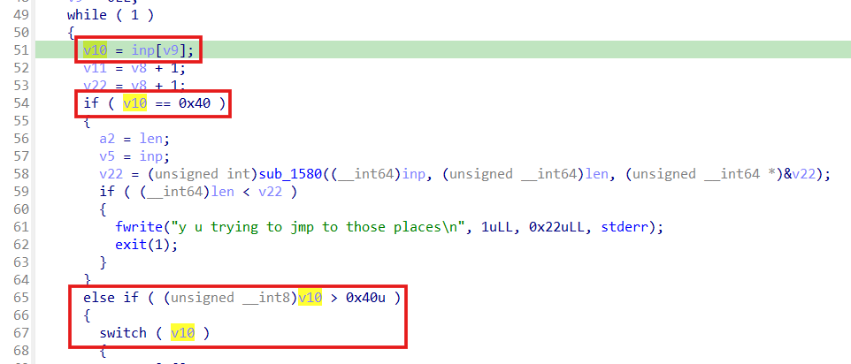
    
    - Nếu byte này có giá trị bằng `0x60`, thì byte này tương đương với lệnh `mov` với byte tiếp theo là toán hạng đích - là thanh ghi, 4 bytes tiếp theo là toán hạng nguồn - data tại một vùng nhớ (mảng byte) có sẵn.

        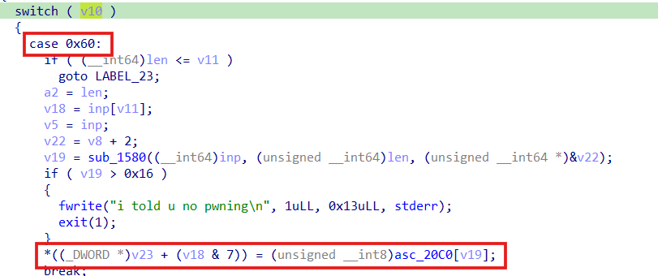

        Ví dụ:
        ```
        60   00  01 00 00 00
        |    |   |
        mov  r0	 flag[1]
        ```

    - Nếu byte này có giá trị bằng `0x70`, thì sẽ kiểm tra ouput với số `0x69696969` và đây chính là điều kiện để vượt qua được bài này.

        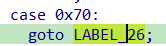

        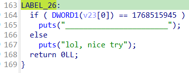

    - Nếu byte này có giá trị bằng `0x50`, lệnh này là lệnh jump có điều kiện, 2 bytes tiếp theo biểu diễn cho 2 thanh ghi được sử dụng trong kiến trúc máy vm này, 4 byte tiếp theo sẽ biểu diễn cho địa chỉ sẽ jump tới.

        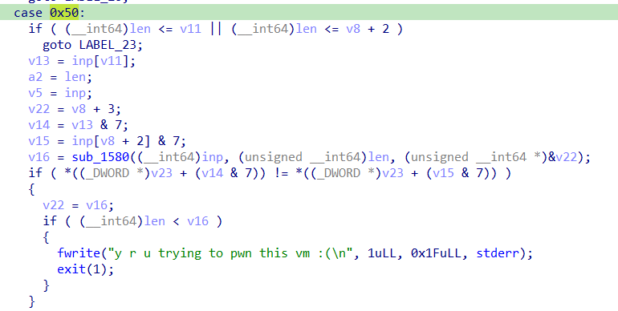

        Ví dụ:
        ```
        50   00  03  28 0a 00 00
        |    |   |   |
        jne  r0  r3  0x00000a28
        ```
    
    - Nếu byte này có giá trị bằng `0x20`, sẽ cộng giá trị tại 2 thanh ghi được biểu diễn bằng 2 byte tiếp theo và lưu kết quả vào thanh ghi đích (`add rx, ry` ~ `rx += ry`).

        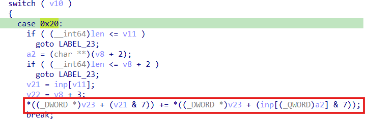

        Ví dụ:
        ```
        20   00  02
        |    |   |
        add  r0  r2
        ```

    - Tương tự, với byte `0x30`, nó sẽ được sử dụng để xor 2 thanh ghi và lưu kết quả vào thanh ghi đích.

        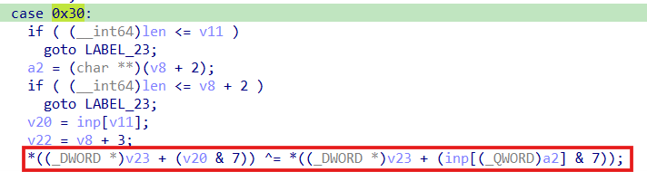

        Ví dụ:
        ```
        30  00  01
        |   |   |
        xor r0  r1
        ```
    
    - Nếu byte đó có giá trị bằng `0x10`, lệnh này là lệnh `mov`, nhưng toán hạng nguồn là một hằng số.

        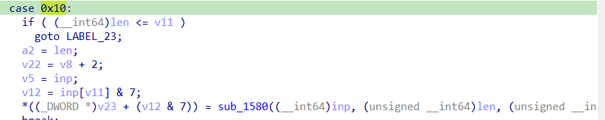

        Ví dụ:
        ```
        10   03  79 00 00 00
        |    |   |
        mov  r3  0x00000079
        ```
    
### **[2.2] File `check.bin`**
- Khi mở file này bằng công cụ HxD, ta thấy file chứa toàn các byte khá giống với custom opcode được mô tả bên trên. Dự đoán đây là một file binary có thể chạy được trên vm được cung cấp.
    
    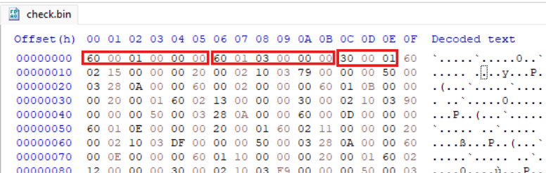

- Dựa theo bộ quy tắc đó, chúng ta có thể tách các byte ra và dịch nó sang dạng giống assembly dễ đọc hơn và có thể trích xuất ra các phương trình tính toán các phần tử của flag

## **[3] SOLVE**
- Đầu tiên, chúng ta cần chuyển các opcode theo định dạng của vm sang dạng code assembly:
    - Code Python: [Opcode-To-Asm](OpcodeToAsm.py)
    - Assembly: [Disassembly](disassembly.txt)
- Sau khi đã có file code assembly của chương trình, ta nhận thấy toàn bộ chương trình `check.bin` này đều được chia thành các khối xử lý như sau:
    ```
    0000:   | 60 00 01 00 00 00      | mov_char r0, flag[1]
    0006:   | 60 01 03 00 00 00      | mov_char r1, flag[3]
    000c:   | 30 00 01               | xor r0, r1
    000f:   | 60 02 15 00 00 00      | mov_char r2, flag[21]
    0015:   | 20 00 02               | add r0, r2
    0018:   | 10 03 79 00 00 00      | mov_imm r3, 0x79
    001e:   | 50 00 03 28 0a 00 00   | jne r0, r3, 0xa28
    ```
    ==> Đoạn này có thể hiểu là một phương trình như sau:<br>
    `((flag[1] ^ flag[3]) + flag[21]) == 0x79`
- Tương tự với các khối xử lý sau, ta sẽ format lại bằng python và sử dụng thư viện z3 để giải phương trình thì sẽ ra được flag cần tìm
    - Code format: [Gen equation](gen_equation.py)
    - Code solve: [Solve](solve.py)

> **Flag:** `scriptCTF{5up3r_dup3r_345y_vm_r3v}`